# Availability Patterns in Distributed Systems

## Overview

**Availability patterns** are established architectural approaches used to ensure a system remains operational and accessible to users, even in the face of failures, unexpected events, or planned maintenance windows. These patterns form a critical component of any robust distributed system design, addressing the reality that hardware will inevitably fail, networks will become congested, and software will encounter bugs.

The fundamental goal of availability patterns is not to prevent all failures—that is often impossible or prohibitively expensive. Instead, these patterns focus on minimizing downtime, maintaining consistent service levels, and recovering quickly when failures do occur. This shift in mindset from "building flawless systems" to "building resilient systems" represents a mature understanding of distributed computing realities.

Applying the **80/20 Rule** to availability design means recognizing that achieving the last few percentage points of availability becomes exponentially more expensive. While 99% availability (about 3.65 days of downtime per year) might cost X dollars, achieving 99.9% availability might cost 10X, and 99.99% could cost 100X or more. Understanding where to draw the line—based on business requirements, customer expectations, and cost constraints—is a critical architectural decision.

Availability patterns work hand-in-hand with other system design concepts. They complement **consistency patterns** (discussed in previous notes) by addressing the "A" in the CAP theorem, ensuring that systems remain accessible even when consistency guarantees must be relaxed. They also interact with **scalability patterns** because highly available systems often need to scale horizontally to handle increased load while maintaining redundancy.

## The Importance of Availability

In modern digital infrastructure, availability has become a non-negotiable requirement for most applications. The impact of downtime extends far beyond simple lost transactions—it affects customer trust, brand reputation, employee productivity, and ultimately, revenue. Consider the consequences of a system becoming unavailable at different scales.

For a small startup, an hour of downtime might result in lost sales, frustrated customers, and recovery efforts that divert engineers from feature development. For a large e-commerce platform like Amazon, each minute of downtime can cost millions of dollars in lost revenue. For critical infrastructure like hospital systems or emergency services, downtime can literally be a matter of life and death.

These realities have driven the development of sophisticated availability patterns that can handle various failure scenarios while maintaining acceptable service levels. Understanding these patterns—and knowing when to apply each one—represents essential knowledge for any system designer or engineer.

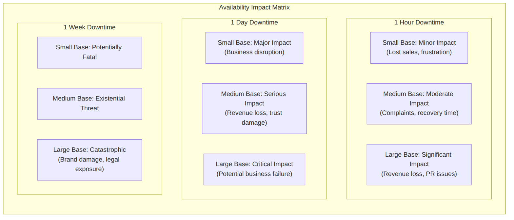

## 1. Fail-Over Patterns

**Failover** is an availability pattern that ensures continuous system function by configuring a backup component to automatically take over operations if the primary component experiences a failure. The failover mechanism operates automatically, detecting failures and redirecting traffic without human intervention, thereby minimizing recovery time and reducing the impact of failures on end users.

Failover patterns address one of the fundamental challenges in distributed systems: the inevitability of component failure. Whether caused by hardware degradation, software bugs, network issues, or unexpected load spikes, failures will occur. The question is not whether to design for failure, but how quickly and gracefully the system can recover when failures happen.

The core philosophy behind failover is **redundancy with automatic switching**. By maintaining one or more standby systems that can take over when the primary fails, systems can achieve levels of availability that would be impossible with single-component architectures. The automatic nature of the switching mechanism is crucial because human intervention—even if available—typically takes too long to meet stringent availability targets.

### Active-Passive Failover (Master-Slave)

Active-passive failover represents the simpler of the two primary failover architectures. In this configuration, a primary (also called "active") server handles all incoming traffic while a secondary (also called "passive" or "standby") server remains on standby, ready to take over if the primary fails.

The mechanics of active-passive failover rely heavily on **heartbeat mechanisms**. Heartbeats are periodic signals sent between the primary and standby servers to confirm that the primary is still operational and responsive. These heartbeats typically occur at fixed intervals (often every few seconds) and include information about the sender's health status, load levels, and recent transaction activity.

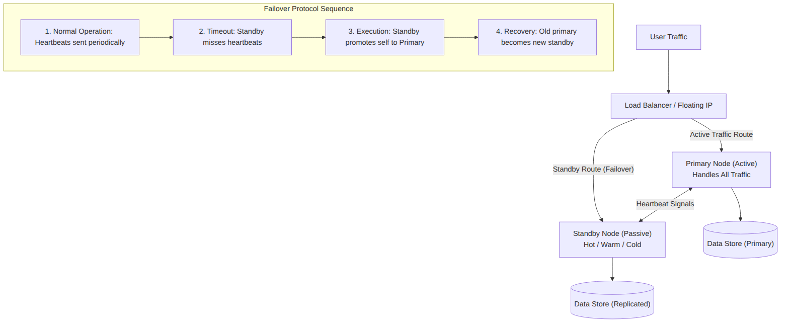

The **standby state** of the passive server significantly impacts recovery time and is categorized into two types based on how thoroughly the standby is kept synchronized and ready:

**Hot Standby** represents the most prepared standby configuration. In a hot standby setup, the passive server is not only running but is also kept fully synchronized with the primary server's state. All data changes occurring on the primary are immediately replicated to the hot standby, and the standby is ready to take over with minimal startup time. This results in near-instantaneous recovery, typically measured in seconds or less. Hot standby is appropriate for systems requiring the fastest possible recovery and those where any data loss is unacceptable. However, hot standby requires more resources (compute, memory, network bandwidth) and incurs higher operational costs due to the constant synchronization overhead.

**Cold Standby** represents the least prepared standby configuration. In a cold standby setup, the passive server is not kept running continuously but is brought online only when needed. The server may need to load data from backups, initialize services, and perform consistency checks before becoming ready to serve traffic. Recovery times for cold standby can range from minutes to hours depending on system complexity and data volume. Cold standby is less expensive to maintain because the standby server consumes no resources when idle, but the longer recovery time means more significant downtime. Cold standby is appropriate for disaster recovery scenarios where brief delays are acceptable and cost optimization is a priority.

**Warm Standby** occupies the middle ground between hot and cold. In a warm standby configuration, the passive server is running but may not be fully synchronized with the primary. The standby might receive periodic updates rather than continuous replication, and some initialization steps may be required before taking over. Recovery times typically fall between those of hot and cold standby. Warm standby is a common choice for systems that need reasonable recovery times without the full cost of hot standby.

The routing of traffic in active-passive configurations is managed by an external component—typically a **load balancer** or a **floating IP mechanism**. The load balancer performs continuous health checks on the primary server and routes traffic only to the healthy primary node. When the primary fails, the load balancer detects the failure through missing health checks and redirects traffic to the standby. The standby must typically claim the primary's IP address or be registered with the load balancer before it can start receiving traffic.

### Active-Active Failover (Master-Master)

Active-active failover represents a more complex but potentially more performant configuration. In this architecture, both servers (or all servers in a multi-node cluster) run concurrently and actively handle incoming traffic, distributing the operational load between them.

The fundamental difference from active-passive is that all nodes in an active-active configuration are capable of handling all types of traffic—not just serving as standby. This means both nodes can accept reads and writes, and incoming traffic is distributed across all operational nodes.

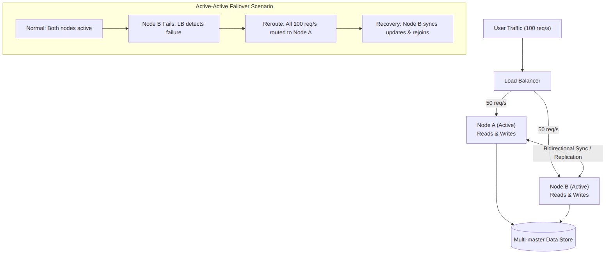

The routing mechanisms in active-active configurations differ from active-passive due to the need to balance traffic across multiple active nodes:

**DNS-based routing** can be used to distribute traffic by configuring DNS to return multiple IP addresses for the service hostname. Clients then choose which address to connect to, typically in a round-robin fashion. However, DNS-based routing has significant limitations including slow propagation of changes, lack of awareness of server health, and no load balancing intelligence.

**Load balancer routing** is the more common approach for active-active configurations. A hardware or software load balancer sits in front of all active nodes and distributes traffic based on various algorithms (round-robin, least connections, weighted distribution, etc.). The load balancer also performs health checks and automatically removes failed nodes from the rotation.

**Anycast routing** can be used at the network level, particularly for globally distributed services. In anycast, multiple nodes announce the same IP address via BGP, and network routing directs traffic to the nearest node. This approach provides built-in failover at the network level but offers less control over traffic distribution.

Active-active configurations offer several advantages over active-passive. Because all nodes are actively processing traffic, the system can achieve higher aggregate throughput. Additionally, if one node fails, the remaining nodes simply absorb its share of traffic, resulting in graceful degradation rather than a sudden failover event. The remaining nodes might experience increased load but can often continue operating without users experiencing a significant service disruption.

However, active-active configurations introduce significant complexity, particularly around **conflict resolution**. When multiple nodes can accept writes simultaneously, the system must have mechanisms to handle situations where the same data is modified on multiple nodes at roughly the same time. This conflict resolution problem is non-trivial and is discussed in more detail in the Replication section.

### Health Checks and Failure Detection

The effectiveness of any failover system depends on its ability to quickly and accurately detect failures. Health checks form the foundation of failure detection, providing the signals that trigger failover decisions.

**Heartbeat mechanisms** establish regular communication between primary and standby nodes (in active-passive) or among all nodes (in active-active). The heartbeat interval—the time between consecutive heartbeat signals—represents a trade-off between detection speed and network overhead. Shorter intervals enable faster failure detection but consume more network bandwidth and increase the chance of false positives due to transient network issues.

**Timeout thresholds** determine how long a node waits before considering a peer failed. When heartbeats are missed, the timeout countdown begins. If enough heartbeats are missed to exceed the threshold, failure is declared and failover is initiated. The timeout value must be calibrated based on network characteristics—a timeout that is too short may trigger spurious failovers during normal network latency spikes, while a timeout that is too long delays failure detection and extends downtime.

**Health check depth** varies across implementations. Some systems only check whether the peer is reachable on the network (layer 3 connectivity). Others perform deeper checks, verifying that specific services are running, that application-level responses are healthy, or that performance metrics are within acceptable ranges. Deeper health checks provide more confidence that the node is truly operational but take longer to perform.

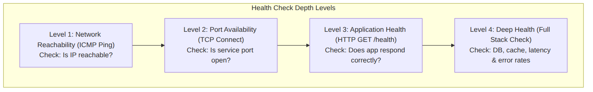

### Failover Considerations and Challenges

While failover patterns dramatically improve system availability, they introduce their own challenges that must be addressed in system design:

**Split-brain scenarios** occur when communication between primary and standby fails, but both nodes remain operational and believe the other has failed. In this situation, both nodes might attempt to become primary, potentially serving conflicting data to users. Preventing split-brain requires careful design of the failure detection and failover protocols, often involving quorum mechanisms that require agreement from a majority of nodes before failover proceeds.

**Data loss** represents a significant risk in failover scenarios. If the primary fails before recently written data can be replicated to the standby, those writes are lost. The probability of data loss depends on the replication strategy (synchronous vs. asynchronous) and the failure timing. Synchronous replication eliminates this risk but impacts performance; asynchronous replication enables better performance but introduces a window of vulnerability.

**Failover latency** is the time between primary failure and standby taking over. This latency includes time for failure detection, decision making, and the actual switchover operation. Even with hot standby, there is typically some measurable downtime during failover. For critical systems, this latency must be minimized and accounted for in availability calculations.

**Network partitioning** creates ambiguous situations where nodes cannot communicate reliably. During a partition, determining which node should be primary becomes challenging. Some systems choose to stop accepting writes during partitions (favoring consistency), while others continue operating with a best-effort approach (favoring availability). The CAP theorem dictates that this trade-off cannot be avoided.

**Flapping** occurs when a node rapidly oscillates between healthy and unhealthy states, triggering repeated failovers. Flapping wastes resources, causes instability, and can indicate underlying issues that need investigation. Many failover systems implement back-off algorithms or require multiple consecutive failures before triggering failover to avoid flapping.

### Use Cases for Failover Patterns

**Database Failover** represents a common application of failover patterns. When a primary database server fails, a standby server takes over to minimize database downtime. Database failover is particularly critical for write-heavy workloads where database unavailability prevents any write operations.

**Application Server Failover** protects against application server failures by maintaining multiple application server instances behind a load balancer. When an instance fails, the load balancer automatically routes traffic to healthy instances. This pattern is fundamental to modern web application architectures.

**Load Balancer Failover** ensures that the load balancer itself does not become a single point of failure. Many load balancers support active-passive configurations where a standby load balancer takes over if the primary fails.

**Multi-Region Failover** extends failover across geographic regions for disaster recovery. If an entire data center or region becomes unavailable, traffic is routed to a standby region. Multi-region failover typically involves longer failover times but provides protection against site-wide disasters.

## 2. Replication Patterns

**Replication** ensures high availability by storing multiple identical copies of data across geographically distributed or isolated locations. If a storage node fails, the data remains accessible from another location. Replication goes beyond simple failover by ensuring that data—not just processing capacity—is resilient to node failures.

The relationship between replication and availability is intimate. Replication enables availability by ensuring that the failure of any single node does not result in data loss or service unavailability. However, replication introduces its own complexities around consistency, latency, and conflict resolution that must be carefully managed.

Replication patterns can be categorized along several dimensions: the number of leaders, the synchronization approach, and the consistency guarantees provided. Understanding these dimensions enables architects to choose the right replication strategy for their specific requirements.

### Master-Slave Replication

Master-slave replication is the most straightforward replication topology. A single designated **master** (also called "primary") node processes all write operations, while one or more **slave** (also called "replica" or "standby") nodes store copies of the data and handle read operations.

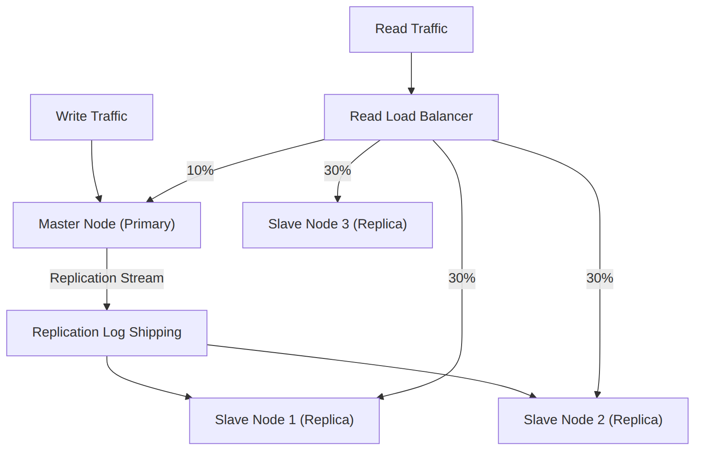

The master node serves as the authoritative source of truth for the dataset. All modifications—inserts, updates, and deletes—must be submitted to the master. The master records these modifications in a **transaction log** (such as a write-ahead log or binary log) and propagates them to slave nodes through a replication stream.

Slaves apply the changes from the master in the same order they occurred, maintaining consistency with the master. This ordered replication ensures that slaves eventually reach the same state as the master, modulo any replication lag.

**Read scalability** represents the primary advantage of master-slave replication. Because slaves maintain identical copies of the data, read traffic can be distributed across multiple slaves, dramatically increasing aggregate read throughput. For read-heavy workloads—which represent the majority of many applications—this scalability benefit is significant.

**Write scalability** remains limited to a single node in master-slave replication. All writes must flow through the master, which becomes both a single point of contention and a potential bottleneck. Applications requiring high write throughput may need alternative approaches such as sharding or multi-master replication.

**Failure handling** in master-slave replication involves promoting a slave to become the new master. The promotion process requires selecting a slave that is most up-to-date with the failed master, stopping replication, and reconfiguring the application to send writes to the new master. This process typically involves some manual intervention or automated scripts and results in temporary write unavailability.

Master-slave replication is widely used in production systems. MySQL's default replication mode, PostgreSQL's streaming replication, and MongoDB's replica sets (when configured with a single primary) all implement master-slave replication.

### Master-Master Replication

Master-master replication extends the replication model by allowing multiple nodes to accept writes. In this configuration, any node can serve as a master for writes, and changes are propagated bidirectionally among all masters.

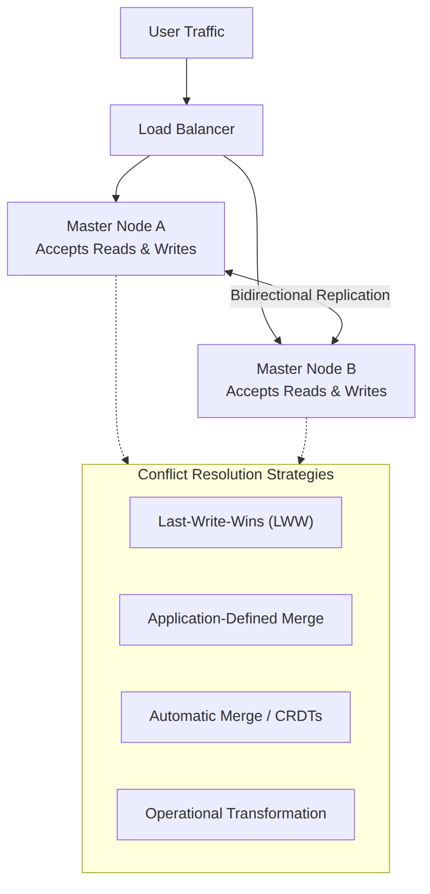

Master-master replication addresses the write scalability limitation of master-slave by distributing writes across multiple nodes. However, this benefit comes at the cost of significantly increased complexity, particularly around **conflict resolution**.

When multiple masters accept writes to the same data item simultaneously, conflicts become inevitable. Consider two masters both updating the same user record at the same time—one setting the user's email address to "alice@example.com" while the other sets it to "alice.new@example.com." Which value should win?

Various **conflict resolution strategies** exist for handling these situations:

**Last-Write-Wins (LWW)** is the simplest approach, where the write with the latest timestamp (or highest sequence number) is accepted and earlier writes are discarded. LWW is straightforward to implement but can result in data loss when writes occur nearly simultaneously and ordering is ambiguous.

**Application-defined resolution** defers conflict handling to the application layer. When conflicts are detected, both versions are presented to the application, which applies business logic to determine the correct resolution. This approach is flexible but adds complexity to the application.

**Automatic merge** attempts to combine conflicting changes when possible. For example, if two writes add different items to a set, the merged result contains both items. Automatic merge works well for certain data types but is impossible for others.

**Operational transformation** (used in collaborative applications) transforms concurrent operations so that they produce the same result regardless of order. This technique is sophisticated and computationally expensive but provides strong guarantees.

Master-master replication is used in systems where write availability is critical and conflicts can be managed. DNS is a classic example—different DNS servers can accept updates, and the database converges over time despite potential temporary inconsistencies.

### Synchronous vs. Asynchronous Replication

The timing of replication—whether changes are propagated immediately or deferred—fundamentally impacts both consistency guarantees and performance characteristics.

**Synchronous replication** requires that a write be confirmed by one or more replicas before the write is considered complete. The master waits for acknowledgment from configured replicas before returning success to the client. This approach provides strong consistency guarantees because data is known to be persisted on multiple nodes before the write is acknowledged.

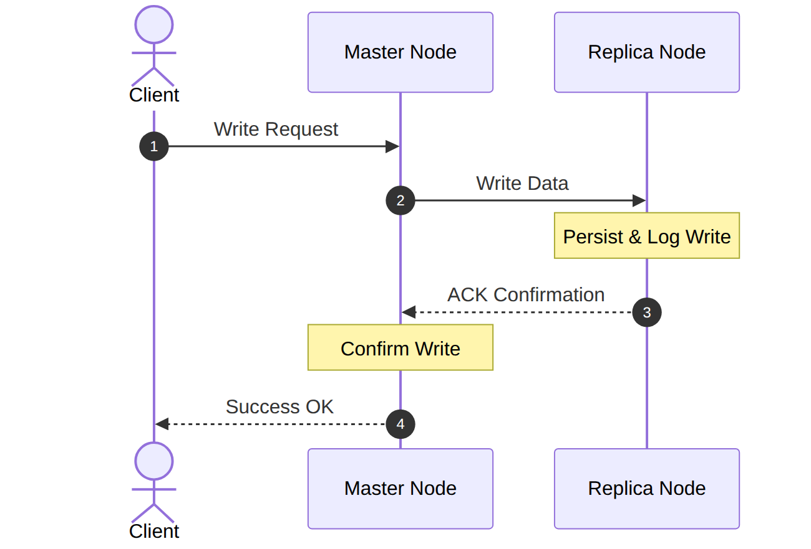

Synchronous replication provides the highest level of data safety because data is known to exist on multiple nodes before the write is confirmed. If the master fails immediately after acknowledging a write, that write exists on at least one replica and can be recovered.

However, synchronous replication impacts both **latency** and **availability**. Every write must wait for at least one replica round-trip before completion. In geographically distributed systems, this latency can be substantial. Additionally, if a replica is unavailable or slow, writes are blocked until the situation resolves, potentially causing timeouts and unavailability.

**Asynchronous replication** propagates changes in the background without waiting for replica confirmation. The master acknowledges the write immediately after persisting locally, and the replication to replicas happens later, typically through a dedicated replication thread or process.

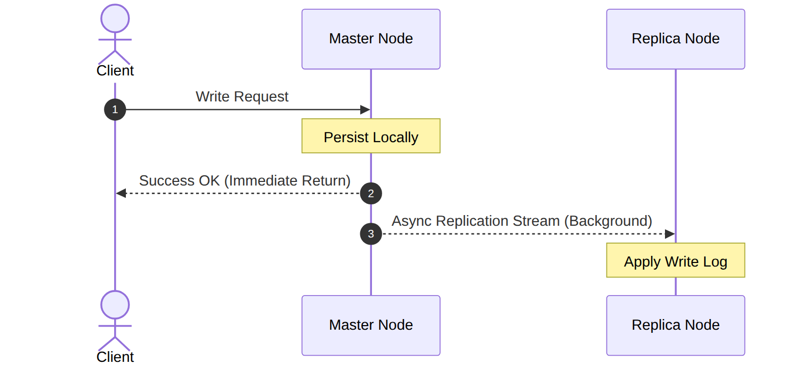

Asynchronous replication minimizes write latency because the master does not wait for replica confirmation. This approach enables higher write throughput and better performance, particularly in distributed systems where replicas are geographically distant.

The trade-off is **potential data loss**. If the master fails before replicating recent writes to any replica, those writes are lost. The window of vulnerability is the replication lag—the time between a write being acknowledged and that write being applied to replicas. This lag can range from milliseconds to minutes depending on system load, network conditions, and configuration.

**Semi-synchronous replication** offers a middle ground. In semi-synchronous mode, the master waits for at least one replica to acknowledge receipt of the write, but does not wait for the replica to fully apply (durable) the write. This provides a balance between the strong guarantees of synchronous replication and the performance of asynchronous replication.

Most production deployments use a combination of approaches. Synchronous replication might be used within a data center for zero data loss, while asynchronous replication handles cross-region replication where the latency of synchronous replication would be unacceptable.

### Replication Topologies

Beyond the leader-based replication discussed above, other topologies exist for specific use cases:

**Leaderless replication** eliminates the concept of a designated leader, allowing any node to accept reads and writes. Amazon DynamoDB and Apache Cassandra use leaderless replication. In these systems, clients write to any node, and changes are propagated to other nodes through a gossip protocol. Conflicts are resolved using quorum-based techniques (read from R nodes, write to W nodes, require W+R > N for strong reads).

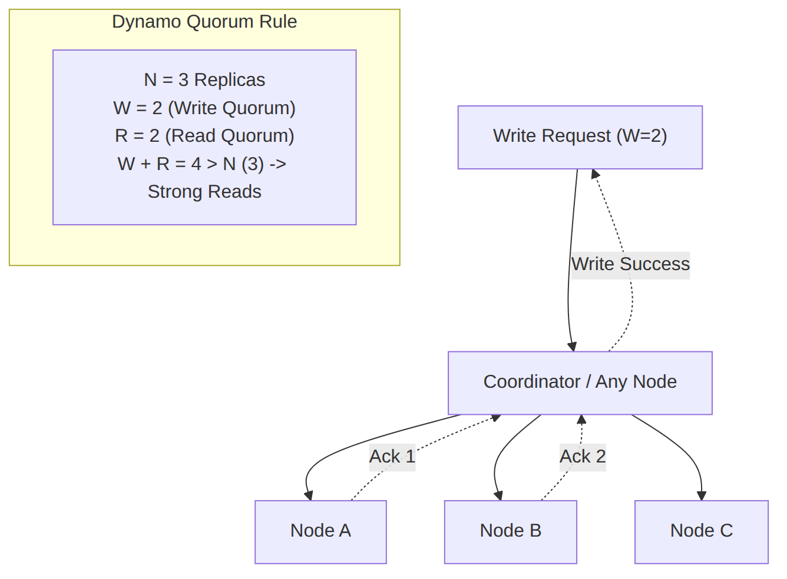

**Chain replication** organizes nodes in a chain, where the head accepts writes and the tail confirms durability. Writes flow through intermediate nodes but are not complete until reaching the tail. Chain replication provides strong consistency with good throughput and is used in systems like Microsoft's Copilot.

**Tree and hierarchical replication** organizes replicas in a tree structure, with the primary at the root and replicas as children. Changes flow from root to children, potentially through intermediate levels. This topology reduces load on the primary but can increase replication latency for distant leaves.

### Replication Lag and Its Implications

**Replication lag** is the time difference between when a write is committed on the master and when that write is applied on a replica. In asynchronous replication systems, some lag is inevitable—the replication process takes time to complete, and replicas may fall behind during periods of high write load or network congestion.

Replication lag has important implications for application behavior:

**Stale reads** occur when a read is served by a replica that has not yet applied the latest writes. The application may read outdated data, potentially making decisions based on information that is no longer current. This is particularly problematic for operations that depend on seeing previous writes.

**Read-after-write consistency** may be violated when a client writes data and then immediately reads it from a replica that has not yet received the write. The client may see the old value instead of the value they just wrote.

**Causal consistency** may be violated when operations have causal dependencies but replicas are not synchronized. For example, if operation B depends on the result of operation A, and B is read from a replica that has A but not the results of A's effects, the system appears inconsistent.

Mitigation strategies for replication lag include:

**Monitoring replication lag** provides visibility into how far behind replicas have fallen. Many databases expose metrics for replication lag that can be collected and alerting thresholds configured.

**Read-your-writes awareness** routes reads to the master or to replicas that are known to be caught up. Some applications track their own writes and ensure subsequent reads go to nodes that have applied those writes.

**Follower reads with causal awareness** use techniques like session tokens or vector clocks to route reads to replicas that have the necessary causal history.

**Minimum replica requirements** ensure that reads are only served from replicas that are within an acceptable lag threshold.

### Use Cases for Replication Patterns

**Relational Database Replication** uses master-slave replication to provide read scalability and high availability. MySQL, PostgreSQL, and other RDBMS support various replication configurations to meet different availability and performance requirements.

**NoSQL Database Replication** implements replication to ensure data durability and availability across commodity hardware. MongoDB's replica sets, Cassandra's tunable consistency, and DynamoDB's multi-region replication all address the replication challenge for document and key-value stores.

**File System Replication** maintains copies of file system data across multiple storage nodes. Distributed file systems like HDFS replicate data blocks across nodes to ensure data survives node failures and reads can be balanced across replicas.

**Object Storage Replication** replicates objects across regions for disaster recovery and low-latency access. Amazon S3's cross-region replication automatically replicates new objects to destination regions for compliance or performance reasons.

## 3. Availability in Numbers

Availability is quantified mathematically as a percentage of time a service remains fully functional and accessible. In system design, availability is measured by the number of **"9s"** it achieves—each "9" represents a significant digit in the availability percentage and corresponds to dramatically reduced allowed downtime.

Understanding availability calculations enables architects to make informed decisions about redundancy, failover, and investment in high-availability infrastructure. The mathematical relationship between availability percentages and allowed downtime is precise and often surprising to those encountering it for the first time.

### The Nines of Availability

The "nines" convention expresses availability as a series of percentages with increasing numbers of "9" digits. Each additional "9" represents an order of magnitude improvement in allowed downtime.

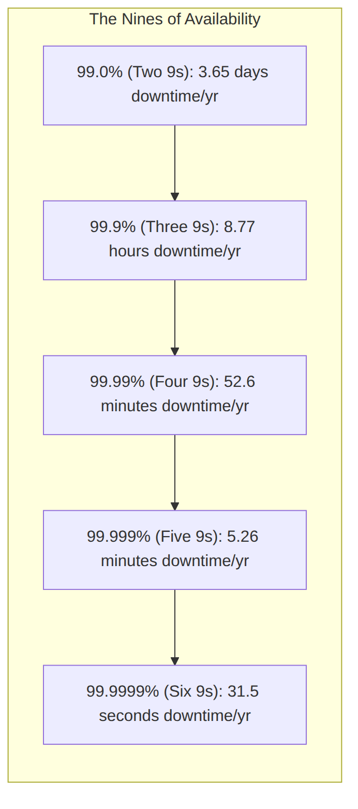

The following table provides a comprehensive breakdown of allowed downtime across various availability levels:

| **Availability Level** | **Downtime/Year** | **Downtime/Month** | **Downtime/Week** | **Downtime/Day** | **Typical Use Case** |
|---|---|---|---|---|---|
| 90% (One 9) | 36.5 days | 73 hours | 16.8 hours | 2.4 hours | Development, non-critical internal tools |
| 99% (Two 9s) | 3.65 days | 7.3 hours | 1.68 hours | 14.4 minutes | Basic commercial services, non-critical apps |
| 99.9% (Three 9s) | 8.77 hours | 43.8 minutes | 10.1 minutes | 1.44 minutes | Standard commercial services, most SaaS |
| 99.99% (Four 9s) | 52.6 minutes | 4.38 minutes | 1.01 minutes | 8.64 seconds | Enterprise services, SLA-backed products |
| 99.999% (Five 9s) | 5.26 minutes | 26.3 seconds | 6.05 seconds | 864 milliseconds | Telecom, financial trading, critical infrastructure |
| 99.9999% (Six 9s) | 31.5 seconds | 2.63 seconds | 0.6 seconds | 86.4 milliseconds |极少数系统，极端冗余 |

### Calculating Availability

The mathematical foundation of availability calculations enables precise predictions of system reliability based on component characteristics. Understanding these calculations is essential for designing systems that meet specific availability targets.

**Basic Availability Formula** expresses availability as the ratio of uptime to total time:

**MTBF and MTTR** provide a framework for understanding availability in terms of component reliability:

- **MTBF (Mean Time Between Failures)**: The average time a component operates before failing. Higher MTBF indicates better reliability.

- **MTTR (Mean Time To Repair)**: The average time required to repair a failed component and restore service. Lower MTTR indicates better recovery capabilities.

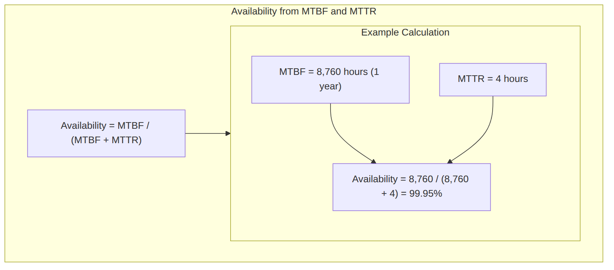

### Series and Parallel Availability

System availability depends critically on how components are connected. Two fundamental topologies—series and parallel—have dramatically different availability characteristics.

**Series Configuration** places components sequentially, where all components must be operational for the system to function. The system fails if any single component fails.

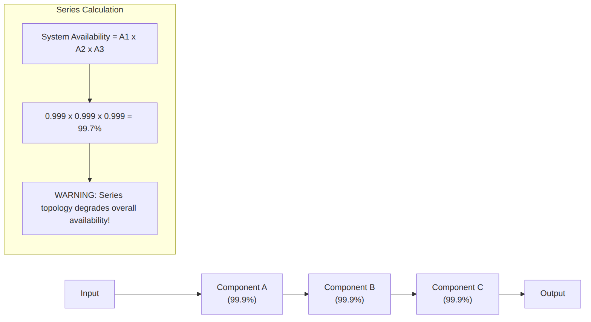

The formula for series availability is multiplicative:

This formula reveals a critical insight: **adding components in series reduces overall availability**. Each additional component introduces an additional failure point. Even highly reliable components degrade aggregate availability when placed in series.

**Parallel Configuration** places components redundantly, where the system remains operational if at least one component is operational.

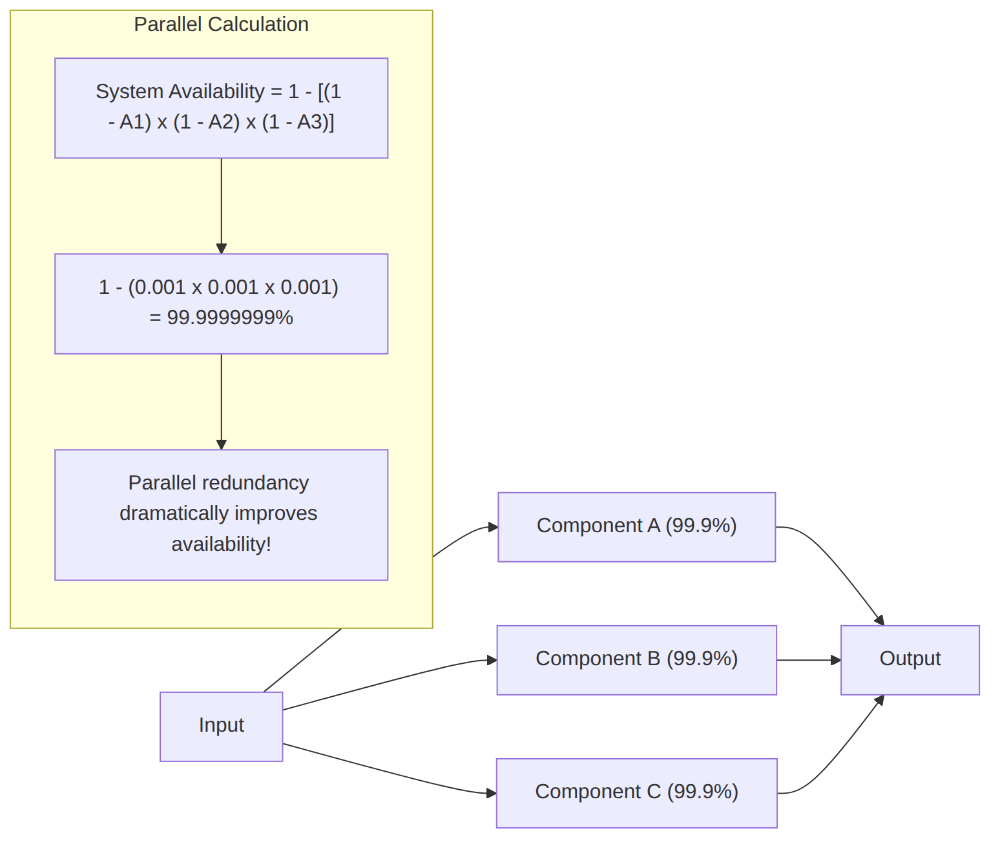

The formula for parallel availability uses the complement of failure probability:

For two parallel components with 99.9% availability each:

### Real-World Availability Calculations

Applying series and parallel calculations to realistic system architectures demonstrates how these formulas inform design decisions:

**Example 1: Simple Web Application**

Consider a web application with three tiers: load balancer (99.99%), application servers (99.9% × 2 in parallel), and database (99.99%):

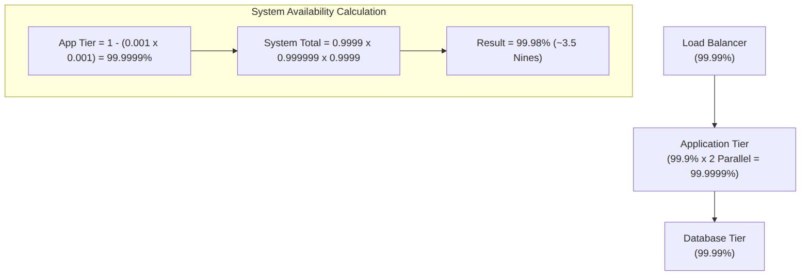

**Example 2: E-Commerce Platform**

A more complex e-commerce platform with multiple redundant components:

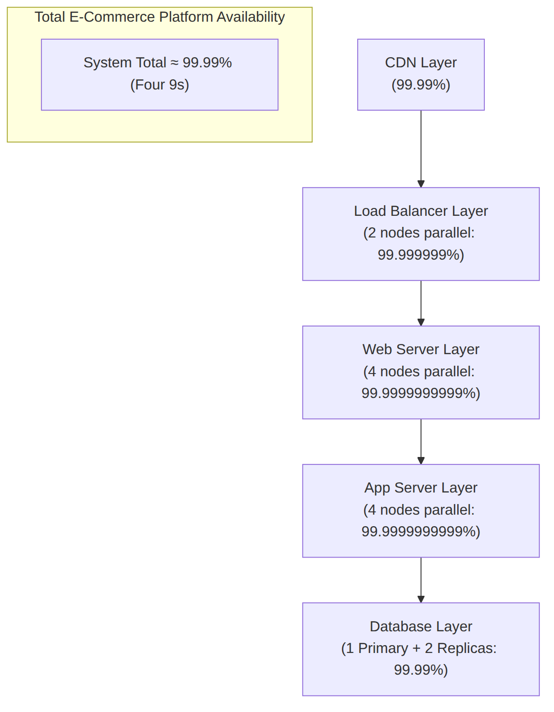

### Service Level Agreements (SLAs)

**Service Level Agreements (SLAs)** formalize availability commitments between service providers and customers. An SLA typically specifies the guaranteed availability level and the remedies (refunds, credits) if the provider fails to meet the commitment.

**SLA Components** typically include:

- **Availability Target**: The promised availability percentage (e.g., 99.9%)

- **Measurement Methodology**: How availability is calculated and measured (e.g., "measured as average across all 1-minute intervals in a month")

- **Exclusions**: Events not counted against availability (planned maintenance, force majeure, customer-caused issues)

- **Remedies**: What happens if the target is missed (service credits, refunds)

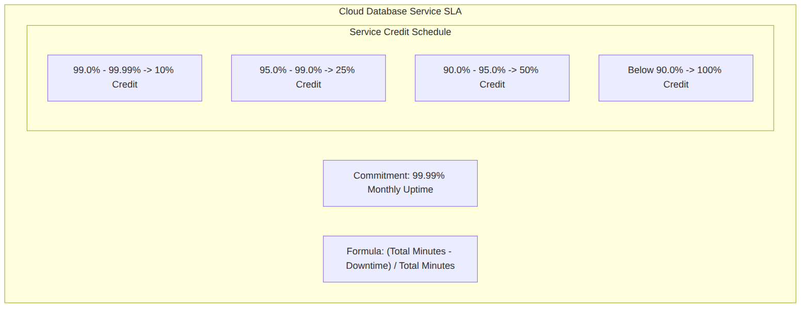

**Service Level Objectives (SLOs)** are internal targets that organizations set for themselves, often more stringent than SLAs to provide a buffer. SLOs drive internal engineering decisions about reliability investments.

**SLA Implications for Design**

Meeting a 99.99% SLA (about 52 minutes of allowed downtime per year) has specific implications:

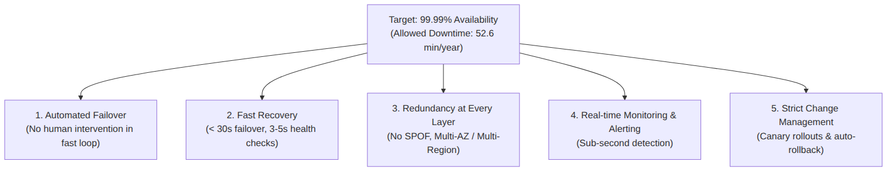

### Availability Anti-Patterns

Several common mistakes undermine availability goals:

**False Redundancy** occurs when components appear redundant but share hidden dependencies. For example, two database servers with separate CPUs but connected to the same storage array. If the storage array fails, both servers fail despite appearing redundant.

**Unbalanced Investment** happens when one component is over-engineered while a less reliable component remains a bottleneck. Availability is limited by the weakest link, so investment should be balanced across all components.

**Ignoring Cascading Failures** can occur when the failure of one component causes overload and failure of dependent components. Proper circuit breakers and load shedding protect against cascading failures.

**Neglecting Data Consistency** can undermine availability. A system that remains technically "available" but serves stale or inconsistent data is not truly meeting user needs. Availability must consider both accessibility and correctness.

### Achieving High Availability in Practice

Real-world high-availability systems employ multiple strategies simultaneously:

**Redundancy at Every Layer** ensures no single point of failure. Each component from the network edge to the storage layer should have backup capacity.

**Geographic Distribution** protects against site-wide disasters. Data and services replicated across multiple regions can survive the loss of an entire data center.

**Automated Operations** reduce human error and accelerate recovery. Automated failover, scaling, and healing respond faster than human operators and operate around the clock.

**Graceful Degradation** ensures core functionality continues when non-essential components fail. Systems should identify critical paths and protect them while allowing non-critical features to degrade.

**Continuous Monitoring** provides visibility into system health and early warning of problems. Monitoring should cover not just whether systems are up, but whether they are performing correctly.

**Chaos Engineering** proactively tests resilience by deliberately introducing failures in controlled environments. Netflix's Chaos Monkey and similar tools verify that redundancy works as designed.

## Interview Questions

**Q: What is the difference between active-passive and active-active failover?**

A: In active-passive failover, only the primary server handles traffic while the standby server remains idle (or processes minimal health monitoring). When the primary fails, the standby takes over. In active-active failover, all servers actively handle traffic simultaneously. Both configurations provide high availability but with different trade-offs: active-passive is simpler and uses resources less efficiently, while active-active provides better scalability but introduces complexity around bidirectional replication and conflict resolution.

**Q: How would you calculate the availability of a system with three components in series, each with 99.9% availability?**

A: For components in series, availability multiplies: 0.999 × 0.999 × 0.999 = 0.997, or 99.7%. This demonstrates a key principle: adding components in series reduces overall availability. Even with highly reliable individual components, a series chain of components will have lower availability than any individual component.

**Q: What are the trade-offs between synchronous and asynchronous replication?**

A: Synchronous replication provides stronger guarantees—data exists on multiple nodes before acknowledgment—but adds latency (waiting for replica confirmation) and can reduce availability (if replicas are slow or unavailable). Asynchronous replication has lower latency and doesn't block on replicas, but risks data loss if the primary fails before replication completes. Most production systems use a combination, such as synchronous replication within a data center and asynchronous across regions.

**Q: How does replication lag affect application behavior?**

A: Replication lag causes replicas to return stale data. This can violate read-after-write consistency (a user writes data, then reads it and sees old values), lead to incorrect decisions based on outdated information, and cause inconsistent behavior across users reading from different replicas. Applications using replicated databases must be designed with lag awareness, either by routing critical reads to the primary or by accepting and handling potential staleness.

**Q: What does "five nines" availability mean, and what does it require to achieve?**

A: Five nines (99.999%) means approximately 5.26 minutes of allowed downtime per year. Achieving this requires near-automated everything: automated failover (no manual intervention can be fast enough), automated healing (detecting and recovering from failures without human involvement), extensive redundancy (multiple components at every layer), geographic distribution (surviving site failures), and rigorous change management (preventing failures from changes). Even with all these measures, five nines is extremely difficult and expensive to achieve.

## Summary and Key Takeaways

Availability patterns form an essential part of distributed system design, addressing the fundamental reality that failures will occur. The key concepts covered in this document are:

**Failover Patterns** provide automatic switching between primary and backup components when failures occur. Active-passive failover offers simplicity with one active node and one standby, while active-active failover provides better resource utilization with all nodes handling traffic but introduces conflict resolution complexity.

**Replication Patterns** ensure data availability by maintaining multiple copies across nodes. Master-slave replication provides read scalability with a single write master, while master-master replication enables write distribution at the cost of conflict complexity. Synchronous replication offers stronger guarantees at the cost of latency, while asynchronous replication prioritizes performance but risks data loss.

**Availability Calculations** quantify system reliability using the "nines" convention. Understanding series vs. parallel availability is critical: series reduces availability while parallel increases it. The mathematical formulas enable precise prediction of system availability based on component characteristics.

**Practical Implementation** requires balanced redundancy at every layer, automated operations, geographic distribution, continuous monitoring, and graceful degradation strategies. Achieving high availability targets like five nines requires investment proportional to the business value of uptime.

The relationship between availability and other system properties—consistency (CAP theorem), performance (latency vs. correctness trade-offs), and cost (80/20 rule application)—must be considered holistically. Availability does not exist in isolation but as part of a system-wide design that balances multiple competing concerns.

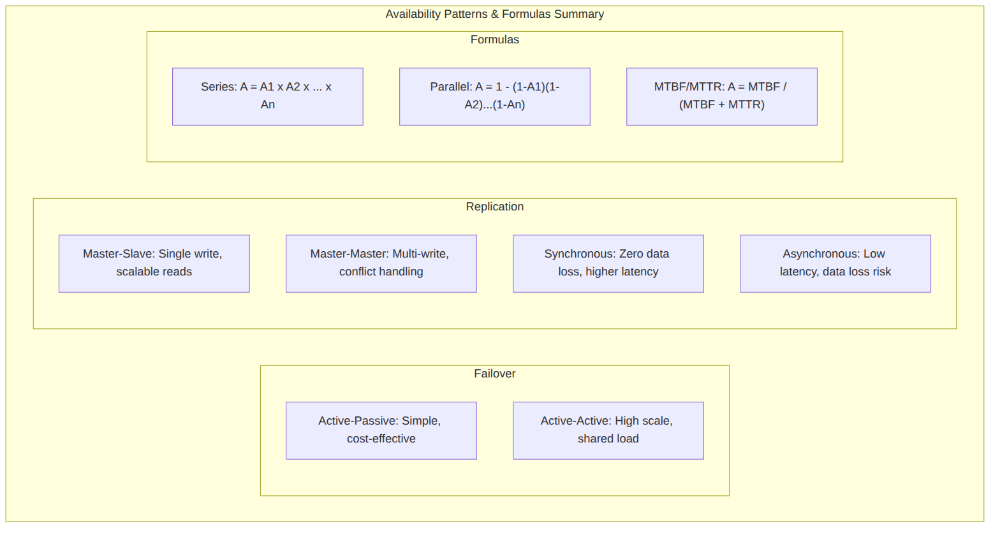
