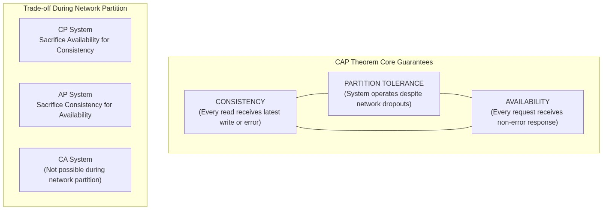
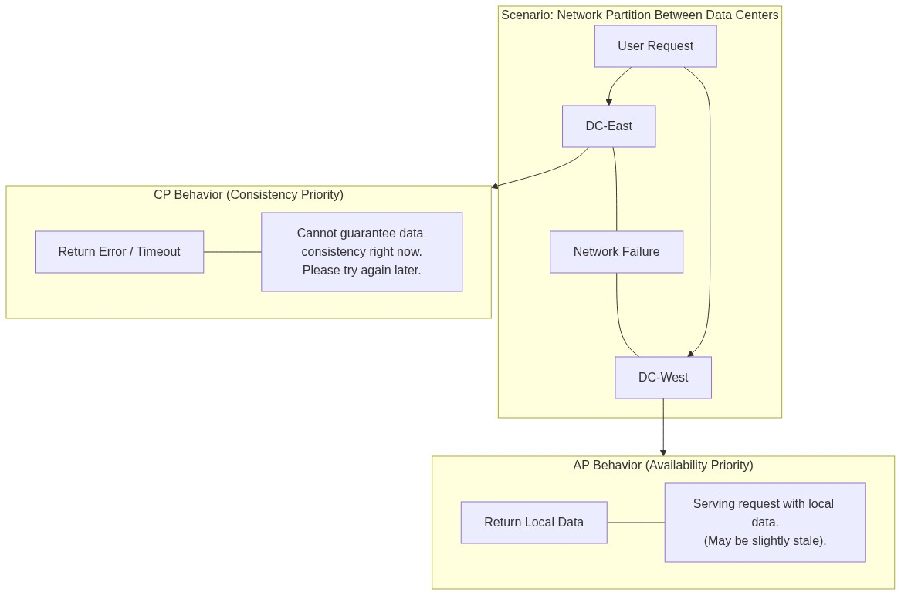
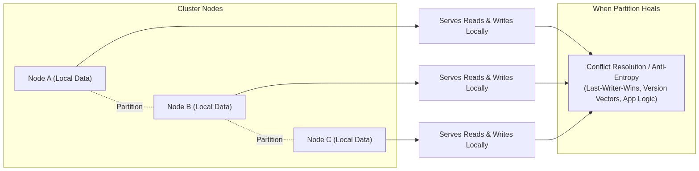
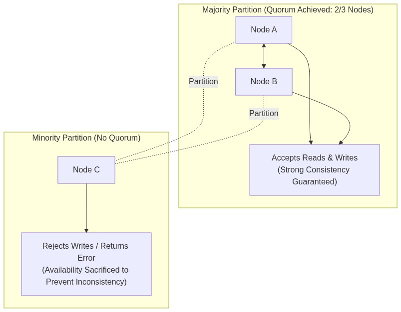
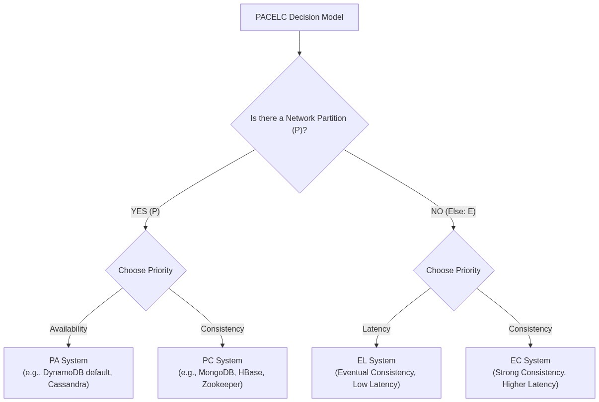
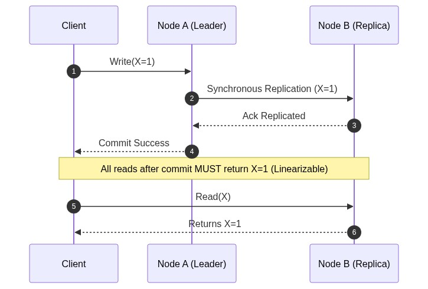
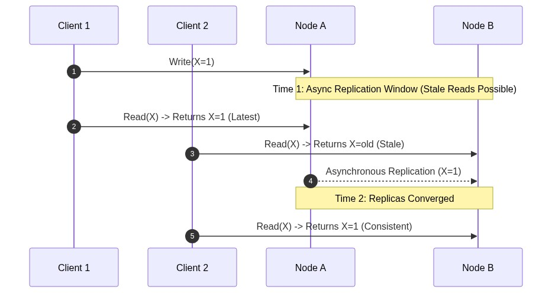
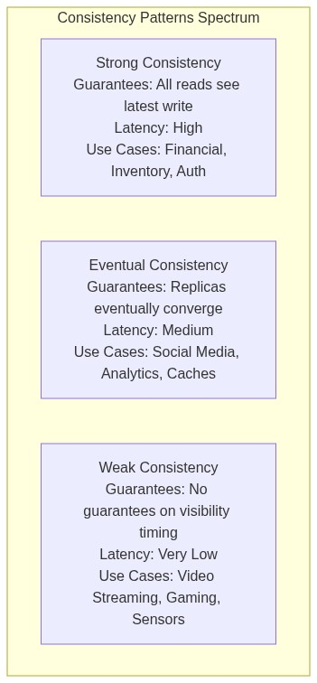
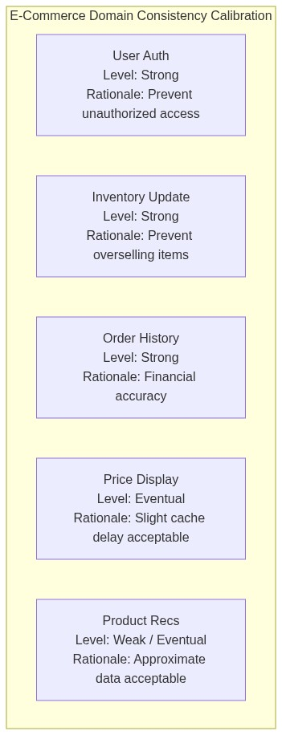

# Availability vs Consistency

## Understanding the Fundamental Trade-off

Availability and consistency represent two critical properties of distributed systems, and understanding their relationship is fundamental to designing robust, scalable architectures. The CAP Theorem, formulated by computer scientist Eric Brewer in 2000, formally describes the constraint that every distributed data store must make: when network partitions occur, you must choose between providing consistent responses or remaining available to serve all requests.

This trade-off is not merely theoretical—it has profound practical implications for system design. Every architectural decision you make about data storage, service communication, and failure handling ultimately reflects a choice about where you stand on the availability-consistency spectrum. Understanding these choices, their implications, and how to make them deliberately is essential for building systems that meet real-world requirements.

The CAP Theorem does not say you can have consistency and availability simultaneously during a partition. It says you must choose. But it does not say you must choose all the time. When the network is healthy and partitions are not occurring, you can have both consistency and availability. The theorem only constrains behavior during partitions, which are inevitable in distributed systems. Understanding this nuance is crucial for making appropriate design decisions.

---

## The CAP Theorem: Formal Foundation

### The Three Guarantees

The CAP Theorem proposes that a distributed data store can provide only two of the following three guarantees simultaneously. Understanding each guarantee is essential for reasoning about distributed system design.

**Consistency** means that every read receives the most recent write or an error. In a consistent system, all nodes see the same data at the same time. If you write a value and then immediately read it, you will get the written value back—or an error indicating the write did not succeed. This property is also known as linearizability, and it ensures that the system behaves as if there were a single copy of the data, even though there may be multiple replicas.

**Availability** means that every request receives a non-error response, even if some nodes in the system are down. An available system continues to process requests even when some of its components have failed. The response may not contain the most recent write (if consistency was sacrificed), but the system remains operational and responsive.

**Partition Tolerance** means the system continues to operate despite network partitions that prevent communication between nodes. Network partitions are inevitable in distributed systems—they occur when network links fail, routers malfunction, or data centers lose connectivity. A partition-tolerant system can detect partitions and handle them gracefully.

### Why Partitions Are Inevitable

The CAP Theorem's significance comes from the reality that network partitions are not edge cases to be ignored—they are normal occurrences in distributed systems. Networks fail. Links go down. Routers malfunction. Data centers lose connectivity. The question is not whether partitions will occur but how your system will behave when they do.

Given that partitions are inevitable, the practical implication of CAP is that you must choose between consistency and availability during partition events. You cannot build a system that is both consistent and available during partitions without sacrificing partition tolerance, which is not viable for any distributed system that spans multiple network segments.

This choice is fundamental and persists across all scales of distributed systems. Whether you are building a global e-commerce platform, a microservices-based application, or a simple replicated database, you are making CAP trade-offs implicitly. The goal is to make these trade-offs explicitly and appropriately for your system's requirements.

### The Two Legitimate Choices

During a network partition, you have only two viable options:

**Consistency over Availability (CP Systems)**: When a partition occurs, the system refuses to respond to requests that might return stale or conflicting data. Instead, it returns errors or timeouts until the partition heals and consistency can be guaranteed. This choice prioritizes correctness over availability.

**Availability over Consistency (AP Systems)**: When a partition occurs, the system continues to serve requests using locally available data, even if that data might be stale or conflicting with other replicas. This choice prioritizes continued operation over strict consistency.

---

## 80/20 Context: Why This Matters

Applying the **80/20 Rule**, understanding CAP and consistency patterns will help you make approximately 80% of the distributed systems design decisions correctly. The remaining 20% involves deep specialization in particular consistency models and database internals.

The practical implications of CAP are profound. Most engineers interact with CAP trade-offs daily without recognizing them. When you choose PostgreSQL over Cassandra, you are choosing CP over AP. When you use Redis for caching, you are choosing availability over consistency for cached data. When you configure your microservices to use eventual consistency for analytics but strong consistency for payments, you are making conscious CAP trade-offs.

Understanding CAP also helps you evaluate database and infrastructure choices more effectively. Rather than accepting marketing claims at face value, you can reason about what trade-offs a system actually makes and whether those trade-offs align with your requirements. This analytical capability is essential for making sound architectural decisions.

---

## AP Systems: Availability Over Consistency

AP systems prioritize availability during network partitions, continuing to serve requests using locally available data. This choice is appropriate for systems where continued operation is more important than strict consistency, or where temporary inconsistency is acceptable to users.

### How AP Systems Work

AP systems maintain availability during partitions by allowing replicas to diverge. Each partition continues to serve reads and writes using its local data, accepting that other partitions may have different values. When the partition heals, the system must reconcile the divergent states—a process called conflict resolution or anti-entropy.

The key mechanism enabling AP systems to continue during partitions is the use of eventually consistent data structures and conflict resolution algorithms. Rather than enforcing strict consistency, AP systems use techniques like version vectors, vector clocks, or last-writer-wins to handle concurrent updates and detect conflicts.

### Conflict Resolution Strategies

AP systems must handle the reality that concurrent updates to the same data on different partitions will create conflicts when the partition heals. Several strategies exist for handling these conflicts.

**Last-Writer-Wins (LWW)** resolves conflicts by selecting the update with the most recent timestamp as the "correct" value. This strategy is simple and provides deterministic resolution, but it can cause data loss if wall clocks are not synchronized, and it discards intermediate updates.

**Version Vectors** track the history of updates across replicas, allowing applications to detect conflicting updates and resolve them programmatically. This strategy provides more flexibility than LWW but requires application-level conflict resolution logic.

**Application-Defined Resolution** allows the application to define how conflicts should be resolved based on domain-specific knowledge. For example, a shopping cart application might merge carts rather than overwriting one with another.

### Real-World AP Systems

**Amazon DynamoDB** (in its original design) is an AP system that prioritizes availability and eventual consistency. DynamoDB allows configurable consistency—applications can choose between strongly consistent reads (which may be unavailable during partitions) and eventually consistent reads (which are always available). This design prioritizes availability for most operations while allowing applications that need strong consistency to opt in.

**Apache Cassandra** is designed as an AP system with tunable consistency. By default, Cassandra uses eventual consistency with quorum-based reads and writes for configurable trade-offs between consistency and availability. Cassandra's wide-column store design and gossip protocol for node coordination are explicitly designed for AP operation.

**DNS** is a classic AP system. When DNS servers cannot communicate, they continue to serve cached responses rather than returning errors. This design ensures that internet connectivity remains functional even during DNS system failures, at the cost of potentially serving stale DNS records until caches expire or synchronize.

### When to Choose AP

AP systems are appropriate when continued operation is more important than strict consistency. Consider AP when users expect the system to always be available, temporary inconsistency is tolerable, and the cost of errors or unavailability exceeds the cost of occasional stale data.

Use cases favoring AP include social media feeds, shopping carts, analytics dashboards, messaging systems, and collaborative tools where users can tolerate seeing slightly outdated information. AP is also appropriate for systems spanning unreliable networks where partitions are frequent.

---

## CP Systems: Consistency Over Availability

CP systems prioritize consistency during network partitions, refusing to serve requests that might return stale or conflicting data. This choice is appropriate for systems where correctness is paramount and temporary unavailability is acceptable.

### How CP Systems Work

CP systems maintain consistency by detecting partitions and taking action to prevent inconsistent responses. The most common approach is to shut down non-quorum nodes, ensuring that only a partition with enough nodes to form a majority continues to serve requests. This sacrifice of availability for some clients ensures that the remaining clients receive consistent data.

The key mechanism enabling CP systems to maintain consistency is quorum-based replication. Writes must be acknowledged by a majority of replicas before being considered committed. During a partition, only the partition with a quorum can accept writes, ensuring that no two partitions can accept conflicting writes simultaneously.

### Quorum and Consensus

CP systems rely on quorum-based protocols to maintain consistency. A quorum is a majority of nodes—for a system with N nodes, a quorum requires at least \(\lfloor N/2 \rfloor + 1\) nodes (strictly more than \(N/2\)). By requiring writes to be acknowledged by a quorum before being considered committed, CP systems ensure that conflicting writes cannot both succeed.

**Raft** is a consensus algorithm used by many CP systems for leader election and log replication. Raft ensures that only one node at a time can be the leader, that writes are replicated to a quorum before being applied, and that the system remains consistent even during node failures.

**Paxos** is another consensus algorithm, more complex than Raft but providing the same guarantees. Paxos uses a two-phase protocol to achieve consensus across a distributed system, ensuring that all non-failed nodes agree on the same value.

### Real-World CP Systems

**Google Spanner** is a globally distributed CP database that provides strong consistency through the use of TrueTime and Paxos consensus. Spanner's design prioritizes consistency even across wide-area replication, accepting higher latency in exchange for strong consistency guarantees.

**MongoDB** (with default configuration) is a CP system that uses replica sets with primary election. When a partition occurs, MongoDB ensures that only the partition containing the primary can accept writes, maintaining consistency at the cost of availability for clients connected to non-primary partitions.

**ZooKeeper** (Apache ZooKeeper) is a coordination service designed as a CP system. ZooKeeper uses Zab (ZooKeeper Atomic Broadcast), a consensus protocol, to ensure that all nodes see the same state. Applications using ZooKeeper for leader election or distributed locking can rely on consistent state.

### When to Choose CP

CP systems are appropriate when correctness is more important than availability. Consider CP when stale data could cause serious problems, when the cost of inconsistency exceeds the cost of unavailability, and when your application can tolerate temporary unavailability.

Use cases favoring CP include financial systems, inventory management, authentication services, and any system where incorrect data could lead to serious consequences. CP is also appropriate for systems where availability can be selectively sacrificed—sacrificing availability for some operations while maintaining availability for others through careful design.

---

## PACELC: Extending CAP

The PACELC model extends CAP to address a limitation: CAP only describes behavior during partitions, but trade-offs also exist during normal operation. PACELC states that if there is a partition (P), the system must choose between availability (A) and consistency (C). Else (E), when the system is operating normally, the system must choose between latency (L) and consistency (C).

### The PACELC Trade-off

This extension recognizes that the consistency-latency trade-off exists even in the absence of partitions. Strong consistency requires coordination between nodes, which introduces latency. Eventual consistency allows nodes to operate independently, reducing latency but accepting temporary inconsistency.

### PACELC in Practice

Different systems make different PACELC trade-offs, and understanding these choices helps evaluate database and infrastructure options.

**DynamoDB** prioritizes availability and low latency over consistency, making it a **PA/EL** (If Partition: Availability, Else: Latency) system by default for most operations. This choice enables fast, predictable response times at the cost of allowing brief windows of inconsistency.

**CockroachDB** prioritizes consistency over availability during partitions and over latency during normal operations, making it a **PC/EC** (If Partition: Consistency, Else: Consistency) system. CockroachDB uses distributed transactions with Raft consensus, accepting higher latency to provide strong consistency across geographic regions.

**Cassandra** provides tunable options, allowing operators to choose between **PC/EC** (high consistency, higher latency) and **PA/EL** (eventual consistency, lower latency) depending on the workload and consistency requirements.

---

## Consistency Patterns

Beyond the binary CAP choice, systems implement various consistency patterns that represent different points on the consistency spectrum. Understanding these patterns helps design systems that provide appropriate consistency guarantees for each use case.

### Strong Consistency

Strong consistency guarantees that after a write completes, all subsequent reads will see that write. The system behaves as if there is only a single copy of the data. Strong consistency is also called linearizability or sequential consistency, and it provides the strongest guarantees about data state.

**When to use strong consistency**: Financial transactions, inventory management, authentication systems, any use case where incorrect data could cause serious problems. Strong consistency is also necessary when operations depend on each other—for example, when you write data and then read it in the same request.

**Implementation mechanisms**: Two-phase commit, distributed locking, consensus protocols (Raft, Paxos), synchronous replication.

### Eventual Consistency

Eventual consistency guarantees that if no new updates are made to an object, all replicas will eventually return the same value. The system will converge to a consistent state given enough time without new writes. Eventual consistency accepts that reads may return stale data during the convergence window.

**When to use eventual consistency**: Social media feeds, product catalogs, analytics dashboards, any use case where temporary inconsistency is tolerable and high availability is important. Eventual consistency is appropriate when the cost of unavailability exceeds the cost of stale data.

**Implementation mechanisms**: Asynchronous replication, gossip protocols, anti-entropy, version vectors, CRDTs (Conflict-free Replicated Data Types).

### Weak Consistency

Weak consistency provides minimal guarantees about when updates become visible. Reads may see updates immediately, after some time, or possibly never. The system provides no guarantee about consistency, making it suitable only for specific use cases where approximate correctness is acceptable.

**When to use weak consistency**: Real-time gaming, video streaming, sensor data, any use case where approximate data is acceptable and extremely low latency is required. Weak consistency is rarely used for business data but is appropriate for streaming and real-time applications.

**Implementation mechanisms**: UDP-based protocols, fire-and-forget messaging, best-effort delivery.

### Comparison Table

---

## Consistency in Practice: Designing for Your Requirements

### The Right Consistency for Each Use Case

Most systems need different consistency levels for different operations. A shopping application might need strong consistency for inventory updates (to prevent overselling) but can tolerate eventual consistency for product recommendations (where stale data is acceptable).

Designing for appropriate consistency means matching consistency guarantees to the semantic requirements of each operation. This approach, sometimes called "calibrated consistency," balances the need for correctness against the cost of strong consistency in latency and availability.

### Designing for Failure

Designing for CAP means designing for failure. Since partitions are inevitable, you must decide how your system will behave when partitions occur.

**Design questions to answer**:

1. Which operations require strong consistency? Which can tolerate eventual consistency?
2. What happens to users when the system cannot provide strong consistency?
3. How will conflicting updates be resolved when the partition heals?
4. How will users be informed when their data may be stale?

**Recovery procedures to define**:

1. How will the system detect partition healing?
2. How will divergent replicas be reconciled?
3. What happens to writes that occurred during the partition?
4. How will users be informed of any data inconsistencies?

---

## Real-World Case Studies

### Case Study: Amazon DynamoDB

Amazon DynamoDB was designed explicitly around the CAP theorem, choosing availability and partition tolerance while providing eventual consistency by default. DynamoDB's design decisions reflect careful consideration of its use cases.

**Design choices**:

- **AP by default**: DynamoDB prioritizes availability, accepting that reads may occasionally return stale data during unusual conditions.
- **Tunable consistency**: Applications can choose strong consistency for operations requiring it, accepting potentially higher latency and reduced availability.
- **Built-in partition handling**: DynamoDB handles network partitions automatically, distributing data across multiple partitions and continuing to serve requests even when some partitions are unavailable.
- **Global tables**: For globally distributed applications, DynamoDB Global Tables provide multi-region replication with configurable consistency.

**Trade-offs accepted**: DynamoDB accepts that during rare edge cases involving very recent writes and specific failure patterns, some reads may return older data than the absolute latest write. In exchange, it provides consistent performance and high availability regardless of scale.

### Case Study: Banking System

A banking system requires strong consistency for financial transactions to prevent double-spending and ensure accurate balances. This is a clear case for CP design.

**Design choices**:

- **Strong consistency required**: Account balances must be accurate; a stale read could lead to overdrafts or incorrect transactions.
- **Partition handling**: During a partition, certain operations become unavailable. Users cannot transfer money between accounts on different partitions, but they can still view their balance on the local partition.
- **Audit trail**: Every transaction is logged with timestamps and identifiers, enabling reconciliation after partition healing.
- **Idempotency**: All transactions are idempotent, allowing safe retries during network issues.

**Trade-offs accepted**: During network partitions, some banking operations become unavailable. A customer might not be able to transfer money to an account on another partition, but their local account remains accessible and their balance remains accurate.

### Case Study: Social Media Platform

A social media platform prioritizes availability and low latency, tolerating eventual consistency for most operations. This is a clear case for AP design.

**Design choices**:

- **Eventual consistency for posts**: When a user posts content, the content may take a few seconds to propagate to all followers' feeds. Users may occasionally see slightly out-of-order posts.
- **Strong consistency for messaging**: Direct messages between users require strong consistency to prevent message loss or duplication.
- **Conflict resolution**: When concurrent edits occur (e.g., two users editing the same document), the system uses last-writer-wins or merges changes.
- **Graceful degradation**: During high load or partial failures, the platform prioritizes continued operation over strict consistency.

**Trade-offs accepted**: During peak load, some recent posts might not appear immediately in all feeds. The platform accepts this trade-off to maintain high availability and low latency for all users.

---

## Interview Questions and Answers

### Q1: Explain the CAP Theorem in your own words.

**Answer Framework**: The CAP Theorem states that a distributed system can provide only two of three guarantees: Consistency (all nodes see the same data at the same time), Availability (every request receives a response), and Partition Tolerance (the system continues operating despite network failures). Since network partitions are inevitable in distributed systems, the practical choice is between Consistency and Availability during partitions. A CP system sacrifices availability to maintain consistency; an AP system sacrifices consistency to maintain availability. Emphasize that partitions are not exceptional—they are normal occurrences that must be handled.

### Q2: When would you choose CP over AP?

**Answer Framework**: Choose CP when consistency is more important than availability for your use case. This includes financial systems where incorrect data could cause serious problems, inventory management to prevent overselling, authentication systems, and any system where stale reads could lead to incorrect decisions. Also choose CP when your application can tolerate temporary unavailability—many operations can fail gracefully while critical operations succeed. Examples include banking systems, payment processors, and inventory systems.

### Q3: How does eventual consistency work?

**Answer Framework**: Eventual consistency guarantees that if no new updates are made to an object, all replicas will eventually converge to the same value. During normal operation, updates are replicated asynchronously to other nodes. During this propagation window, reads may return stale data. When updates are infrequent or the window is short, eventual consistency provides good user experience with low latency and high availability. Emphasize that "eventually" can range from milliseconds to minutes depending on the system and network conditions.

### Q4: What is the difference between strong consistency and eventual consistency?

**Answer Framework**: Strong consistency guarantees that after a write completes, all subsequent reads will see that write—the system behaves as if there is only one copy of the data. Eventual consistency guarantees that all replicas will eventually converge if no new updates occur, but reads may return stale data during the convergence window. Strong consistency requires coordination between nodes, introducing latency and potentially reducing availability during partitions. Eventual consistency allows nodes to operate more independently, reducing latency and increasing availability but accepting temporary inconsistency.

### Q5: How would you design a system that needs strong consistency for some operations but eventual consistency for others?

**Answer Framework**: Different operations have different consistency requirements. Identify which operations require strong consistency (typically operations involving critical state changes, financial transactions, or operations that depend on each other). These operations should use synchronous replication, quorum-based reads/writes, or distributed transactions. Operations that can tolerate stale data (displaying cached content, analytics, recommendations) can use asynchronous replication and eventual consistency. Some systems support tunable consistency at the operation level (like DynamoDB's strongly consistent reads) to enable this flexibility. The key is to be deliberate about which consistency level each operation requires and implement accordingly.

---

## Common Pitfalls and Anti-Patterns

### Ignoring Consistency Requirements

One common mistake is not thinking carefully about consistency requirements before choosing a database or architecture. Engineers sometimes choose a system for its scalability characteristics without understanding its consistency model, leading to subtle bugs where the application assumes stronger consistency than the system provides.

### Over-Engineering Consistency

Another common mistake is requiring strong consistency for operations that do not need it. Strong consistency has costs: higher latency, potentially lower availability, and more complex implementation. Many operations can tolerate eventual consistency, and forcing strong consistency where it is not needed adds unnecessary cost and complexity.

### Not Planning for Partition Scenarios

Systems should be designed to handle partitions deliberately, not accidentally. Without explicit planning, systems may exhibit undefined behavior during partitions—serving stale data without the application's knowledge, accepting writes that cannot be replicated, or losing data silently. Explicit partition handling ensures predictable behavior.

### Assuming Eventual Consistency Is Always Safe

Eventual consistency is not appropriate for all use cases. Applications that assume eventual consistency will always converge quickly may exhibit subtle bugs when convergence takes longer than expected. Applications that assume conflicting updates will never occur may lose data. Understanding the specific eventual consistency guarantees of your system is essential.

---

## Key Takeaways

**The CAP Theorem is fundamental**: A distributed system can provide only two of three guarantees: Consistency, Availability, and Partition Tolerance. Since partitions are inevitable, you must choose between Consistency and Availability during partition events.

**CP systems sacrifice availability for consistency**: During partitions, CP systems refuse to serve requests rather than risk returning stale data. CP is appropriate for systems where correctness is paramount and temporary unavailability is acceptable.

**AP systems sacrifice consistency for availability**: During partitions, AP systems continue serving requests using locally available data, accepting that the data might be stale. AP is appropriate for systems where continued operation is more important than strict consistency.

**PACELC extends CAP**: Beyond partitions, there is a latency-consistency trade-off. Strong consistency requires coordination, which introduces latency. This trade-off exists even when the network is healthy.

**Consistency is a spectrum**: Strong consistency, eventual consistency, and weak consistency represent different points on the consistency-availability-latency spectrum. Choose the consistency level appropriate for each operation.

**Different operations need different consistency**: Most systems need strong consistency for some operations and eventual consistency for others. Design for appropriate consistency at the operation level.

**Design for failure**: Since partitions are inevitable, design explicitly for how your system will behave during partitions. Decide which operations to fail, which to allow with potentially stale data, and how to reconcile divergent states when the partition heals.

---

## Actionable Next Steps

### Immediate Actions (Next 24 Hours)

1. **[30 minutes]** Identify three operations in your current system. Classify each as requiring strong consistency, eventual consistency, or weak consistency. Be prepared to explain your reasoning.

2. **[20 minutes]** Review your system's chosen databases and data stores. Which are CP systems? Which are AP systems? Do these choices align with your consistency requirements?

3. **[25 minutes]** Identify what happens in your system during a network partition. Which operations fail? Which continue? Is this behavior intentional?

4. **[15 minutes]** Review how conflicting updates are handled in your system. Is the conflict resolution strategy appropriate for your use case?

### Understanding Exercises

1. **[45 minutes]** Design a simple shopping cart system that uses eventual consistency. How would you handle conflicts? How would you inform users of any inconsistencies?

2. **[30 minutes]** Research a real-world outage caused by a consistency-related failure. What went wrong? How could it have been prevented?

3. **[20 minutes]** Explain to a non-technical stakeholder why their feature cannot have both strong consistency and five-nines availability during network partitions.

### Deep-Dive Topics (If Time Permits)

- **Consensus Algorithms**: Raft and Paxos internals
- **CRDTs**: Conflict-free replicated data types for AP systems
- **Distributed Transactions**: Two-phase commit and saga patterns
- **Tunable Consistency**: How databases like DynamoDB and Cassandra provide configurable consistency
- **Consistency Models**: Linearizability, sequential consistency, causal consistency

---

> **Final Thought**: The availability-consistency trade-off is not a problem to be solved but a constraint to be navigated. Every distributed system makes these trade-offs, often without explicit acknowledgment. By understanding CAP, PACELC, and the spectrum of consistency patterns, you can make deliberate choices that align with your system's requirements. The goal is not to achieve both availability and consistency (which is impossible during partitions) but to understand the trade-offs you are making and design accordingly. This understanding is fundamental to building distributed systems that are both robust and appropriate for their use cases.
