# Background Jobs in Distributed Systems

## Overview

**Background jobs** are tasks executed independently of the main, user-facing execution flow of a system. Instead of forcing a user or the main thread to wait for a task to finish, these operations run asynchronously in the background, allowing the primary application to remain responsive and available for other requests. Background jobs form a critical component of modern distributed systems architecture, enabling applications to handle workloads that would otherwise block user requests or exceed acceptable response time thresholds.

The fundamental principle behind background jobs is **separation of concerns and time**. Long-running operations, resource-intensive computations, and operations that don't require immediate user feedback should not be executed within the synchronous request-response cycle. By moving these operations to background processes, applications can maintain low latency for interactive requests while still completing necessary work.

Applying the **80/20 Rule** to background jobs means recognizing that approximately 80% of computational work in most applications doesn't require immediate execution. Report generation, email sending, data aggregation, and batch processing can all run asynchronously without impacting user experience. The remaining 20%—critical path operations that users await—should execute synchronously for immediate feedback.

Background jobs interact deeply with other system design concepts. They complement **availability patterns** by ensuring that background processing can continue even if some worker nodes fail. They work with **caching patterns** by handling cache warming and invalidation. They enable **microservices architectures** by providing asynchronous communication between services. And they relate to **consistency patterns** by affecting when data changes become visible across the system.

## Why Background Jobs Matter

Modern web applications face constant pressure to deliver fast, responsive user experiences. A user submitting a form shouldn't wait 30 seconds while the system generates a PDF report, sends notification emails, and updates analytics dashboards. These operations can—and should—happen asynchronously while the user receives immediate confirmation that their request was accepted.

The benefits extend beyond user experience. Background jobs enable **temporal decoupling**, where the producer of work (the application code that initiates a job) doesn't need to be available when the job actually executes. This separation provides fault tolerance—if a worker node fails, jobs remain queued and will be processed by other workers. It also enables **load leveling**, smoothing out traffic spikes by processing work at a rate the system can sustain.

Consider an e-commerce platform processing orders. When a customer places an order, the synchronous flow should capture the order, confirm payment, and display confirmation. The asynchronous flows—which can happen in the background—inventory decrement, warehouse notification, shipping label generation, email confirmations, recommendation engine updates, and analytics tracking. This architecture enables the platform to handle thousands of concurrent orders while maintaining sub-second response times.

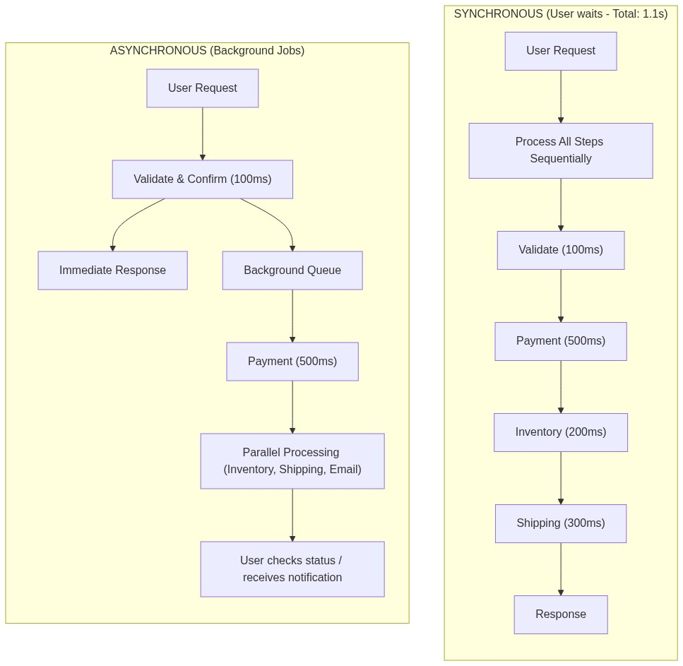

## Typical Use Cases for Background Jobs

Understanding the breadth of background job applications helps identify opportunities in your own systems. Background jobs serve numerous purposes across different domains.

**Maintenance and Housekeeping Tasks** keep systems healthy over time. These include cleaning up expired sessions and temporary data, rotating log files before disk space is exhausted, archiving old records to cheaper storage, rebuilding search indexes to reflect recent changes, and generating periodic system health reports. These tasks are essential for system sustainability but don't need to execute synchronously with user requests.

**Large Volume Data Processing** handles operations that exceed reasonable time limits for synchronous execution. Bulk data imports from external systems, data exports for reporting or backup purposes, ETL (Extract, Transform, Load) pipelines that move and transform data between systems, and complex calculations that process millions of records all require background execution. These workloads can take minutes, hours, or even days to complete.

**Notification Delivery** ensures users receive updates without blocking primary operations. Batch email campaigns, SMS alerts for important events, mobile push notifications, and in-app notification generation can all execute asynchronously. Notification systems often have their own infrastructure precisely because of the volume and timing requirements.

**Long-Running Computations** handle computationally intensive work that would degrade user experience if executed synchronously. Financial report generation, machine learning model inference, image or video processing, document conversion, and complex analytics all benefit from background execution. Users can initiate these operations and receive notifications when results are ready.

**Third-Party Service Integration** manages communication with external APIs that may be slow, unreliable, or rate-limited. Calling external payment gateways, integrating with shipping provider APIs, synchronizing data with partner systems, and fetching data from social media platforms all work better as background jobs that can handle retries and rate limiting gracefully.

## 1. Event-Driven Background Jobs

**Event-driven background jobs** are reactive tasks that execute in response to specific triggers or state changes. Rather than executing on a predetermined schedule, these jobs wait for events to occur and process them as they arrive. This pattern enables systems to respond immediately to interesting conditions while maintaining loose coupling between event producers and consumers.

The event-driven pattern aligns naturally with distributed systems because events naturally express what happened without prescribing how systems should respond. Multiple consumers can subscribe to the same event, each performing different processing. New consumers can be added without modifying existing code. And the system remains responsive because event production doesn't wait for processing to complete.

### Message Queue Architectures

**Message queues** provide the foundation for most event-driven background job systems. A message queue accepts messages from producers and delivers them to consumers, providing durability, ordering guarantees, and delivery semantics that simplify building reliable background processing.

The architecture involves several key components working together. **Producers** are application components that generate jobs by publishing messages to the queue. **The queue itself** stores messages persistently and manages delivery to consumers. **Consumers** (also called workers) retrieve messages from the queue and process them. **Message brokers** are the software systems that implement queue semantics—examples include RabbitMQ, Apache Kafka, Amazon SQS, Google Pub/Sub, and Azure Service Bus.

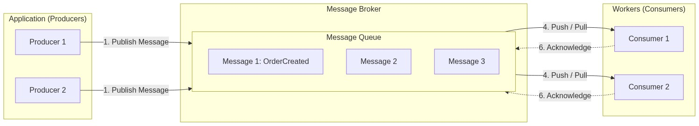

**Apache Kafka** represents the high-throughput, distributed streaming platform approach to message queues. Kafka excels at handling millions of messages per second with persistent storage across configurable retention periods. It's particularly suited for event streaming, log aggregation, and real-time analytics workloads. Kafka organizes messages into topics, partitions them for parallelism, and maintains offsets that enable precise control over consumption. Workers can consume messages in parallel from different partitions, enabling horizontal scalability.

Kafka provides durability through sequential writes to disk and configurable replication across brokers. A Kafka cluster can survive broker failures without message loss. However, Kafka's at-least-once delivery semantics mean that consumers must handle duplicate messages idempotently. Kafka is ideal for use cases requiring high throughput, message replay, and complex stream processing with Kafka Streams or similar frameworks.

**RabbitMQ** offers a more traditional message broker model with flexible routing capabilities. RabbitMQ supports multiple exchange types—direct exchanges route messages based on exact routing keys, topic exchanges enable pattern-based routing with wildcards, fanout exchanges broadcast to all bound queues, and headers exchanges route based on message header attributes. This flexibility enables sophisticated routing patterns including work queues, publish/subscribe, and request/reply patterns.

RabbitMQ provides explicit acknowledgments that enable at-most-once or at-least-once delivery semantics depending on configuration. Messages can be persistent (surviving broker restarts) or transient. RabbitMQ excels at use cases requiring fine-grained routing, complex queue topologies, and compatibility with various messaging protocols (AMQP, MQTT, STOMP).

**Amazon SQS** provides fully managed message queuing as a cloud service. SQS eliminates operational overhead—no servers to manage, no software to install, no capacity planning required. SQS offers two queue types: Standard Queues provide maximum throughput with at-least-once delivery and possible out-of-order arrival, while FIFO Queues guarantee exactly-once processing and preserve exact message ordering.

SQS provides automatic scaling, high availability across multiple availability zones, and configurable message retention (up to 14 days). Its integration with other AWS services (Lambda, EC2, ECS, S3) makes it natural for cloud-native architectures. However, SQS lacks some features of self-managed brokers—there's no message streaming or replay from arbitrary offsets, and visibility timeouts require explicit handling for long-processing messages.

### Publish-Subscribe Patterns

**Publish-subscribe (pub/sub)** patterns extend the basic message queue model by enabling multiple consumers to receive the same message. Where a work queue distributes messages across workers for load balancing, pub/sub broadcasts messages to all interested subscribers.

The pub/sub pattern is essential when the same event should trigger multiple independent processing flows. When an order is placed, the inventory system needs to decrement stock, the shipping system needs to prepare labels, the email system needs to send confirmations, and the analytics system needs to record the transaction. A single "OrderPlaced" event published to a topic can fan out to all these subscribers.

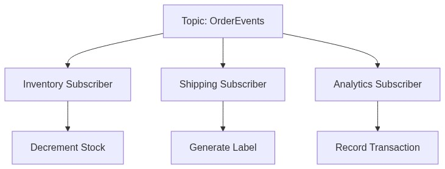

Implementation varies by message broker. Kafka implements pub/sub through consumer groups—messages are delivered to one consumer within each consumer group, but all groups receive every message. Thus, adding a new "notification" consumer group doesn't affect existing consumers. RabbitMQ uses exchange types, where a fanout or topic exchange delivers to all bound queues regardless of consumer groups.

**Event filtering** enables subscribers to receive only relevant messages. In Kafka, filtering happens at the consumer level based on message content. In RabbitMQ, topic exchanges enable routing key patterns like "orders.*.created" to match specific events. Some systems support SQL-like filtering expressions evaluated against message content, providing fine-grained selection without consumer-side filtering logic.

### Webhooks and Callbacks

**Webhooks** provide an HTTP-based mechanism for event notification. Rather than consumers polling for updates, producers push notifications to subscriber endpoints. Webhooks transform background jobs from pull-based (consumers pulling from queues) to push-based (producers pushing to endpoints).

Webhooks excel for third-party integrations and external systems. When a payment is processed, the payment provider can POST to your application's webhook endpoint. When a document is uploaded to cloud storage, the storage service can notify your application. When a user action triggers an external system, that system can receive immediate notification via webhook.

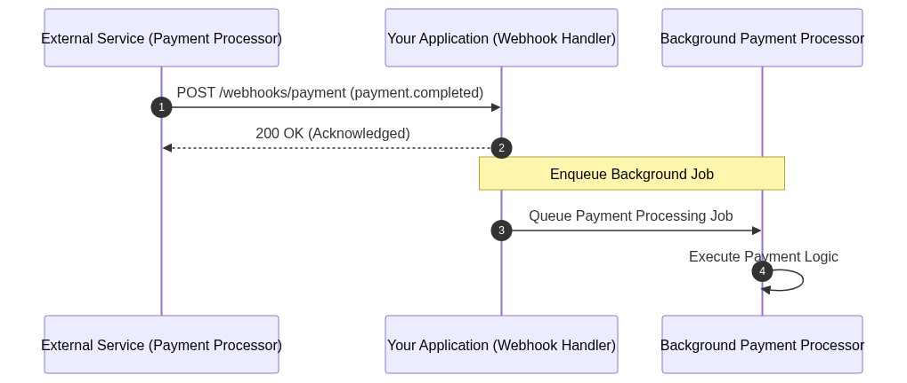

Implementing robust webhooks requires several considerations. **Security** is paramount—webhook endpoints should verify signatures provided by the sender, accept connections only from known IP ranges, and validate payload authenticity. **Idempotency** is essential because webhooks may be delivered multiple times; handlers should process based on event IDs rather than blindly executing side effects. **Asynchronous processing** is recommended—webhook handlers should acknowledge quickly (within seconds) and queue actual processing as background jobs to avoid HTTP timeouts and enable retry handling.

### Database Observers and Triggers

**Database triggers** execute code automatically in response to database events such as inserts, updates, or deletes. While not true background jobs in the distributed sense, triggers provide a mechanism for automatically responding to data changes.

Triggers excel for maintaining derived data and enforcing data integrity. When a row is inserted, a trigger can update summary tables. When certain fields change, a trigger can invalidate related caches. When records are deleted, a trigger can clean up related data in other tables.

However, triggers present significant challenges in distributed systems. **Performance impact**—synchronous execution within the transaction that triggered them—can degrade database write performance. **Complexity**—triggers executing triggers can create confusing execution flows. **Observability**—it's difficult to monitor, retry, or debug trigger execution. **Scalability**—triggers don't scale horizontally like message queue consumers.

Modern architectures prefer **change data capture (CDC)** over direct triggers. CDC tools like Debezium, AWS DMS, or database-specific features monitor transaction logs or change streams and publish changes as messages to queues. This separates the event detection from event processing, enabling scalable, observable background processing.

### Event Processing Patterns

**Message ordering** varies across systems and affects processing logic. Some queues guarantee strict ordering (FIFO queues), while others provide best-effort ordering that may deliver messages out of sequence. Applications must decide whether ordering matters—if processing "update user" followed by "delete user" differs from processing them in reverse order, the system needs ordering guarantees.

**Message filtering** enables consumers to receive only relevant messages. This can happen at the broker level (topics, routing keys, content-based routing) or at the consumer level (filtering after receipt). Filtering at the broker reduces network traffic and processing overhead; filtering at the consumer is simpler but processes more messages.

**Aggregation patterns** combine multiple related messages into single processing units. Instead of processing thousands of "item added to cart" events individually, an aggregator might collect events for a time window and process them together, reducing processing overhead and enabling batch operations.

**Routing patterns** direct messages to appropriate consumers based on content or metadata. Content-based routing evaluates message content to determine routing. Header-based routing uses message attributes. These patterns enable sophisticated processing flows where different consumers handle different message types.

### Error Handling and Retries

**Error handling** in event-driven systems requires careful design. Transient failures—network timeouts, temporary unavailability—should trigger retries. Permanent failures—invalid data, business rule violations—should route to dead letter queues for investigation.

**Retry strategies** balance responsiveness against system load. **Immediate retries** handle momentary glitches without delay. **Exponential backoff** increases delay between retries exponentially (1s, 2s, 4s, 8s...) to handle sustained issues without overwhelming failing services. **Dead letter queues** capture messages that exceed retry limits, enabling later investigation and manual intervention.

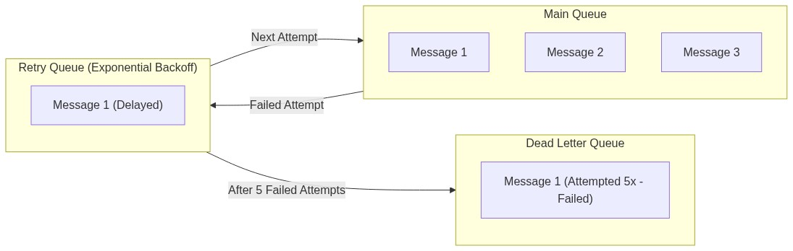

**Circuit breakers** prevent cascading failures when downstream services are unhealthy. If a background job repeatedly fails calling an external API, a circuit breaker can temporarily halt calls, allowing the external service to recover. This pattern—borrowed from electrical engineering—protects system stability during partial outages.

### Consumer Groups and Scaling

**Consumer groups** enable horizontal scaling of message processing. Multiple worker instances share the workload, with the queue distributing messages among them. As load increases, add more workers; as load decreases, remove workers. The queue handles the complexity of work distribution.

In Kafka, consumer groups ensure each partition is processed by exactly one consumer within the group. More consumers than partitions means some consumers sit idle. Fewer consumers than partitions enable parallelism up to the partition count. This model provides predictable scaling boundaries.

In RabbitMQ, consumers connect to queues directly. The prefetch count controls how many unacknowledged messages a consumer can have, enabling load balancing without explicit consumer group configuration. Multiple consumers on a queue compete for messages, with the broker dispatching to whichever consumer is ready.

**Work stealing** patterns enable efficient utilization when job processing times vary. Workers with faster processing take additional work from busier workers. This approach—used by systems like Go's goroutine scheduler—minimizes overall completion time when job durations are unpredictable.

## 2. Schedule-Driven Background Jobs

**Schedule-driven background jobs** execute based on time triggers rather than event triggers. These jobs run on predetermined schedules—hourly, daily, weekly—or at specific times. Schedule-driven jobs handle operations that must occur at regular intervals regardless of system activity, making them essential for maintenance, reporting, and periodic synchronization tasks.

The schedule-driven pattern suits tasks with inherent temporal requirements. Daily report generation should happen once per day. Session cleanup should run hourly. The payroll system should process on the first and fifteenth of each month. These schedules exist independent of whether any other system events occur.

### Cron and Unix Scheduling

**Cron** is the foundational scheduling mechanism on Unix-like systems. Cron tables (crontabs) define jobs with five-field schedules: minute, hour, day-of-month, month, and day-of-week. Each field supports specific values, ranges, and lists, enabling precise temporal specification.

Common cron expressions include: `0 * * * *` (every hour at minute 0), `0 0 * * *` (every day at midnight), `0 0 * * 0` (every Sunday at midnight), and `30 4 1 * *` (4:30 AM on the first of every month). The flexibility of cron syntax enables almost any recurring schedule.

Cron jobs are implemented by the cron daemon, which wakes periodically to check for jobs that should run. When a scheduled time arrives, cron spawns a shell and executes the defined command. The spawned process runs independently of the cron daemon.

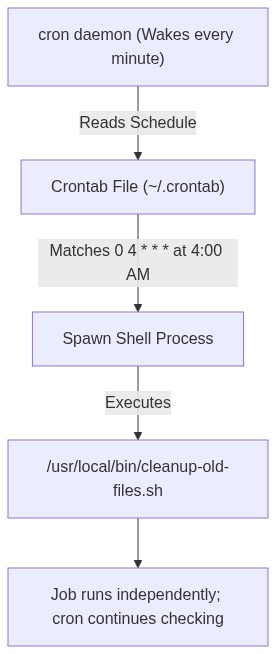

Cron's limitations become apparent in modern distributed systems. **Single point of failure**—if the server running cron crashes, no jobs execute. **No distribution**—jobs run on one server with no built-in mechanism for multiple servers to coordinate. **Limited visibility**—monitoring what jobs ran and when requires external tooling. **Time zone handling**—crontab times are interpreted in the system's time zone, complicating schedules spanning time zones.

### Scheduled Task Schedulers

**Application-level schedulers** embed scheduling logic within the application itself. These schedulers provide programmatic scheduling, better integration with application code, and often better observability than system cron.

**Celery Beat** (Python) extends the Celery distributed task queue with a scheduler component. Celery Beat reads periodic task definitions and publishes tasks to the message queue at scheduled times. Workers then consume and process tasks just like any other Celery job. This architecture combines the reliability of a task queue (persistence, retries, multiple workers) with cron-like scheduling.

Celery Beat supports cron-like expressions, interval-based scheduling, and crontab patterns. It can also ensure that only one instance runs in clustered environments through scheduler locking, preventing duplicate job execution.

**Quartz** (Java) provides enterprise-grade scheduling with extensive features. Quartz supports cron expressions, calendar-based scheduling (excluding holidays), job persistence to databases, clustering for high availability, and sophisticated triggering (multiple triggers per job, misfire handling). Major Java frameworks (Spring, Quarkus) integrate with Quartz for scheduled task management.

**Sidekiq Scheduler** (Ruby) combines with Sidekiq's Redis-backed job queue. Scheduler processes periodically enqueue jobs according to configured schedules, which workers then process. The approach inherits Sidekiq's reliability and retry mechanisms while adding temporal scheduling.

**BullMQ** (Node.js) implements job queues backed by Redis with built-in scheduling support. The Scheduler component handles delayed jobs and recurring patterns. BullMQ's TypeScript implementation provides strong typing and integrates well with modern JavaScript frameworks.

### Cloud-Based Schedulers

**Cloud schedulers** provide managed scheduling as a service, eliminating server management and providing enterprise integration. These services handle high availability, monitoring, and integration with other cloud services.

**Amazon EventBridge Scheduler** enables scheduled invocation of AWS services, HTTP endpoints, or serverless functions. EventBridge provides cron-like scheduling with timezone support, managed infrastructure with no servers to maintain, reliable execution with automatic retries, and integration with the full AWS ecosystem.

EventBridge Scheduler can invoke Lambda functions directly, POST to HTTP endpoints (including on-premises systems via API Gateway), start ECS tasks, and trigger Step Functions workflows. The service handles scaling automatically and provides execution history for debugging.

**Google Cloud Scheduler** provides similar functionality for Google Cloud Platform. It can trigger HTTP endpoints, publish messages to Pub/Sub, invoke App Engine services, and execute Cloud Functions. Cloud Scheduler provides at-least-once delivery guarantees and configurable retry policies.

**Azure Logic Apps** combines scheduling with workflow automation. Logic Apps schedules can trigger on recurring patterns and execute complex workflows defined visually or in code. Integration with Azure Functions, API Management, and hybrid connectivity enables scheduling across cloud and on-premises systems.

**AWS Step Functions** extends beyond simple scheduling into workflow orchestration. Step Functions enable complex patterns including sequential steps, parallel execution, branching logic, and human approval checkpoints. Scheduled Step Function executions can orchestrate sophisticated background processing flows.

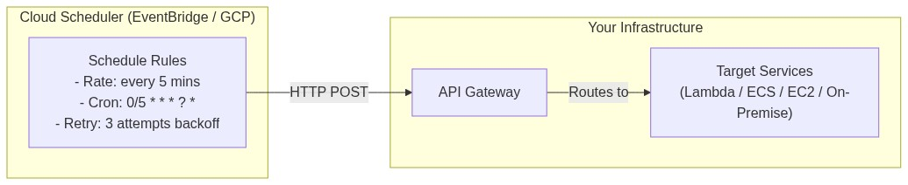

### One-Time and Delayed Jobs

**One-time jobs** execute exactly once at a specified future time. These differ from recurring schedules in that the job definition includes a specific execution time rather than a repeating pattern.

Use cases for one-time jobs include: sending scheduled notifications (remind me in 1 hour), delayed processing (process this at off-peak time), and time-delayed retry logic. Many job queue implementations support delayed or scheduled jobs by holding messages until the scheduled time.

**Delayed jobs** execute after a specified duration rather than at an absolute time. The job is enqueued immediately but marked to not execute until the delay expires. This pattern suits rate limiting (don't retry for 5 minutes), user experience (send confirmation after 30 seconds), and load management (process batch at 3 AM).

Implementation varies across systems. RabbitMQ supports delayed message plugins that hold messages until their delay expires. Amazon SQS supports delay queues that postpone message delivery. Redis-backed queues often implement delayed jobs using sorted sets with execution timestamps as scores, periodically scanning for due jobs.

### Time Zones and Daylight Saving Time

**Time zone handling** introduces subtle complexity for schedule-driven jobs. Schedules defined in one time zone may behave unexpectedly during daylight saving time transitions. A job scheduled for 2:00 AM might not exist on days where clocks "spring forward" past 2:00 AM, or might execute twice on days where clocks "fall back."

Best practices for time zone handling include: **use UTC internally**—store all schedule definitions and execution times in UTC, converting to local time only for display. **specify time zones explicitly**—don't rely on system time zone; instead, specify the time zone for each schedule. **prefer offset-aware libraries**—programming languages provide libraries that handle DST transitions correctly.

Consider a daily job scheduled at 9:00 AM in New York. During DST transition in November, the same local time represents different UTC times before and after the transition. A naive implementation might execute at the wrong time or execute twice. A robust implementation calculates UTC equivalents and handles transitions explicitly.

### Returning Results from Schedule-Driven Jobs

A significant challenge with schedule-driven jobs is **returning results to callers**. Unlike synchronous function calls where results return immediately, background jobs execute asynchronously with variable completion times. When a user schedules a report for generation, how do they receive the completed report?

Several patterns address result return:

**Polling mechanisms** enable clients to check job status. The job system provides an API endpoint that returns job status (pending, running, completed, failed) and potentially results or result locations. Clients poll periodically until the job completes.

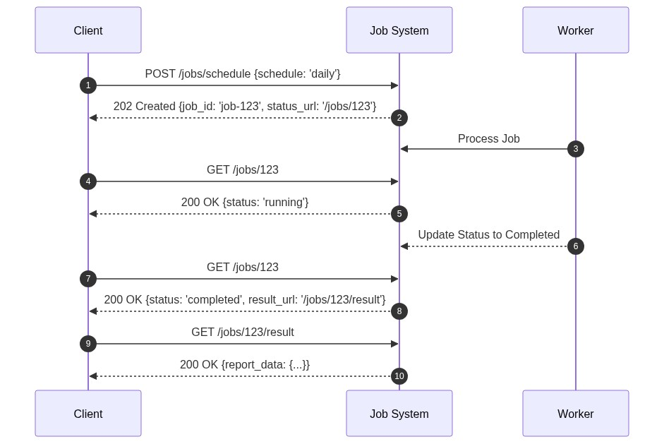

**Webhook callbacks** notify clients when jobs complete. When scheduling a job, the client provides a callback URL. Upon job completion, the system POSTs results (or a result reference) to the callback URL. This pattern enables push notification without polling.

**Result storage** requires systems to persist job outputs. Completed job results are stored in object storage (S3, GCS), database records, or distributed caches. Clients retrieve results from storage using URLs or references provided by the job system. Result storage must handle variable result sizes, cleanup old results, and provide appropriate access controls.

**Status tracking** maintains job lifecycle state. Jobs transition through states: pending (scheduled but not yet executing), running (actively processing), completed (finished successfully), failed (finished with errors), and cancelled (manually stopped). Status includes metadata: scheduled time, start time, end time, worker assigned, retry count, and error messages if applicable.

### Idempotency Considerations

**Idempotency** ensures that executing the same job multiple times produces the same result as executing it once. This property is essential for reliable background processing because retries may cause jobs to execute more than once.

Idempotent operations can safely be retried without causing duplicate side effects. Creating a user with a unique email constraint is idempotent—attempting to create the same user twice doesn't cause problems. Charging a credit card without idempotency protection is not idempotent—retrying might charge the card twice.

Designing idempotent jobs involves several strategies. **Natural keys** use existing identifiers (email, order ID) that naturally prevent duplicates. **Idempotency tokens** generate unique tokens for each job invocation; the system checks token existence before processing. **Idempotency tables** record processed job IDs in a database, enabling duplicate detection. **Read-check-write patterns** read current state, determine desired changes, and apply only if needed.

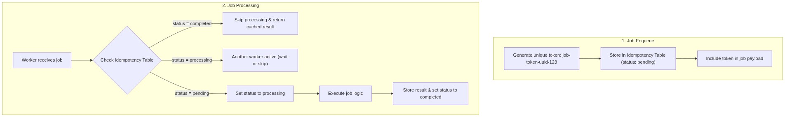

## Architecture Patterns for Background Jobs

### Job Queue Architecture

A robust job queue architecture includes several components working together to provide reliable background processing.

**Job definitions** specify what work to perform. A job definition includes a name, handler function, parameters, and configuration (retry policy, timeout, priority). Jobs are typically defined as code (Python functions, Java classes) with metadata decorators or annotations.

**Queue configuration** defines queue properties including names, routing rules, and priorities. Systems often use multiple queues for different job types—high-priority queues for urgent jobs, low-priority queues for batch work. Queue routing sends jobs to appropriate queues based on job type or metadata.

**Worker processes** execute jobs. Workers connect to queues, pull jobs, execute them, and report results. Worker pools provide parallelism, with multiple workers processing from the same queue. Workers should be stateless, enabling horizontal scaling.

**Message persistence** ensures jobs survive broker restarts. Persistent messages are written to disk before acknowledgment. This durability is essential for critical background processing where job loss is unacceptable.

**Retry handling** manages failed jobs. Failed jobs (exceptions, timeouts) are retried according to policy—immediate retry, delayed retry with backoff, or move to dead letter queue. Retry policies balance recovery against system load.

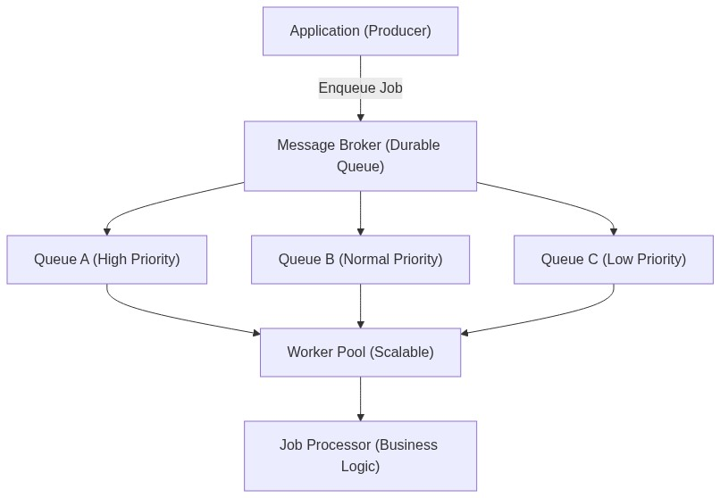

### Observability and Monitoring

**Observability** enables understanding of background job health, performance, and behavior. Without proper monitoring, job failures go undetected and performance issues remain hidden.

**Metrics** quantify system behavior. Key metrics include: jobs enqueued per minute (throughput), jobs processing (current load), jobs completed (success rate), jobs failed (error rate), job duration (latency distribution), queue depth (backlog size), and worker utilization (capacity usage).

**Logging** captures detailed execution information. Job logs should include job ID, start/end times, input parameters, output/results, warnings, and errors. Structured logging (JSON) enables efficient log analysis and querying.

**Tracing** follows jobs through distributed processing. When a job triggers downstream calls, distributed tracing correlates parent and child spans. This visibility helps diagnose latency and error propagation across service boundaries.

**Alerting** notifies operators of problems. Alerts should trigger on: job failure rates exceeding thresholds, job duration exceeding SLAs, queue depth indicating backlog, and worker availability problems.

### Job Dependencies and Workflows

**Job dependencies** express ordering constraints between jobs. Job B shouldn't start until Job A completes. These dependencies create directed acyclic graphs (DAGs) of job execution.

Implementation approaches include: **explicit dependency parameters** where jobs specify predecessor job IDs, **DAG-based schedulers** that parse workflow definitions and manage execution, and **chained callbacks** where each job enqueues the next upon completion.

**Workflow orchestration** systems manage complex job dependencies. Apache Airflow, Prefect, Dagster, and similar tools define workflows as code, schedule execution, handle dependencies, and provide rich monitoring interfaces. These tools excel for data pipelines, ETL processes, and complex business workflows.

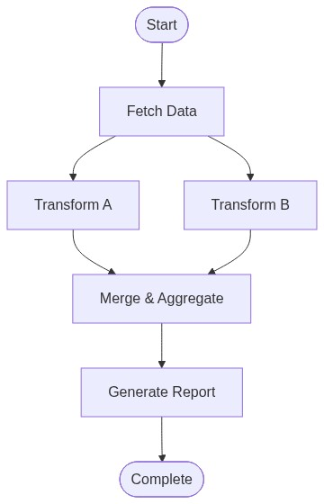

## Common Pitfalls and Best Practices

### Pitfall: Not Handling Failures Gracefully

Background jobs will fail. Network timeouts occur, external services go down, and bugs exist in job code. Systems that don't handle failures gracefully experience data loss, inconsistent state, and operational nightmares.

**Mitigation**: Implement robust retry logic with exponential backoff. Use dead letter queues for jobs that exceed retry limits. Store job state in durable storage. Design jobs to be idempotent. Monitor failure rates and alert on anomalies.

### Pitfall: Overloading Systems

Background jobs consuming resources can degrade foreground application performance if not properly constrained. A batch import job that maxes out CPU and memory will slow down user requests.

**Mitigation**: Isolate job workers from application servers. Use resource limits and quotas. Implement backpressure mechanisms. Schedule heavy jobs during off-peak hours. Monitor resource consumption and scale workers based on load.

### Pitfall: Zombie Jobs

Jobs that start but never complete—due to deadlocks, infinite loops, or crashes—consume resources without producing results. Without monitoring, these zombie jobs can accumulate and overwhelm the system.

**Mitigation**: Implement job timeouts. Monitor long-running jobs. Detect and kill stuck processes. Set up alerts for jobs exceeding expected duration. Implement job heartbeat mechanisms where workers periodically report progress.

### Pitfall: Ignoring Ordering Requirements

Some jobs have implicit ordering requirements. Processing "update" before "create" fails. Processing "delete" before "update" creates inconsistency. Systems that ignore ordering deliver incorrect results.

**Mitigation**: Explicitly specify job dependencies where required. Use ordered queues when ordering matters. Implement version vectors or timestamps for conflict detection. Test job interactions thoroughly.

### Pitfall: Poor Visibility

When jobs fail silently or behave unexpectedly, poor observability makes debugging difficult. Operators can't see what jobs are running, which have failed, or what errors occurred.

**Mitigation**: Implement comprehensive logging with correlation IDs. Expose metrics to monitoring systems. Provide dashboards showing queue depths, job success rates, and processing times. Store job execution history for historical analysis.

## Interview Questions

**Q: How would you design a system to send 1 million emails reliably?**

A: I'd implement a multi-tiered architecture. First, accept email requests through an API and persist them to a durable queue with retry metadata. Second, create worker pools that consume from the queue, with each worker processing at a rate that respects the mail provider's limits. Third, implement retry logic with exponential backoff for transient failures (rate limiting, temporary unavailability) and dead letter handling for permanent failures (invalid addresses). Fourth, add observability with metrics for emails sent, failed, and pending, plus alerting for abnormal failure rates. Finally, implement idempotency using message IDs to prevent duplicate delivery on retries.

**Q: What's the difference between at-most-once, at-least-once, and exactly-once delivery semantics?**

A: At-most-once delivery means messages may be lost but are never delivered twice—the sender gives up if delivery fails. At-least-once delivery means messages are never lost but may be delivered multiple times—the sender retries until acknowledgment. Exactly-once delivery means messages are guaranteed to be processed exactly once, requiring both no loss and no duplication—this is the hardest to implement and typically requires consumer-side idempotency combined with broker-level durability. Most message queues provide at-least-once semantics; exactly-once requires additional application logic.

**Q: How would you handle a job that takes 30 minutes to complete when the queue's visibility timeout is 5 minutes?**

A: Several approaches address this. First, implement heartbeat/extension mechanisms where the worker periodically extends the visibility timeout while processing, signaling it's still alive. Second, break the long job into smaller chunks that complete within timeout limits, with each chunk updating progress state. Third, use a job management system that tracks job state separately from queue visibility—workers claim jobs, update progress, and release claims upon completion. Fourth, for extremely long jobs, offload processing to dedicated compute services (like AWS Batch or ECS tasks) that don't have visibility timeout constraints, with the queue serving as a trigger mechanism.

**Q: How would you ensure that a scheduled job runs exactly once even in a clustered environment with multiple scheduler instances?**

A: Distributed locking ensures mutual exclusion. When a scheduler instance determines a job should run, it attempts to acquire a distributed lock for that job (using Redis SETNX, ZooKeeper, or database rows). If the lock is acquired, the instance schedules the job and releases the lock when complete. If the lock isn't acquired, another instance is handling it. For recurring jobs, the lock can be acquired just before execution rather than at schedule definition time. This pattern prevents duplicate execution while enabling high availability through multiple scheduler instances.

**Q: What strategies would you use to handle jobs with highly variable processing times?**

A: First, implement work stealing where faster workers pull additional jobs from busier workers, improving overall utilization. Second, use priority queues that prioritize shorter or more important jobs, ensuring critical work completes even when the queue is backed up. Third, implement job timeout per category—quick jobs get short timeouts, long jobs get longer ones—with appropriate alerting for timeout failures. Fourth, consider separate queue pools for different job categories, allowing independent scaling and tuning for each workload type.

## Summary and Key Takeaways

Background jobs form an essential layer in distributed system architecture, enabling asynchronous processing that keeps applications responsive while completing necessary work. The key concepts covered in this document provide a foundation for designing robust background processing systems.

**Event-driven jobs** react to system events rather than schedules. Message queues (Kafka, RabbitMQ, SQS) provide the infrastructure for reliable event delivery. Consumer groups enable horizontal scaling. Pub/sub patterns support multiple independent consumers. Robust error handling with retries and dead letter queues ensures reliability. Webhooks extend event processing to external systems.

**Schedule-driven jobs** execute based on time triggers. Cron provides basic Unix scheduling. Application schedulers (Celery Beat, Quartz, BullMQ) offer programmatic scheduling with enterprise features. Cloud schedulers (EventBridge, Cloud Scheduler) provide managed infrastructure. One-time and delayed jobs address specific timing needs. Result return patterns—polling, webhooks, storage—enable communication of job outcomes.

**Operational considerations** determine whether background job systems succeed or fail. Idempotency prevents duplicate side effects. Observability enables debugging and monitoring. Job dependencies create complex workflows. Proper error handling with retries and dead letter queues ensures reliability. Scaling strategies match worker capacity to workload.

The relationship between background jobs and other system properties is significant. Jobs interact with **consistency** when they propagate changes across systems. They affect **availability** by ensuring work completes despite failures. They impact **scalability** by enabling asynchronous processing that scales independently of request handling.

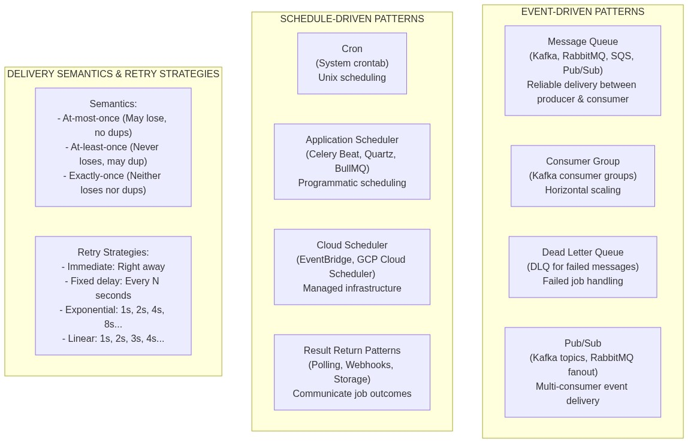

---