# Consistency Patterns in Distributed Systems

## Overview

**Consistency patterns** define how and when data changes propagate throughout a distributed system, determining what guarantees users have about reading the most recent writes. In distributed databases where data is replicated across multiple nodes, consistency patterns answer a fundamental question: **When you write data to one node, how quickly (or slowly) should that change become visible to readers on other nodes?**

The choice of consistency pattern represents one of the most critical architectural decisions in distributed system design. It directly impacts performance, availability, and the correctness guarantees your application can provide. There is no universally "best" consistency pattern—instead, each pattern represents a different point along the fundamental trade-off spectrum between consistency and performance.

Understanding consistency patterns requires first understanding what "consistency" means in this context. In distributed systems, consistency refers to the guarantee that all nodes in a system see the same data at the same time. However, enforcing strict consistency across geographically distributed nodes is expensive in terms of latency and can reduce availability during network partitions. This is precisely why multiple consistency patterns exist—each offers different guarantees suited to different use cases.

The three primary consistency patterns—Weak Consistency, Eventual Consistency, and Strong Consistency—represent three distinct points on the consistency spectrum. Strong Consistency provides the strongest guarantees but at the highest performance cost. Weak Consistency offers the best performance but provides minimal guarantees. Eventual Consistency sits in the middle, offering reasonable guarantees with better performance characteristics than strong consistency.

## The Consistency Spectrum

Before diving into individual patterns, it's essential to understand where they fit in the broader consistency landscape. The consistency spectrum can be visualized as a continuum from weakest to strongest guarantees.

This spectrum illustrates the fundamental trade-off: as consistency guarantees strengthen, latency typically increases and availability may decrease. Conversely, weaker consistency patterns offer lower latency and higher availability but provide fewer correctness guarantees.

The relationship between these patterns is not always linear or discrete. Many systems implement hybrid approaches or allow applications to choose consistency levels on a per-operation basis. For example, Amazon DynamoDB allows developers to specify whether they want strongly consistent reads or eventually consistent reads for each read operation.

## 1. Strong Consistency

### Definition and Guarantees

**Strong Consistency** guarantees that after a write operation completes, all subsequent read operations will return that written value or a more recent value. In other words, once a write is acknowledged to the client, the data is guaranteed to be consistent across all replicas and all future reads.

The formal definition of strong consistency often refers to **linearizability**, which is one of the strongest consistency models. Linearizability requires that every operation appears to take effect atomically at some point between its invocation and its response. If operation B begins after operation A completes, then B must see the effects of A.

Strong consistency provides the following guarantees:

1. **Read-your-writes consistency**: A client that writes a value will immediately read that same value from any server.

2. **Monotonic reads consistency**: If a process reads a value, any subsequent read by that same process will return the same value or a more recent one.

3. **Monotonic writes consistency**: Writes are serialized in the order they were submitted, ensuring writes do not appear to be reordered.

4. **Write-follows-reads consistency**: A write operation is guaranteed to happen after any reads that preceded it.

These guarantees make strong consistency ideal for systems where data correctness is paramount and where operations have dependencies on previous operations.

### Implementation Mechanisms

Implementing strong consistency in distributed systems requires sophisticated coordination mechanisms. The primary mechanisms include:

**Single Leader Replication**: In this architecture, all writes must go through a single designated leader node. The leader coordinates all writes and ensures they are applied in a total order. Reads can be served by the leader or by followers that are guaranteed to be caught up. This model is used by PostgreSQL logical replication, MySQL binlog-based replication, and Kafka's partitioned replication.

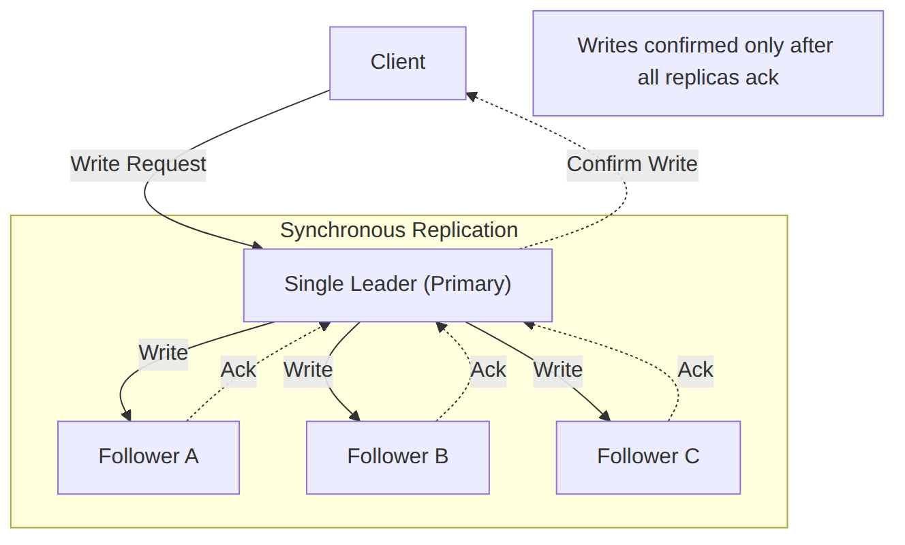

**Two-Phase Commit (2PC)**: This distributed transaction protocol ensures atomicity across multiple nodes. In the first phase (prepare), the coordinator asks all participants to promise to commit or abort. In the second phase (commit), if all participants voted yes, the coordinator instructs them to commit; otherwise, it instructs them to abort. Two-phase commit provides strong consistency but at the cost of blocking and latency.

**Three-Phase Commit (3PC)**: An extension of 2PC that removes the blocking nature by introducing an additional phase. However, 3PC is still not immune to network partitions in certain failure scenarios and is rarely used in practice.

**Consensus Algorithms**: Algorithms like Paxos and Raft provide strong consistency guarantees through leader election and log replication. These algorithms are designed to be fault-tolerant and can continue operating despite node failures. Raft, in particular, has become popular due to its understandable design and is used in systems like etcd and CockroachDB.

The Raft consensus algorithm works as follows:

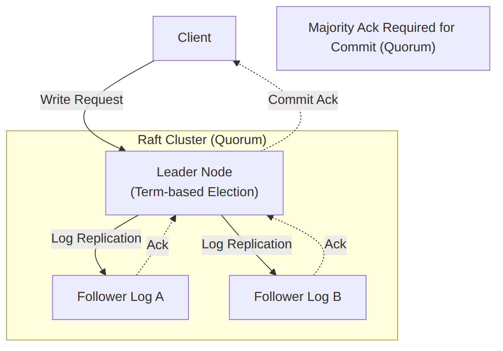

**Distributed Locks**: Some systems implement strong consistency using distributed locking mechanisms. Tools like ZooKeeper or etcd can provide distributed locks that ensure only one node can modify data at a time. However, locks introduce contention and can become performance bottlenecks.

### Use Cases

Strong consistency is essential in scenarios where incorrect or stale data could lead to serious problems:

**Financial Transactions**: Banking systems, stock trading platforms, and payment processors absolutely require strong consistency. If a user withdraws money from an ATM, the balance must immediately reflect this withdrawal across all systems. Similarly, in stock trading, two clients cannot be allowed to purchase the same share simultaneously.

Consider a stock trading scenario without strong consistency: Client A and Client B both see 100 shares available at $50 per share. Both submit buy orders simultaneously. Without strong consistency, both orders might be accepted, resulting in 200 shares being sold when only 100 existed. This represents a fundamental violation of business correctness.

**Inventory Management**: E-commerce systems managing limited inventory must prevent overselling. When a customer adds an item to their cart and proceeds to checkout, the inventory count must be immediately decremented. If eventual consistency were used, two customers might both purchase the last item, leading to overselling and customer dissatisfaction.

**Reservation Systems**: Airline booking, hotel reservations, and concert ticketing all require strong consistency guarantees. The last seat on a flight cannot be sold to two different passengers, and a hotel room cannot be double-booked.

**User Authentication and Authorization**: When a user changes their password or permissions are modified, these changes must take effect immediately. If a user's access is revoked, they should immediately lose access to protected resources—not after some eventual convergence period.

### Examples

**Google Spanner**: A globally distributed database that provides strong consistency through the use of TrueTime and Paxos consensus. Spanner uses GPS clocks and atomic clocks to provide bounded uncertainty in clock reads, allowing it to provide globally consistent reads with external consistency guarantees.

**etcd**: A distributed key-value store used by Kubernetes for storing cluster state. etcd uses the Raft consensus algorithm to provide strong consistency guarantees. Every read operation in etcd is guaranteed to return the latest committed value.

**ZooKeeper**: A coordination service providing strong consistency guarantees. ZooKeeper implements a leader-based consensus protocol and provides guarantees about the order of operations, making it suitable for leader election, distributed locks, and configuration management.

**CockroachDB**: A distributed SQL database that provides strong consistency through the use of Raft consensus for writes. CockroachDB offers serializable isolation, the strongest isolation level in ACID databases.

**MongoDB (with replica set and write concern "majority")**: When configured with appropriate write concerns, MongoDB can provide strong consistency guarantees. Setting `writeConcern: {w: "majority"}` ensures writes are acknowledged only after being replicated to a majority of replicas.

### Trade-offs

While strong consistency provides essential correctness guarantees, it comes with significant trade-offs:

**Latency**: To ensure all replicas have the same data, systems must wait for acknowledgments from multiple nodes. In geographically distributed systems, this can mean waiting for network round-trips across continents. A strongly consistent write to a globally distributed database might take hundreds of milliseconds compared to single-digit milliseconds for a weakly consistent write.

**Availability**: During network partitions, strongly consistent systems may become unavailable. Consider a three-node cluster where the leader crashes and a partition occurs. If the partition prevents a quorum from forming, the system cannot accept writes even though two-thirds of the nodes are operational. This directly contradicts the "A" in CAP theorem.

**Throughput**: The coordination required for strong consistency limits throughput. Systems cannot parallelize writes to different partitions as freely because they must maintain global consistency.

**Complexity**: Implementing strong consistency correctly is notoriously difficult. Consensus algorithms like Raft and Paxos require careful handling of edge cases, timeouts, and recovery procedures.

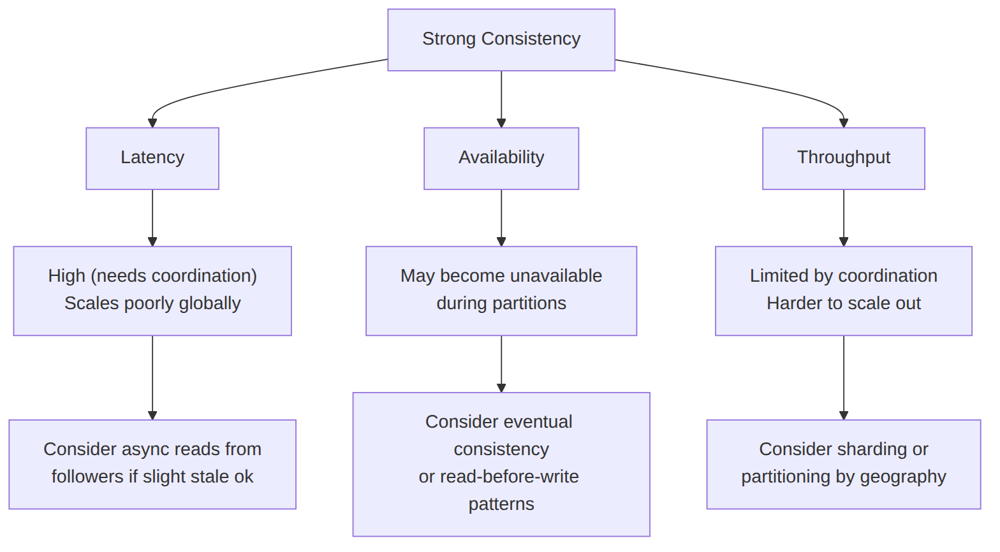

### Interview Questions

**Q: What is the difference between strong consistency and linearizability?**

A: Linearizability is a specific consistency model that is stronger than what is typically meant by "strong consistency." Linearizability requires that every operation appears to take effect atomically at some point between its invocation and its response. It provides real-time guarantees—a read that begins after a write completes must see that write's result. "Strong consistency" is a looser term that generally means reads always return committed writes, but the exact guarantees depend on the implementation. Some strong consistency models don't guarantee real-time ordering across clients.

**Q: How would you implement a strongly consistent counter in a distributed system?**

A: A strongly consistent counter requires coordination to prevent concurrent increments from causing incorrect results. Options include: (1) A single leader architecture where all increments go through one node, (2) Distributed locking using ZooKeeper or etcd to serialize increments, (3) A consensus protocol like Raft where increments are logged and replicated to a quorum before being applied, or (4) A distributed transaction spanning multiple nodes with appropriate isolation levels. The choice depends on throughput requirements and failure tolerance needs.

**Q: Can a system provide both strong consistency and high availability during network partitions?**

A: According to the CAP theorem, this is impossible for the general case. During a partition, you must choose between consistency (C) and availability (A). However, specific systems can provide both by making certain assumptions: Spanner achieves this by using TrueTime with bounded uncertainty; systems that never experience partitions (by design) can provide both; or systems that sacrifice partition tolerance entirely. For practical purposes, you must design for partition scenarios and choose whether to remain available (eventual consistency) or consistent (unavailable).

## 2. Eventual Consistency

### Definition and Guarantees

**Eventual Consistency** guarantees that if no new updates are made to a data item, eventually all reads to that item will return the latest written value. The key word is "eventually"—this consistency model makes no guarantees about when convergence will occur.

In eventual consistency, reads may return stale data for an indeterminate period after a write. However, the system provides a bounded "window of inconsistency" that depends on factors like network latency, load, and the specific implementation. Under normal operating conditions, this window is typically milliseconds to seconds, but it can extend indefinitely during pathological conditions.

Eventual consistency provides the following weaker guarantees:

1. **Convergence**: All replicas will eventually converge to the same value if no new writes occur.

2. **No guarantee on staleness**: Reads may return any previous value for an unbounded time period.

3. **No guarantee on ordering**: Writes may be applied in different orders at different replicas.

4. **Best-effort propagation**: The system makes a best-effort attempt to propagate updates but doesn't guarantee delivery within a time bound.

The "eventual" in eventual consistency is deliberately vague because the model doesn't specify when convergence will occur. This ambiguity is both a strength (simplicity) and a weakness (unpredictability) of the model.

### Implementation Mechanisms

Eventual consistency is implemented through various replication strategies that propagate updates asynchronously:

**Asynchronous Master-Slave Replication**: Writes go to a master node and are propagated to slaves via an asynchronous replication stream. The master acknowledges the write immediately after logging it locally; slaves receive updates through a background process. This is the replication model used by traditional MySQL and PostgreSQL replication.

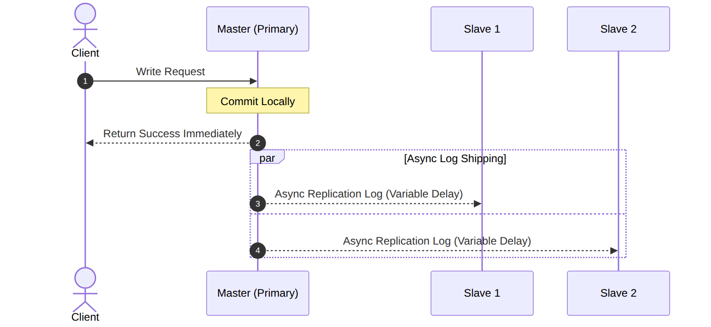

**Anti-Entropy and Gossip Protocols**: Some systems periodically compare their state with other nodes to identify and repair inconsistencies. Amazon DynamoDB uses anti-entropy processes that run in the background to reconcile divergent partitions. Cassandra uses a gossip protocol where nodes periodically exchange state information to ensure consistency.

**Merkle Trees**: Used for efficient comparison and synchronization of large datasets. Each node maintains a Merkle tree of its data, and nodes compare trees to identify which keys need synchronization. This reduces the amount of data transferred during reconciliation.

**Vector Clocks**: A mechanism for tracking causality in distributed systems. Vector clocks assign each node a timestamp that encodes the history of operations that have affected a data item. By comparing vector clocks, nodes can determine whether their values are causally related, older, or newer than each other.

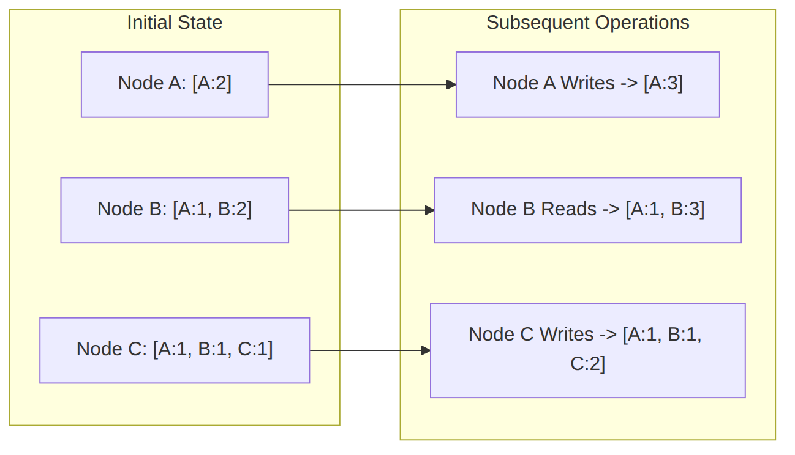

**Quorum-Based Systems**: Systems like DynamoDB and Cassandra use quorum-based reads and writes. A write is acknowledged after W replicas acknowledge it; a read is performed from R replicas. If W + R > N (where N is the total number of replicas), reads are guaranteed to see the latest write.

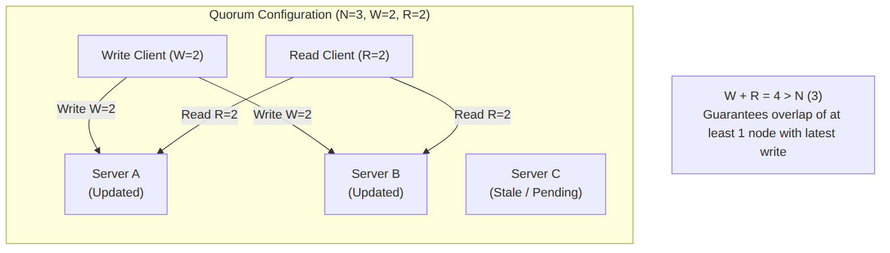

### Conflict Resolution Strategies

Because eventual consistency allows concurrent writes to different replicas, conflicts are inevitable. Various strategies exist for resolving these conflicts:

**Last-Write-Wins (LWW)**: The most common strategy, where writes include timestamps, and the write with the latest timestamp wins. This is simple to implement but can cause data loss when writes occur nearly simultaneously. Cassandra uses LWW by default, using timestamp resolution.

**Version Vectors**: Each value has a version number that increments with each write. When conflicts are detected, the system can present multiple versions to the application for manual resolution or apply business logic to merge them.

**Application-Defined Merge**: The application defines custom conflict resolution logic. For example, in a shopping cart application, the union of two cart versions might be the correct resolution (items present in either cart are kept).

**Operational Transformation (OT)**: Used in collaborative applications (like Google Docs), where concurrent operations are transformed to produce a consistent result regardless of order.

**CRDTs (Conflict-Free Replicated Data Types)**: Data structures mathematically designed to converge regardless of the order of operations. Examples include G-counters (grow-only counters), LWW-registers, and OR-sets (observed-remove sets). CRDTs guarantee convergence without coordination.

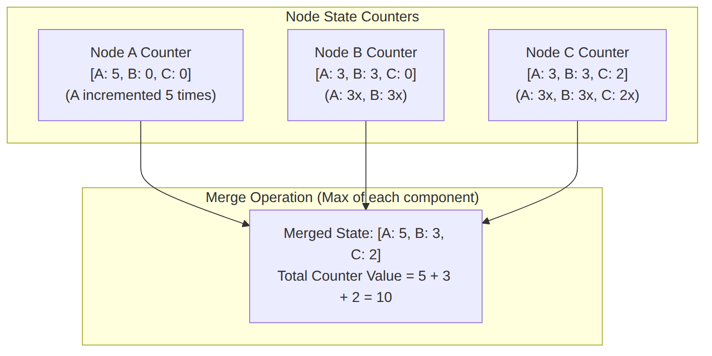

### Use Cases

Eventual consistency is appropriate when:

**Social Media Applications**: When a user updates their profile picture or posts content, it's acceptable if some followers see the old picture for a few seconds. The content will eventually reach all users, and the slight delay doesn't impact correctness.

**E-commerce Product Catalogs**: Product descriptions, prices, and images can tolerate brief inconsistencies. If a price changes, some users might briefly see the old price, but this is acceptable for catalog browsing. However, the shopping cart and checkout must be strongly consistent to prevent pricing errors.

**Analytics and Metrics**: Time-series data, analytics, and metrics are inherently append-only and tolerant of eventual consistency. Dashboards showing metrics can tolerate a few seconds of staleness.

**Content Delivery Networks (CDNs)**: Cached content is served with eventual consistency guarantees. The "eventual" part might be a TTL-based expiration or a cache invalidation mechanism.

**Recommendation Systems**: Product recommendations, friend suggestions, and similar features are naturally tolerant of staleness. A user won't notice if their recommended friend list is a few seconds behind.

**Logging and Monitoring**: Application logs, monitoring metrics, and observability data are typically eventually consistent. The critical aspect is that no log entries are lost, but order and timing aren't as crucial.

### Examples

**Amazon DynamoDB**: DynamoDB provides eventual consistency by default but allows developers to choose strongly consistent reads on a per-operation basis. DynamoDB's replication uses asynchronous propagation with versioning and conflict resolution.

**Apache Cassandra**: Cassandra is designed for eventual consistency by default, with tunable consistency levels per query. It uses a gossip protocol for state dissemination and allows W/R quorum configuration to balance consistency and availability.

**Amazon S3**: S3 provides eventual consistency for overwrite PUTS and DELETES in certain regions (though most now provide strong consistency). S3's replication is asynchronous, and a read immediately after a write might return the old value.

**DNS**: The Domain Name System is a classic example of eventual consistency. When DNS records are updated, changes propagate through the hierarchy over minutes to hours depending on TTL settings.

**Riak**: A distributed database explicitly designed around eventual consistency, with configurable consistency levels and support for CRDTs.

### Trade-offs

Eventual consistency offers significant advantages but introduces challenges:

**Unpredictable Staleness**: There's no guarantee about when convergence occurs. Under normal conditions, it might be milliseconds; under heavy load or network issues, it could be seconds or minutes.

**Conflict Handling Complexity**: Application developers must handle conflicts that would be impossible in strongly consistent systems. This adds significant complexity to application code.

**Debugging Difficulty**: When a bug involves inconsistent state, reproducing it can be extremely difficult because the inconsistent state might have already converged by the time the bug is investigated.

**Mental Model Mismatch**: Developers accustomed to strongly consistent databases must fundamentally change their mental model when working with eventual consistency. Operations that seem "obvious" in a single-node database become complex in eventual consistency environments.

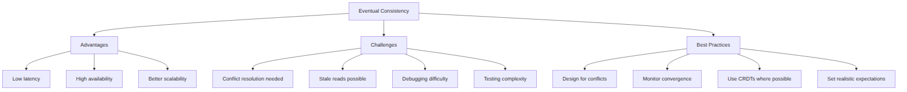

### Interview Questions

**Q: How would you explain eventual consistency to a non-technical stakeholder?**

A: "Imagine you're at a conference and two people are updating the same presentation slides from different tablets. For a brief moment, the screens might show different versions. Eventually, when the updates sync, they'll show the same thing. Eventual consistency works similarly—the system will eventually agree on the data, but for a brief period, different parts might show slightly different information."

**Q: What are the different conflict resolution strategies and when would you use each?**

A: Last-Write-Wins is simplest and works for data where the most recent value is always correct (like user profile updates). Application-defined merge is appropriate when business logic determines the correct merged state (like shopping carts where the union of items is correct). CRDTs are best when the data type naturally supports conflict-free merging (like counters or sets). Version vectors with manual resolution are necessary when human judgment is required to resolve conflicts.

**Q: How does DynamoDB balance eventual and strong consistency?**

A: DynamoDB allows developers to choose consistency on a per-operation basis. By default, reads are eventually consistent and return faster. When an application needs the most recent value (like checking inventory before checkout), it can request a strongly consistent read, which reads from the leader partition and waits for confirmation. This allows developers to optimize most operations for performance while reserving strong consistency for critical operations.

**Q: What are the implications of eventual consistency for application correctness?**

A: Applications must be designed with the understanding that reads can return stale data. This means you cannot assume that a write is immediately visible to subsequent reads. It also means you must handle conflicts explicitly—two simultaneous writes might both succeed, and the system must have a strategy to reconcile them. Finally, applications should have clear business rules about what "correct" means in the face of conflicts.

## 3. Weak Consistency

### Definition and Guarantees

**Weak Consistency** provides minimal guarantees about when reads will reflect writes. Under weak consistency, reads may return any value that existed at some point, with no guarantee about freshness, ordering, or convergence.

Unlike eventual consistency, which at least promises eventual convergence, weak consistency makes essentially no promises about the relationship between writes and reads. A write might never be visible to certain readers, or it might be visible only under specific conditions.

This might seem useless at first glance, but weak consistency patterns are valuable for specific use cases where:

1. **Absolute performance is critical**: Weakening consistency constraints allows maximum optimization for speed.

2. **Approximate answers are acceptable**: Many use cases don't require exact values.

3. **Fire-and-forget semantics are sufficient**: Some operations are best-effort where loss is tolerable.

Weak consistency is the broadest category and includes patterns like:

- **Read-after-write with no guarantees**: The system doesn't promise that writes are visible to subsequent reads.

- **Best-effort delivery**: Updates are sent but acknowledgment isn't required; lost updates might never be delivered.

- **TTL-based caching**: Data is considered valid for a time period; after expiration, fresh data is fetched.

- **Epidemic/broadcast protocols**: Updates spread through the system like gossip but without guaranteed delivery.

### Implementation Mechanisms

Weak consistency is typically the default for systems optimized for maximum performance:

**Fire-and-Forget Messaging**: Updates are sent to the network without waiting for acknowledgment. If the message is lost, it's lost forever. This is used in UDP-based protocols, some monitoring systems, and scenarios where loss is acceptable.

**UDP Multicast/Broadcast**: Updates are broadcast to all nodes without acknowledgment. Some nodes might miss updates due to network issues, but the system doesn't wait to confirm receipt.

**Probabilistic Propagation**: Updates are propagated with some probability. Each node might forward updates to a subset of other nodes, expecting that eventually updates will spread through the network. This is similar to gossip protocols but without guaranteed eventual delivery.

**Best-Effort Caching**: Data is cached with no guarantee of freshness. Cache misses might return stale data or miss data entirely.

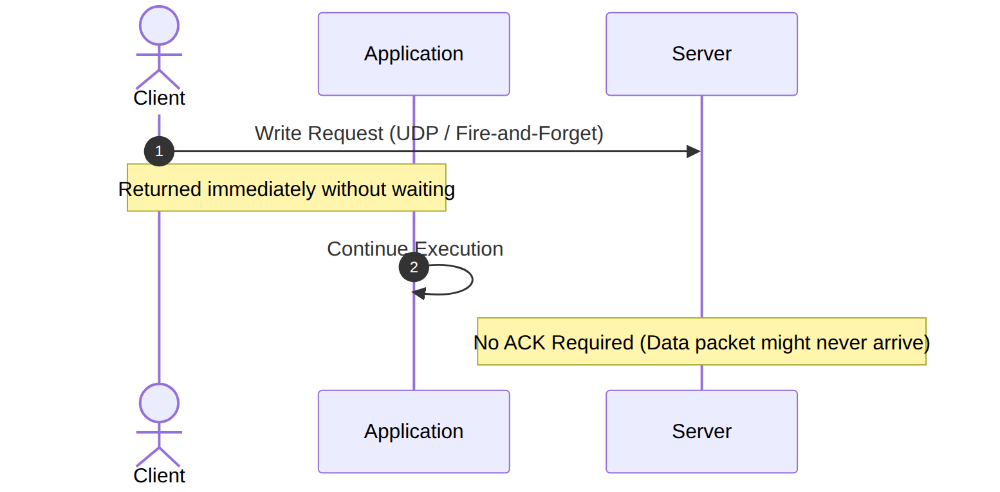

**Approximate Computing**: Some systems compute approximate answers rather than exact ones. This is common in aggregation systems where exact precision isn't required.

### Use Cases

Weak consistency is appropriate when:

**Metrics and Monitoring**: Telemetry data, application metrics, and monitoring events are inherently tolerant of loss. If you lose a few data points from a monitoring stream, the overall picture remains accurate. The slight inaccuracy in analytics is far less costly than the latency of ensuring strong consistency.

**Real-Time Gaming**: Position updates, player actions, and game events are often sent with weak consistency guarantees. The cost of waiting for acknowledgment could introduce latency that impacts gameplay. If a player position update is lost, the next update will correct it.

**IoT Sensor Networks**: Sensors often send data via unreliable protocols. Network conditions in IoT environments can be poor, and requiring strong consistency acknowledgments might prevent any data from being transmitted.

**Social Media "Likes"**: The number of "likes" on a post doesn't need to be exact. A few lost updates won't significantly impact the displayed count, and the performance benefit of weak consistency improves user experience.

**DNS Caching**: While DNS has caching with TTLs (which provides eventual consistency), the initial propagation and certain DNS updates can be weakly consistent. Outdated DNS answers might be served for the TTL duration.

**Logging with Sampling**: High-volume logging systems might sample logs and send them with weak consistency. The statistical properties of the sample remain valid even if individual log entries are lost.

**Voice and Video**: Real-time communication prioritizes low latency. Some packet loss is tolerable and expected; retransmission and acknowledgment overhead would degrade quality more than the occasional lost packet.

### Examples

**UDP-based protocols**: Many real-time applications use UDP because TCP's acknowledgment and retransmission mechanisms add latency. UDP sends packets without waiting for acknowledgment, providing weak consistency but maximum performance.

**Redis Pub/Sub**: Redis's publish-subscribe mechanism provides at-most-once delivery. Subscribers might miss messages if they're disconnected; messages are not persisted. This is weak consistency suitable for real-time notifications.

**Memcached**: The memcached caching system doesn't provide consistency guarantees between cached values and the database. Stale cache entries are possible, and there's no mechanism to invalidate across all clients atomically.

**UDP-based telemetry**: Many APM (Application Performance Monitoring) tools send telemetry data via UDP to minimize performance impact. Data loss is expected and tolerated.

**Epidemic broadcast protocols**: Used in some distributed databases for spreading information about data changes. The "epidemic" nature means updates spread probabilistically and might not reach all nodes.

### Trade-offs

Weak consistency represents the extreme end of the consistency spectrum:

**Maximum Performance**: By far the lowest latency option, weak consistency allows systems to operate at maximum speed without any coordination overhead.

**Maximum Availability**: Systems can continue operating under almost any condition, including severe network partitions. There's nothing to block, so operations always succeed (or fail locally).

**Minimum Correctness**: The fundamental trade-off is correctness. Reads might return any value, writes might never be visible, and there's no guarantee of convergence.

**Application Burden**: Applications using weak consistency must handle arbitrary staleness, lost updates, and the absence of any ordering guarantees.

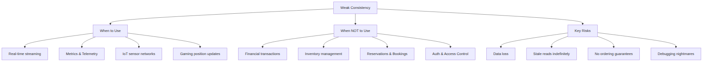

### Interview Questions

**Q: When would you deliberately choose weak consistency over eventual or strong consistency?**

A: "I'd choose weak consistency for use cases where absolute performance is critical and data loss is tolerable. Real-time gaming position updates, IoT sensor data, metrics collection, and video streaming are all candidates. In these cases, the slight inaccuracy introduced by weak consistency has minimal business impact, while the latency reduction significantly improves user experience. The key question is: what's the cost of a stale or lost update versus the cost of added latency?"

**Q: How does weak consistency differ from eventual consistency?**

A: "The key distinction is convergence. Eventual consistency guarantees that replicas will eventually converge to the same value if no new writes occur. Weak consistency makes no such guarantee—a value written might never be visible to certain readers. Eventual consistency sits between weak and strong consistency, providing some comfort about the system's eventual state, while weak consistency provides essentially no guarantees beyond 'maybe your write arrived.'"

## Consistency Patterns Comparison

### Comprehensive Comparison Table

| **Aspect** | **Strong Consistency** | **Eventual Consistency** | **Weak Consistency** |
|---|---|---|---|
| **Read Guarantees** | Always returns latest write | Returns latest write eventually | Returns any value, no guarantees |
| **Write Guarantees** | Atomic, ordered, all replicas | Propagated asynchronously | Fire-and-forget, may be lost |
| **Latency** | Highest (requires coordination) | Medium (async with quorum) | Lowest (no waiting) |
| **Availability** | May decrease during partitions | Generally high | Maximum |
| **Throughput** | Limited by coordination | Good (can parallelize) | Maximum |
| **Conflict Resolution** | Handled by protocol | Application or system | Not handled or impossible |
| **Implementation Complexity** | Very high | High | Low |
| **Data Loss Risk** | None | Low | Possible |
| **Staleness Window** | Zero | Variable (ms to sec) | Unbounded or infinite |
| **Use Cases** | Financial, reservations, auth | Social media, e-commerce, CDNs | IoT, metrics, gaming, streaming |
| **Examples** | Spanner, etcd, ZooKeeper | DynamoDB, Cassandra, S3 | UDP, Redis Pub/Sub, Memcached |

### Decision Framework

Choosing the right consistency pattern requires understanding your specific requirements:

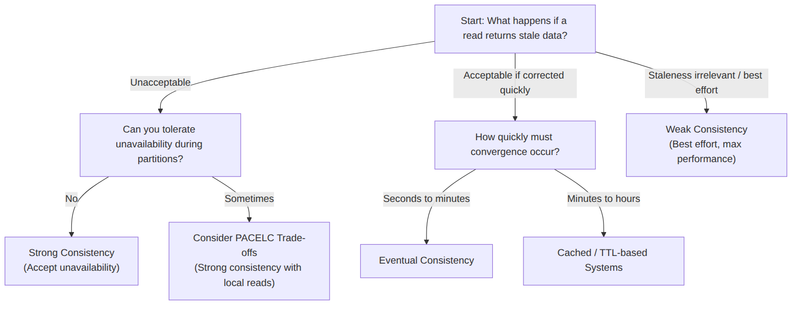

### Timeline Comparison

The following ASCII diagram shows how data propagation differs across consistency patterns:

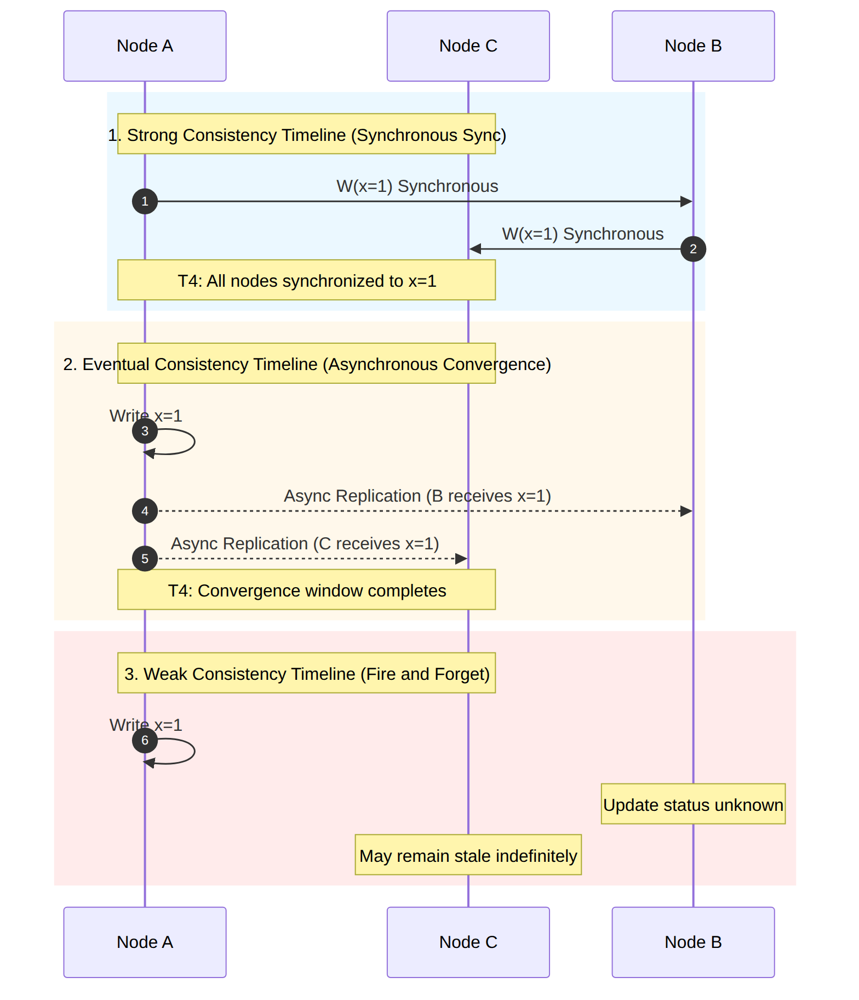

### Cost Comparison

The performance cost of each consistency pattern can be quantified:

**Strong Consistency Cost Factor**:
- P99 write latency increases 5-10x compared to weak consistency
- Throughput decreases 50-90% due to coordination overhead
- Availability may drop to 0% during extended partitions

**Eventual Consistency Cost Factor**:
- P99 write latency increases 1.5-3x compared to weak consistency
- Throughput scales linearly with nodes (good parallelism)
- Availability remains high (>99.9%) in most scenarios

**Weak Consistency Cost Factor**:
- P99 write latency is minimal (microseconds in LAN, milliseconds in WAN)
- Maximum throughput achievable
- Availability approaches 100% (only local failures matter)

## Implementing Consistency Patterns in Practice

### Hyrum's Law and Consistency

Hyrum's Law states: "With a sufficient number of users of an API, all observable behaviors of your system will be depended on by somebody." This has profound implications for consistency patterns.

If your system ever returns a stale value, even once, and an application somewhere was checking for that value, that application has now implicitly depended on that behavior. Changing the consistency model—even to make it "better"—could break dependent applications.

This means:

1. **Document your consistency guarantees**: Make it explicit what guarantees you're providing.

2. **Version your APIs**: When changing consistency, provide a migration path.

3. **Monitor for implicit dependencies**: Watch for applications that might have adapted to inconsistent behavior.

### The 80/20 Rule Application

Applying the 80/20 rule to consistency patterns means:

1. **Most operations can be eventually consistent**: 80% of reads might not need strong consistency. Design your default for eventual consistency.

2. **Identify critical paths**: The remaining 20% of operations (financial transactions, inventory, auth) need strong consistency. Handle these explicitly.

3. **Optimize the common case**: If 80% of your operations are reads, make eventual consistency your default and add strong consistency only where needed.

4. **Accept imperfection**: Perfect consistency is expensive. 80% of the correctness at 20% of the cost is often the right trade-off.

### Hybrid Approaches

Modern systems often implement hybrid approaches:

**Read-Your-Writes Consistency**: This hybrid pattern guarantees that a client will always read their own writes, regardless of the underlying consistency model. Implementing this requires sticky sessions or tracking client's last write timestamp.

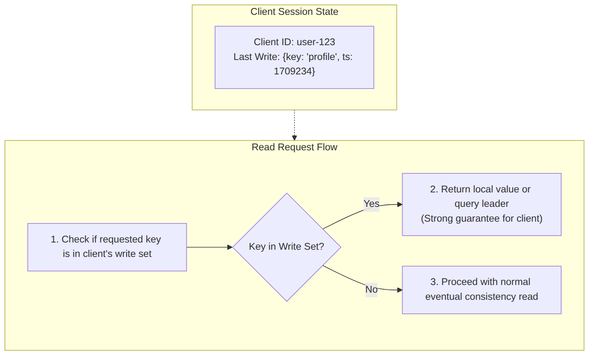

**Monotonic Reads**: A pattern where reads from a client never go "backwards in time." This can be implemented by routing reads to the same replica or by tracking the client's "read watermark."

**Bounded Staleness**: A compromise where reads may be stale, but only up to a configurable bound. Cassandra's "ttl" and DynamoDB's "max staleness" options implement this pattern.

### Consistency Levels in Real Systems

Many production systems expose configurable consistency levels:

**MongoDB Consistency Levels**:
- `w: 1` (unacknowledged): Write returns immediately
- `w: majority`: Write replicated to majority
- `w: all`: Write to all replicas
- `readConcern: local`: Read from primary
- `readConcern: majority`: Read from majority-replicated data
- `readConcern: linearizable`: Linearizable reads

**Cassandra Consistency Levels**:
- `ONE`: Acknowledge after one replica
- `QUORUM`: Acknowledge after quorum
- `ALL`: Acknowledge after all replicas
- `LOCAL_ONE`: Local datacenter only

**DynamoDB**:
- Eventually consistent reads (default): Cheaper, faster
- Strongly consistent reads: Higher cost, lower throughput
- Transactional reads/writes: ACID properties

## Anti-Patterns and Common Mistakes

### 1. Assuming Eventual Consistency is Easy

Many developers assume that moving to eventual consistency simplifies their system. In reality:

- **It's harder to reason about**: Stale reads introduce subtle bugs that are difficult to reproduce.

- **Testing is harder**: The non-deterministic nature of eventual consistency makes testing challenging.

- **Debugging is harder**: By the time you investigate, convergence might have occurred.

### 2. Mixing Consistency Models Inconsistently

Applying different consistency levels without a clear strategy leads to confusion:

- **Don't**: Use strong consistency for some data and weak for others without clear criteria.

- **Do**: Document which data uses which consistency level and why.

### 3. Ignoring Conflict Resolution

In eventual consistency systems, conflicts are guaranteed. Common mistakes include:

- **Ignoring conflicts**: Assuming "it won't happen" guarantees eventual production incidents.

- **Silent resolution**: Resolving conflicts silently can hide bugs.

- **Inadequate monitoring**: Not tracking conflict rates and patterns.

### 4. Underestimating the CAP Implications

The CAP theorem states that during a partition, you must choose between consistency and availability. Common mistakes include:

- **Believing you can have both**: You cannot have both during partitions.

- **Not planning for unavailability**: Strongly consistent systems will be unavailable during partitions; plan for this.

- **Not testing partition scenarios**: If you haven't tested your system during a partition, you don't know how it behaves.

### 5. Inconsistent Client Views

When the same data can be read with different consistency levels:

- **Don't**: Allow clients to arbitrarily choose consistency levels for the same data.

- **Do**: Define clear policies about which operations require which consistency level.

## Summary and Key Takeaways

Consistency patterns represent one of the fundamental trade-offs in distributed system design. The choice between strong, eventual, and weak consistency involves carefully weighing the costs and benefits for your specific use case.

**Strong Consistency** provides the highest guarantees but at significant cost in latency, availability, and complexity. It is essential for financial transactions, reservation systems, and scenarios where incorrect data could cause serious problems. Systems like etcd, ZooKeeper, and Spanner provide strong consistency guarantees.

**Eventual Consistency** sits in the middle of the spectrum, promising that replicas will eventually converge while allowing better performance and higher availability. It is the right choice for social media, content delivery, and e-commerce catalogs where brief staleness is acceptable. DynamoDB and Cassandra provide configurable eventual consistency.

**Weak Consistency** sacrifices all guarantees for maximum performance and availability. It is appropriate for real-time streaming, IoT sensors, and metrics collection where some data loss is tolerable. UDP-based protocols and Redis Pub/Sub exemplify weak consistency.

The key insights to remember are:

1. **There is no one-size-fits-all solution**: Different data in the same system may require different consistency levels.

2. **Consistency is a spectrum, not a binary choice**: Most systems offer multiple consistency levels that can be tuned.

3. **Understand your requirements first**: The right consistency level depends on what happens when data is stale or lost.

4. **Plan for conflicts**: In eventual and weak consistency systems, conflicts are guaranteed. Have a resolution strategy.

5. **Monitor consistency**: Track staleness metrics, conflict rates, and convergence times to ensure your system behaves as expected.

6. **Document your guarantees**: Make consistency guarantees explicit in your API documentation and architecture diagrams.

7. **Test partition scenarios**: The true behavior of your consistency model is revealed during network partitions.

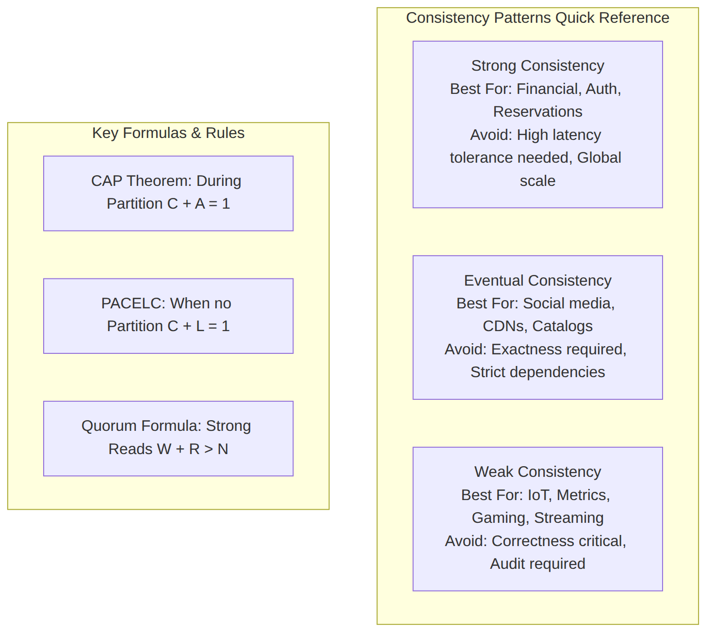
