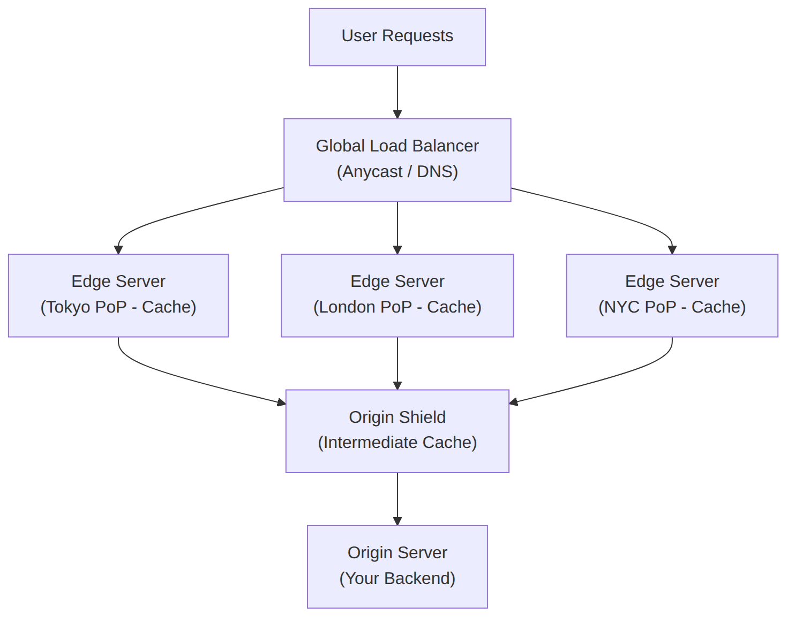
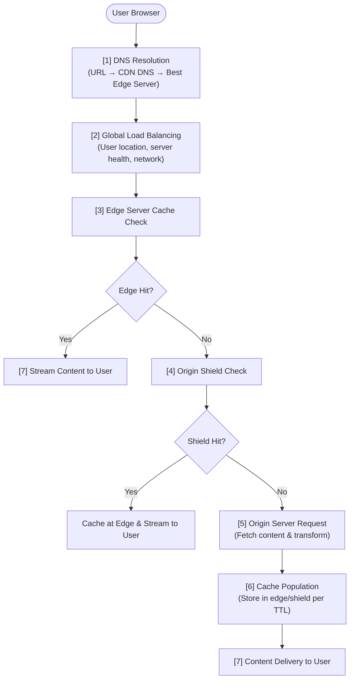
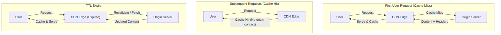
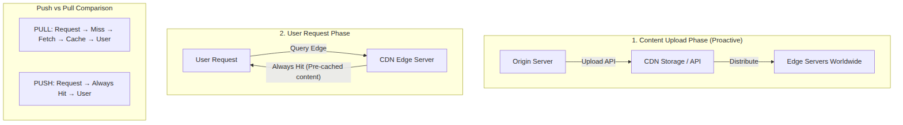
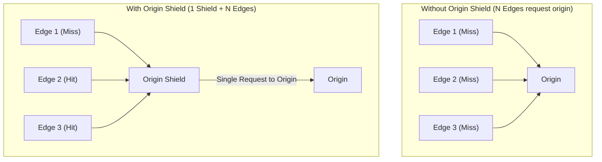
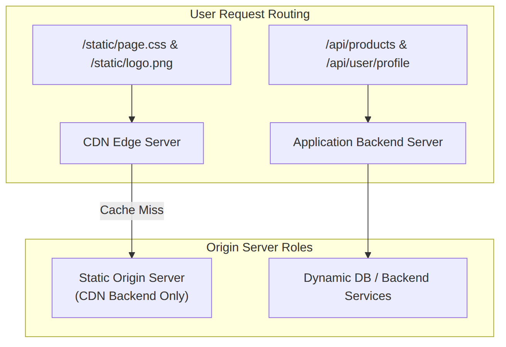

# Content Delivery Networks (CDNs) in Distributed Systems

## Overview

A **Content Delivery Network (CDN)** is a globally distributed network of proxy servers deployed in multiple data centers across the world to deliver web content to users from locations geographically closer to them. The fundamental purpose of a CDN is to reduce latency, improve performance, and decrease the load on origin servers by caching content at edge locations strategically positioned around the globe.

The architecture of a CDN represents a sophisticated approach to solving one of the fundamental challenges of the internet: delivering content quickly to users regardless of their geographic location. Without a CDN, a user in Tokyo requesting content from a server in New York would experience significant latency due to the physical distance and number of network hops involved. With a CDN, that same user might be served from an edge node in Tokyo or Singapore, reducing round-trip time from hundreds of milliseconds to single digits.

CDNs have become an essential component of modern web infrastructure. Major websites including Google, Facebook, Netflix, and Amazon rely extensively on CDNs to serve billions of requests daily. According to industry estimates, CDNs serve over 50% of all web traffic, making them one of the most critical pieces of internet infrastructure. Understanding CDN architecture, operation, and trade-offs is essential for any system designer working on applications that serve global audiences.

The **80/20 Rule** applies profoundly to CDN design and usage. Approximately 80% of typical web traffic consists of static content that rarely changes—images, stylesheets, JavaScript files, fonts, and other assets. By offloading this static content to a CDN, the remaining 20% of dynamic content can receive full server resources. This distribution means that implementing a CDN can dramatically improve overall system performance with relatively straightforward configuration, capturing most of the performance benefits through simple architectural decisions.

CDNs interact deeply with other system design concepts. They work with **DNS** to route users to optimal edge servers based on geographic location. They complement **caching strategies** by providing distributed cache infrastructure at the network edge. They enable **high availability** through redundant infrastructure and automatic failover. They support **microservices architectures** by providing fast content delivery for static assets while application servers handle dynamic requests. And they affect **scalability** by offloading traffic that would otherwise overwhelm origin servers.

## The Fundamental CDN Architecture

Understanding CDN architecture requires examining how content flows from origin servers through the CDN infrastructure to end users. The architecture consists of several interconnected components that work together to deliver content efficiently.

### Core Components

A CDN infrastructure comprises several key components that work together to serve content to users. The **origin server** represents the authoritative source of content—the web server, storage bucket, or application backend that holds the original files. When content is not available in the CDN cache, requests are forwarded to the origin server, which then provides the content for caching and delivery.

**Edge servers** (also called PoPs or Points of Presence) are the CDN's distributed proxy servers located in data centers around the world. These servers cache content and serve it directly to users. Edge servers are strategically placed in locations with high population density and internet connectivity to minimize latency. A major CDN provider might operate hundreds of edge locations across dozens of countries.

**Global load balancers** route user requests to the optimal edge server based on factors including geographic proximity, server load, network conditions, and content availability. Modern CDNs use sophisticated anycast routing and health checking to direct traffic appropriately.

**Cache servers** within edge locations store cached content according to configured TTL values. These servers use high-performance storage (often SSDs or in-memory caching) to serve content with minimal latency. Cache servers track what content is stored, how fresh it is, and how frequently it's accessed.

**Origin shield** is an intermediate caching layer between edge servers and origin servers. When an edge server needs to fetch content from the origin, the request goes through the origin shield, which may already have the content cached from another edge server's request. This architecture reduces load on origin servers and improves cache efficiency.



### How CDN Works: The Complete Flow

When a user requests content through a CDN, the request traverses several stages before the content is delivered. Understanding this flow is essential for troubleshooting and optimization.

**Step 1: DNS Resolution** begins when the user types a URL or clicks a link. The CDN URL resolves through DNS to the CDN's global load balancer. Modern CDNs use sophisticated DNS routing that considers the user's geographic location (determined by their DNS resolver's IP), network conditions, and the location of edge servers with cached content.

**Step 2: Global Load Balancing** receives the request and determines the optimal edge server to serve the request. The load balancer considers factors such as server health, current load, geographic proximity to the user, and network latency estimates. The request is then routed to the selected edge server.

**Step 3: Edge Server Processing** receives the request at the selected edge location. The edge server checks its local cache to determine if the requested content is available and fresh. This cache lookup is extremely fast, typically completing in microseconds.

**Step 4: Cache Hit Scenario** occurs when the requested content is found in the cache and is still fresh (within its TTL). The edge server immediately returns the cached content to the user. This scenario provides the best performance, with latency potentially under 10 milliseconds for users near the edge location.

**Step 5: Cache Miss Scenario** occurs when the content is not cached or has expired. The edge server requests the content from the origin shield (if configured) or directly from the origin server. The origin returns the content, which the edge server caches according to TTL configuration and then delivers to the user.

**Step 6: Content Delivery** completes when the requested content reaches the user's browser. The content may include headers that control browser caching behavior, enabling the browser to cache content locally for subsequent requests.



### CDN Benefits for System Design

Implementing a CDN provides multiple benefits that directly address common system design challenges.

**Latency Reduction** represents the most obvious benefit. By serving content from geographically proximate edge servers, CDN reduces the physical distance data must travel. The improvement is particularly significant for global audiences where origin servers might be far from many users. Latency reduction directly impacts user experience, conversion rates, and engagement metrics.

**Bandwidth Cost Reduction** occurs because CDN servers serve cached content instead of origin servers. For high-traffic websites, the majority of bandwidth costs come from serving static content. CDNs typically charge less per gigabyte than origin bandwidth costs, and many CDN providers include bandwidth from their own network to origin in their pricing.

**Origin Server Protection** results from the CDN acting as a shield in front of origin servers. During traffic spikes or DDoS attacks, the CDN absorbs much of the traffic, protecting origin servers from overload. This protection extends to origin server failures—the CDN can serve cached content even when the origin is temporarily unavailable.

**High Availability** is enhanced through CDN infrastructure redundancy. Major CDN providers operate thousands of servers across numerous data centers, providing built-in redundancy. If one edge location fails, traffic is automatically routed to nearby locations. This infrastructure would be extremely expensive to replicate independently.

**Security Enhancements** are provided by many CDN providers as additional services. DDoS mitigation, Web Application Firewall (WAF) capabilities, bot management, and SSL/TLS termination at the edge reduce security burdens on origin servers. These features are often included in CDN pricing or available as low-cost add-ons.

**SEO Improvement** results from faster page load times and reduced latency, which are factors in search engine ranking algorithms. Google's PageSpeed Insights and Core Web Vitals metrics are directly impacted by CDN usage, potentially improving search rankings for CDN-served content.

## 1. Pull CDN Architecture

**Pull CDNs** represent the most common CDN deployment model, particularly for consumer-facing web applications. In this architecture, content is automatically fetched (pulled) from the origin server to CDN edge servers only when users request it. The name derives from the CDN "pulling" content from the origin on demand rather than content being "pushed" to the CDN proactively.

The Pull CDN model aligns naturally with how most web content is accessed. Users request URLs, and the CDN determines whether to serve from cache or fetch from origin. This reactive model requires minimal configuration changes beyond URL rewriting and provides automatic scaling as traffic patterns change.

### How Pull CDN Works

The Pull CDN workflow begins with the origin server hosting all content, typically configured with standard URLs that point to the CDN domain rather than directly to origin. When the first user requests a piece of content, a chain of events unfolds.

The user's browser requests the CDN URL (for example, `https://cdn.example.com/images/photo.jpg`). The CDN's DNS routes this request to an appropriate edge server. The edge server checks its cache and finds no matching entry—this is a **cache miss**. The edge server then requests the content from the origin server (for example, `https://www.example.com/images/photo.jpg`). The origin server returns the content, which the edge server caches according to TTL configuration and delivers to the user.

When subsequent users request the same content, the edge server finds the cached entry and serves it directly without contacting the origin. This cache hit provides extremely fast response times and reduces origin server load to zero for that content.



### Cache Miss Penalty

The most significant characteristic of Pull CDN is the **cache miss penalty**. When content is first requested or after it has expired, the request must travel all the way to the origin server, increasing latency for that request. This penalty is sometimes called the "thundering herd" problem when many users simultaneously request uncached content.

The severity of cache miss impact depends on several factors. **Origin proximity** matters—if the origin is far from the CDN edge, latency increases significantly. **Origin performance** affects how quickly content is fetched and returned. **Content size** impacts transfer time, particularly for large files. **Network conditions** between CDN and origin influence throughput and reliability.

Mitigation strategies for cache miss penalties include **pre-warming**, where content is proactively fetched to populate caches before users request it. This approach can be implemented through scheduled crawling of likely content or triggered fetching when new content is published. **Stale-while-revalidate** caching allows serving stale content while fresh content is fetched in the background, ensuring users always get fast responses while cache is refreshed. **Origin shield** deployment creates an intermediate cache between edges and origin, reducing the impact when multiple edges need the same uncached content.

### Time-To-Live (TTL) Configuration

TTL configuration is the primary mechanism controlling how long content remains cached in Pull CDN edge servers. TTL values directly impact cache efficiency, origin load, and content freshness.

**Short TTLs** (minutes to hours) ensure content remains fresh and updates propagate quickly to all edge locations. This configuration suits content that changes frequently or where showing outdated content could cause problems. However, short TTLs increase origin server load because content must be fetched more frequently, and they reduce cache efficiency because content is less likely to be served from cache for subsequent requests.

**Long TTLs** (days to weeks or even months) maximize cache efficiency and minimize origin load. Content is fetched once and served from cache for extended periods, dramatically reducing origin bandwidth costs. This configuration suits stable content such as versioned assets, immutable files, and content where occasional staleness is acceptable. The tradeoff is delayed propagation of updates—if content changes, users may see old versions until TTL expires.

**TTL Selection Guidelines** vary by content type. Static assets like images, videos, and downloadable files typically use long TTLs (days to weeks) because they change infrequently. Versioned files (like `app.v1.js`) can use very long TTLs because new versions get new URLs. CSS and JavaScript can use moderate TTLs (hours to days) with cache-busting techniques for updates. API responses typically use short TTLs (seconds to minutes) or no caching at all. User-generated content may use moderate TTLs with purge-on-update mechanisms.

```
TTL CONFIGURATION BY CONTENT TYPE

Content Type          Typical TTL       Rationale
-------------         -----------       ----------------------------------------
Versioned static      1 year+          URL changes when content changes
  assets
Images/Videos         1-7 days         Large files, infrequent changes
CSS/JavaScript       4-24 hours        Changes through versioning
API responses         0-60 seconds      Dynamic content, freshness critical
User avatars          1-24 hours        Moderate change frequency
News articles         5-60 minutes      Updates important but not instant
Product images        4-24 hours        May change with inventory
```

### Cache Invalidation in Pull CDN

When content changes on the origin server, the cached version in the CDN becomes stale. Several mechanisms exist for handling this staleness.

**TTL-based expiration** automatically removes content from cache when its TTL expires. This passive approach requires no action but means changes aren't visible until all TTLs have passed. It's the simplest approach and works well when content changes are infrequent or slight staleness is acceptable.

**Explicit cache purge** actively removes specific content from CDN cache before TTL expires. When content is updated on origin, the origin server (or a management system) sends a purge request to the CDN API, immediately invalidating the specified content. Purge can target individual URLs, URL patterns, or entire directories. Most CDN providers offer purge APIs for programmatic invalidation.

**Surrogate keys** provide fine-grained cache tagging. Content is tagged with keys (like product ID or category), and purge requests can invalidate all content associated with a key. This approach is more efficient than purging individual URLs when many resources share update patterns (like all product images that need updating when a product description changes).

**Cache busting** techniques make cached URLs unique when content changes. By including content hashes, timestamps, or version numbers in URLs (like `style.css?v=2.3.1` or `app.a1b2c3d4.js`), new content gets new URLs that don't exist in cache. Browser cache is also bypassed, ensuring users receive the latest content immediately.

```
CACHE INVALIDATION STRATEGIES

Strategy 1: TTL Expiration
  Origin: style.css (updated)
  CDN: style.css cached for 24 hours
  Result: Users see old version for up to 24 hours

Strategy 2: Explicit Purge
  Origin: style.css (updated)
  System: POST /purge?url=style.css
  CDN: Immediately invalidates style.css
  Result: Next request fetches new version from origin

Strategy 3: Cache Busting URL
  Origin: style.css (updated)
  URL changes to: style.css?v=2.0
  Old URL (style.css?v=1.5) still cached
  New URL (style.css?v=2.0) not in cache
  Result: Users get new version immediately via new URL
```

### Optimal Use Cases for Pull CDN

Pull CDNs excel in several scenarios common to modern web applications.

**High-traffic websites with static assets** benefit enormously from Pull CDN. Sites serving images, videos, CSS, JavaScript, and fonts to millions of users can offload the vast majority of bandwidth to CDN edges, dramatically reducing origin server costs and improving user experience.

**Dynamic applications with static components** benefit from separating static and dynamic content. The CDN serves static assets while origin servers handle dynamic requests. This architecture simplifies scaling—origin servers need only handle dynamic traffic, which is typically a fraction of total requests.

**Sites with unpredictable traffic patterns** benefit from Pull CDN's on-demand caching. When traffic spikes occur (due to viral content, marketing campaigns, or news coverage), the CDN automatically handles increased load without origin server changes. No capacity planning is needed for static content delivery.

**Content that changes infrequently** suits the Pull CDN model well. News articles, blog posts, product catalogs, and documentation sites typically have content that remains stable for hours or days between updates. Long TTLs maximize cache efficiency while purge-on-update ensures changes propagate quickly when needed.

**Developer teams that prefer simplicity** often prefer Pull CDN because it requires minimal operational overhead. Content management doesn't require special workflows or integration—standard publishing processes automatically populate CDN caches through user traffic.

## 2. Push CDN Architecture

**Push CDNs** represent an alternative CDN deployment model where content is proactively uploaded (pushed) to CDN edge servers before users request it. In this architecture, the origin server or content management system takes responsibility for ensuring content exists on CDN edges, rather than waiting for user requests to trigger cache population.

The Push CDN model gives operators complete control over what content exists on CDN edges and when it appears. This control comes with additional operational complexity but enables scenarios where on-demand caching (Pull CDN) is insufficient.

### How Push CDN Works

The Push CDN workflow begins with content creators or automated systems uploading content directly to CDN storage. The upload process ensures content exists on CDN infrastructure before any user requests it.

The content management system or build process uploads content to CDN storage. This upload may use the CDN provider's API, CLI tool, or integration with storage services. The CDN propagates content to edge locations, making it available for user requests. When users request content, edge servers serve the already-cached content immediately—no origin fetch is needed.

The key difference from Pull CDN is the direction of data flow: in Pull CDN, content flows from origin to CDN when users request it; in Push CDN, content flows from origin to CDN proactively, and then from CDN to users.



### Content Synchronization Mechanisms

Maintaining synchronization between origin content and CDN edges is a central concern in Push CDN architectures. Several mechanisms facilitate this synchronization.

**Direct API Upload** involves calling the CDN provider's API to upload content directly to CDN storage. This approach offers maximum control but requires integration development and management. API uploads support operations like create, update, delete, and list, enabling full content lifecycle management.

**Webhook-triggered uploads** automatically push content to CDN when changes occur on origin. When a CMS publishes new content, it triggers a webhook that initiates CDN upload. This approach ensures CDN is always current without continuous polling or manual uploads.

**Scheduled synchronization** uploads content at regular intervals, suitable for content that changes periodically but not continuously. A nightly sync might upload newly created or modified content from origin storage to CDN, ensuring CDN has content that was updated during the day.

**Build-time integration** uploads content as part of the deployment or build process. For static sites, the build system generates all content and uploads it to CDN before deployment completes. This approach ensures CDN is always synchronized with the deployed version.

**Storage integration** connects CDN directly to origin storage services. Some CDN providers integrate with cloud storage (like S3, GCS, or Azure Blob Storage), automatically syncing content from these sources. When content is added to the storage bucket, it's automatically pushed to CDN edges.

### Zero Cache Miss Advantage

The defining advantage of Push CDN is the **absence of cache miss latency**. Because content is uploaded to CDN before any user requests it, the first request is identical to subsequent requests—all are served from CDN cache with minimal latency.

This advantage is particularly significant for certain content types. **Large files** like high-resolution videos, software installers, or dataset downloads would otherwise require long origin fetches on cache miss, potentially causing user frustration or timeout. **Time-sensitive content** like live event streams, breaking news, or real-time data feeds cannot tolerate cache miss delays. **Critical content** like error pages, landing pages, or conversion-critical assets need guaranteed fast delivery.

However, the practical impact of zero cache miss depends on cache hit rates in the Pull CDN alternative. For content accessed frequently enough that cache miss probability is low, the theoretical advantage of Push CDN diminishes. For infrequently accessed content or content with very long TTLs, the difference becomes significant.

### Storage Cost Considerations

Push CDN typically incurs higher storage costs than Pull CDN because content must exist on CDN storage whether or not users access it. This cost structure has important implications.

**Predictable storage costs** result from explicit content uploads. Operators know exactly what content exists on CDN and can calculate storage costs based on upload volume. This predictability aids budgeting and cost monitoring.

**Storage efficiency trade-offs** arise because Push CDN may store content that users never request. For content with low access rates, this inefficiency may exceed the cost of Pull CDN's occasional cache miss. Optimizing Push CDN cost-effectiveness requires analyzing access patterns and only uploading content likely to be requested.

**Tiered storage** strategies can mitigate inefficiency. Push CDN storage might be used for high-priority content likely to be accessed, while Pull CDN handles long-tail content accessed less frequently. Some CDN providers offer hybrid models that combine Push and Pull approaches.

**Content lifecycle management** in Push CDN requires explicit deletion when content is removed from origin. Unlike Pull CDN where TTL expiration eventually removes stale content, Push CDN requires active deletion to avoid accumulating unused content that incurs storage costs.

```
STORAGE COST COMPARISON: PUSH VS PULL CDN

Scenario: 100GB of content, varying access patterns

PULL CDN (Pay for egress, not storage):
  Storage: Free (implicit, cache-based)
  Egress: Only for accessed content
  Example: If 30GB accessed, pay for 30GB egress

PUSH CDN (Pay for storage + egress):
  Storage: Pay for all uploaded content
  Egress: For all content (even if not accessed)
  Example: Pay for 100GB storage + 100GB egress

Cost Breakpoints:
  Low access rate (<30%): Pull CDN cheaper
  High access rate (>70%): Costs similar
  Predictable content: Push CDN may be cheaper
  Variable content: Pull CDN more cost-effective
```

### Optimal Use Cases for Push CDN

Push CDNs excel in scenarios where content is known in advance and the zero-cache-miss advantage provides meaningful benefit.

**Video streaming platforms** often use Push CDN for premium content. Videos are encoded, uploaded to CDN before release, and served at consistent high speed without cache miss delays. This approach ensures buffering-free playback from the first viewer.

**Software distribution** benefits from Push CDN's guaranteed delivery. Software installers, patches, and updates must be downloaded reliably and quickly. Push CDN ensures these large files exist on edges before users initiate downloads.

**E-commerce product launches** can benefit from Push CDN for new product pages and images. High-profile launches generate traffic spikes where cache misses in Pull CDN could cause origin overload. Pre-uploading ensures instant delivery.

**Gaming content delivery** uses Push CDN for game assets, patches, and downloadable content. Games require fast, reliable delivery of large files, and content is known in advance rather than dynamically generated.

**Static site deployments** work well with Push CDN because all content exists at deploy time. The build process can upload everything to CDN, ensuring instant availability and simple rollback (re-upload previous version).

**Live event preparation** involves pre-uploading static assets associated with events before they begin. Lower thirds, replay clips, and supporting content can be on CDN edges before the first viewer arrives.

### Hybrid Push-Pull Approaches

Many modern CDN deployments combine Push and Pull approaches to capture benefits of both models.

**Hot/Cold content separation** pushes high-priority or large content while relying on Pull for long-tail content. Critical assets and large files get proactive upload, while less-accessed content uses on-demand caching.

**Push for seeding, Pull for updates** uses Push CDN to initially populate content, then relies on Pull mechanism for updates. This approach reduces initial cache miss while maintaining automatic update propagation.

**Conditional push** analyzes access patterns and pushes content that meets certain popularity thresholds. Content below the threshold relies on Pull caching. This approach optimizes Push storage costs while ensuring popular content has zero cache miss.

**Tiered CDN architecture** uses different CDN providers or tiers for different content. Premium CDN with Push might serve high-value content while economical CDN with Pull serves general content.

## Comparative Analysis: Pull CDN vs Push CDN

Understanding the differences between Pull and Push CDN enables informed architectural decisions. Both approaches have legitimate use cases, and the optimal choice depends on specific requirements.

### Architectural Comparison

The fundamental architectural difference lies in content propagation direction. Pull CDN follows a reactive model where content moves from origin to CDN on demand, triggered by user requests. Push CDN follows a proactive model where content moves from origin to CDN in advance, triggered by content management systems or scheduled processes.

This difference has cascading effects throughout the system. Pull CDN requires only URL rewriting and standard HTTP behavior—the CDN acts transparently as a caching layer. Push CDN requires explicit upload infrastructure, synchronization logic, and potentially more complex content management workflows.

```
ARCHITECTURAL COMPARISON

PULL CDN                           PUSH CDN
---------                          --------
Reactive: User triggers transfer    Proactive: System triggers transfer
No upload infrastructure needed     Upload pipeline required
Automatic cache management         Manual cache management
Content appears when accessed      Content exists before access
TTL controls removal               Deletion must be explicit
Scalable without configuration     Upload capacity planning needed
Origin still involved on cache miss  Origin only for upload, not serving
```

### Performance Characteristics

Performance comparison reveals trade-offs that favor different approaches under different conditions.

**First request latency** strongly favors Push CDN because content exists on edges before any requests occur. Pull CDN incurs origin fetch latency on first request or after TTL expiry. The difference is most significant for large files and distant origin servers.

**Subsequent request latency** is equivalent between approaches—both serve from edge cache with minimal latency. The first-request advantage of Push CDN diminishes as Pull CDN cache warms up.

**Cache warm-up time** is zero for Push CDN (content exists from the start) and variable for Pull CDN (depends on traffic patterns and TTL). Pull CDN for infrequently accessed content may never achieve full cache warm-up.

**Traffic spike handling** differs significantly. Push CDN handles spikes without origin involvement because content already exists on edges. Pull CDN may cause origin overload during spikes if cache warm-up is insufficient.

```
PERFORMANCE COMPARISON

Metric                      Pull CDN           Push CDN
------                      --------          --------
First request latency       Variable (high)   Consistent (low)
Subsequent latency          Low               Low
Cache warm-up time          Minutes to hours  Zero
Origin load during spikes   Can be high        Minimal
Cold start penalty          Yes               No
Time to first byte          Depends on origin  Edge speed
```

### Cost Comparison

Cost structures differ substantially between approaches, affecting total cost of ownership.

**Bandwidth costs** in Pull CDN depend on actual traffic served—content cached but never accessed incurs no CDN bandwidth cost. Push CDN bandwidth costs cover all uploaded content regardless of access, even if content is never requested.

**Storage costs** exist only in Push CDN because content must be stored explicitly. Pull CDN storage is implicit and based on cache population from traffic. For content with low access rates, Pull CDN storage is effectively free.

**Origin bandwidth costs** differ significantly. Pull CDN can incur substantial origin bandwidth for cache misses, particularly during cache warm-up or after TTL expiry. Push CDN origin bandwidth occurs only during upload, not during user requests.

**Operational costs** include development and maintenance of upload pipelines for Push CDN, which Pull CDN doesn't require. These costs must be factored into total cost of ownership.

```
COST COMPARISON (Illustrative)

Scenario: 1TB content library, 10% accessed in month

PULL CDN:
  CDN bandwidth: 100GB egress @ $0.02 = $2.00
  CDN storage: Implicit, no charge
  Origin bandwidth: 100GB @ $0.09 = $9.00
  Total: ~$11/month

PUSH CDN:
  CDN bandwidth: 1000GB egress @ $0.02 = $20.00
  CDN storage: 1000GB @ $0.01 = $10.00
  Origin bandwidth: 1000GB upload @ $0.09 = $90.00
  Total: ~$120/month

Break-even: Push CDN becomes cheaper when access rate approaches 100%
```

### Operational Complexity

Operational requirements differ substantially between approaches.

**Pull CDN complexity** is primarily configuration-focused. URL rewriting, TTL tuning, cache purge procedures, and origin server sizing are the main concerns. No custom upload infrastructure is needed.

**Push CDN complexity** includes upload pipeline development and maintenance, synchronization logic, error handling for failed uploads, and content lifecycle management. These requirements add development and operational overhead.

**Monitoring needs** differ. Pull CDN monitoring focuses on cache hit rates, origin load, and cache efficiency. Push CDN monitoring includes upload status, synchronization delays, and storage utilization.

**Rollback procedures** are simpler for Push CDN—re-upload previous content versions. Pull CDN rollback may require cache purge plus waiting for TTL expiry of incorrect content.

### Decision Framework

Choosing between Pull and Push CDN (or hybrid approaches) requires considering multiple factors.

**Choose Pull CDN when**: content access patterns are unpredictable and follow actual demand; operational simplicity is prioritized; content changes frequently and updates should propagate automatically; development resources are limited; cost efficiency for long-tail content is important.

**Choose Push CDN when**: content is known in advance of user access; zero first-request latency is critical; content is large and origin fetch would be slow; traffic spikes are predictable and intense; content lifecycle is well-controlled; budget allows for storage investment.

**Choose Hybrid when**: content mixes high-priority and long-tail items; some content benefits from Push while other suits Pull; cost optimization across content types is needed; different CDN tiers are available for different content.

```
CDN SELECTION DECISION MATRIX

Factor                      Favors Pull    Favors Push
------                      -----------    -----------
Access predictability       Unpredictable  Predictable
Content size                Small-medium  Large
Update frequency           High           Low
First-request latency       Less critical  Critical
Traffic pattern             Variable       Steady/predictable
Operational resources       Limited        Available
Content lifecycle           Complex        Well-defined
Budget constraints          Strict         Flexible
```

## CDN Caching Strategies

Effective CDN usage requires understanding and implementing appropriate caching strategies. These strategies determine what content is cached, for how long, and how updates are handled.

### Cache Key Design

The **cache key** determines what combination of request attributes results in a cached response. Poor cache key design can dramatically reduce cache hit rates or serve incorrect content.

**URL-based caching** is the default, where the full URL is the cache key. Two requests with different URLs cache independently. This approach is simple and predictable but may cause issues when the same content is accessible via multiple URLs (with/without www, trailing slashes, case variations).

**Query parameter handling** requires explicit configuration. Some parameters should be ignored for caching (like tracking parameters `utm_source`), while others should be included (like API keys or version numbers). CDN providers offer parameter filtering options to handle these variations.

**Host header variations** should typically be normalized. Requests to `example.com` and `www.example.com` should generally cache together. CDN providers can be configured to ignore host header differences for caching purposes.

**Accept-encoding variations** (gzip, brotli, deflate) create separate cache entries per encoding. CDNs may transcode between formats at the edge, serving one cached version to browsers with different capabilities.

```
CACHE KEY OPTIMIZATION EXAMPLES

Problem: URL variations create separate cache entries
  /page.html
  /page.html/
  /Page.html

Solution: Normalize URLs to single cache key
  Cache key: /page.html (case-insensitive, trailing slash removed)

Problem: Tracking parameters bloat cache
  /page.html?utm_source=twitter&utm_campaign=spring
  /page.html?utm_source=facebook&utm_campaign=spring
  /page.html (organic)

Solution: Ignore utm_* parameters
  Cache key: /page.html (utm_* stripped)

Problem: Personalization creates unique keys per user
  /api/user?user_id=123
  /api/user?user_id=456

Solution: Don't cache personalized endpoints
  Cache-Control: private or no-store
```

### Cache-Control Header Directives

HTTP Cache-Control headers provide fine-grained control over CDN caching behavior.

**`public`** indicates the response can be cached by any cache, including CDN edges. This is the default for most CDN-cached content.

**`private`** indicates the response is specific to a single user and should not be cached at shared caches (like CDN edges). Private content may still be cached by the user's browser.

**`no-store`** completely prevents caching. This directive should be used for sensitive data that should never be stored, even temporarily.

**`no-cache`** requires revalidation with origin before serving cached content. Unlike preventing caching entirely, this approach serves cached content only after confirming it's still valid.

**`max-age=N`** specifies the maximum time (in seconds) content should be cached. This directive directly sets the TTL that CDN edges should use.

**`s-maxage=N`** specifies maximum caching time for shared caches specifically, overriding `max-age` for CDN edges but not for browsers.

**`stale-while-revalidate=N`** allows serving stale content while revalidating in the background. Users get fast responses immediately while cache is refreshed for future requests.

**`stale-if-error=N`** allows serving stale content when origin returns an error, improving availability at the cost of potentially stale content.

```
CACHE-CONTROL HEADER EXAMPLES

Cache static assets for 1 day:
  Cache-Control: public, max-age=86400

Cache in browser, not at CDN edge:
  Cache-Control: private, max-age=86400

Never cache (sensitive/personalized):
  Cache-Control: no-store, private

Revalidate before serving, cache for 1 hour:
  Cache-Control: public, max-age=0, must-revalidate

Serve stale for up to 1 hour while revalidating:
  Cache-Control: public, max-age=3600, stale-while-revalidate=3600

Cache for 1 week at edge, 1 hour in browser:
  Cache-Control: public, max-age=604800, s-maxage=3600
```

### Edge-Side Includes (ESI)

**Edge-Side Includes (ESI)** is a markup language for assembling web pages at the CDN edge from cached and uncached components. ESI enables cacheable page shells with dynamic content injected at the edge.

The ESI processor at the CDN edge replaces ESI tags with content from specified sources. A cached HTML shell might include ESI tags for personalized headers, shopping cart contents, or real-time data. The CDN fetches dynamic content and assembles the complete page without involving origin servers for assembly.

ESI use cases include **personalized page sections** that can be assembled at the edge rather than generated per-request at origin. **CMS integration** where page templates are cached while content fragments are fetched dynamically. **Real-time components** like stock prices, weather, or inventory that can't be cached but should be fetched from nearby edge rather than distant origin.

ESI implementation requires CDN provider support and markup in HTML pages. Not all CDN providers support ESI, and those that do offer varying feature sets.

```
ESI PAGE ASSEMBLY EXAMPLE

HTML Shell (Cached at edge):
  <html>
  <head>...</head>
  <body>
    <esi:include src="/header.html"/>
    <esi:include src="/product.html?id=123"/>
    <esi:include src="/footer.html"/>
  </body>
  </html>

Edge Processing:
1. CDN serves shell from cache
2. ESI processor detects <esi:include> tags
3. Fetches /header.html (cached) - fast
4. Fetches /product.html?id=123 (may be uncached) - from origin or nearby cache
5. Fetches /footer.html (cached) - fast
6. Assembles complete page
7. Returns assembled page to user

User receives full page with dynamic content
Origin only involved for dynamic fragments
```

## CDN Security Considerations

CDNs provide security benefits but also introduce security considerations that must be addressed.

### DDoS Protection

CDNs naturally absorb DDoS attacks because traffic passes through CDN infrastructure before reaching origin servers. The distributed nature of CDN networks means attack traffic is spread across many edge locations, and each edge location is designed to handle high traffic volumes.

CDN providers offer various DDoS protection services. **Volumetric protection** absorbs traffic floods at the network edge. **Protocol attacks** (like SYN floods) are handled through edge infrastructure. **Application layer attacks** (like HTTP floods) are mitigated through rate limiting, challenge pages, and behavior analysis.

**Origin cloaking** prevents attackers from bypassing CDN and directly targeting origin servers. By not exposing origin IP addresses and only accepting traffic from CDN IP ranges, origin servers remain hidden from direct attack.

### SSL/TLS Termination

CDN edge servers typically handle SSL/TLS termination, decrypting HTTPS traffic at the edge and forwarding requests to origin over encrypted or unencrypted connections. This architecture affects security considerations.

**Edge encryption** ensures traffic between users and CDN is encrypted, protecting against eavesdropping and man-in-the-middle attacks. Modern CDNs support TLS 1.3 with perfect forward secrecy.

**Origin encryption** may use self-signed certificates or lower encryption levels because traffic stays within trusted network paths between CDN and origin. Some configurations use unencrypted HTTP between CDN and origin in trusted environments.

**Certificate management** is simplified when CDN handles certificates. Many CDN providers offer free certificates (like Let's Encrypt integration) and automatic renewal. This approach eliminates the operational burden of certificate procurement and deployment.

### Content Security

CDN security extends to protecting content from unauthorized access or modification.

**Hotlink protection** prevents other websites from embedding CDN content (like images) by checking the Referer header. Requests from unauthorized domains are blocked or redirected.

**Signed URLs** provide time-limited access to content. URLs include cryptographic signatures that CDN edges verify before serving content. This approach enables premium content access without traditional authentication.

**Geo-restrictions** limit content access based on user geographic location. CDN edges determine location from IP addresses and enforce access policies. This capability supports regional licensing requirements.

**Bot management** identifies and manages automated traffic. Legitimate bots (like search engine crawlers) receive appropriate treatment while malicious bots are blocked or challenged.

## Major CDN Providers

Understanding the CDN provider landscape helps in selection decisions. Major providers offer different capabilities, pricing models, and geographic coverage.

**Amazon CloudFront** is tightly integrated with AWS ecosystem, offering seamless integration with S3, EC2, Lambda@Edge, and other AWS services. CloudFront supports Lambda@Edge and CloudFront Functions for edge computing. Its global network spans over 600 edge locations. Pricing is consumption-based with tiered pricing for high-volume usage.

**Cloudflare** differentiates with a broad security platform including DDoS protection, WAF, bot management, and CDN in unified offerings. Cloudflare's network spans over 300 cities globally. The free tier provides basic CDN and DDoS protection. Workers platform enables edge computing. Argo Tiered Cache and Smart Routing optimize delivery.

**Akamai** is one of the oldest and largest CDN providers, with the most extensive global network (over 4,000 locations). Akamai serves major enterprises and streaming platforms. Its Luna Control Platform provides sophisticated traffic management. Higher pricing reflects premium network and enterprise features.

**Fastly** emphasizes real-time cache purging and edge computing capabilities. Fastly's Instant Purge provides immediate cache invalidation across the network. Compute@Edge (based on WebAssembly) enables sophisticated edge processing. Fastly serves high-traffic sites requiring instant updates.

**Google Cloud CDN** integrates with Google Cloud Platform services including Cloud Storage and Load Balancing. Its global network leverages Google's infrastructure. Integration with Cloud Armor provides security features. Pricing is competitive for GCP users.

**Microsoft Azure CDN** integrates with Azure services including Blob Storage and Web Apps. It offers multiple CDN products (Standard Microsoft, Standard Akamai, Standard Verizon, Premium Verizon) with different feature sets. Integration with Azure Front Door provides additional capabilities.

**KeyCDN** and **BunnyCDN** are smaller providers focusing on simplicity and cost-effectiveness. They offer straightforward pricing without complex tiering. These providers suit smaller applications or specific regional coverage needs.

```
CDN PROVIDER COMPARISON

Provider        Global PoPs   Edge Computing   Notable Features
--------        -----------   -------------   ----------------
Cloudflare      300+ cities   Workers         Unified security platform
CloudFront      600+          Lambda@Edge     AWS integration
Akamai          4,000+        Yes             Largest network, enterprise
Fastly          80+           Compute@Edge    Instant purging, real-time
Google Cloud    100+          Cloud Functions  Google network
Azure CDN       80+           Azure Functions  Multiple CDN products
KeyCDN          35+           None            Simple, cost-effective
BunnyCDN        90+           None            Storage integration
```

## Common CDN Architectures

CDN integration patterns vary based on application architecture and requirements.

### Standard CDN Integration

The most common pattern involves simple URL rewriting to point static asset requests to CDN domain.

Origin server continues hosting files; URLs in HTML reference CDN domain. CDN fetches from origin on cache miss, caches per TTL, serves subsequent requests from cache. This pattern requires minimal code changes and provides immediate benefits.

```
STANDARD INTEGRATION

Before CDN:
  

After CDN:
  

DNS routes cdn.example.com to CDN edge network.
CDN serves from cache or fetches from example.com origin.
```

### Origin Shield Architecture

For high-traffic deployments, an origin shield layer reduces origin server load.

Edge servers first request content from origin shield. Origin shield, if it has content cached, serves to edges. Only if origin shield misses does it request from origin. This architecture dramatically reduces origin bandwidth and CPU usage when multiple edges request the same content.



### Multi-Tier CDN

Large deployments may use multiple CDN providers or tiers for optimal coverage.

A premium CDN (like Cloudflare) serves primary geographic regions with full features. A secondary CDN (like a regional provider) serves other regions with lower cost. Intelligent routing directs traffic based on user location and CDN performance.

This approach optimizes cost-performance trade-offs across different user populations while avoiding vendor lock-in.

### Hybrid Static and Dynamic Architecture

Modern applications combine CDN for static content with traditional serving for dynamic content.

Static content (HTML, CSS, JS, images, fonts) routes through CDN with aggressive caching. Dynamic content (APIs, user-specific pages, real-time data) routes to application servers or serverless functions. This architecture captures CDN benefits for static content while maintaining dynamic functionality.



## Troubleshooting CDN Issues

CDN issues can manifest as performance problems, content staleness, or service unavailability. Systematic troubleshooting approaches help identify and resolve issues.

### Cache Hit Rate Analysis

Low cache hit rates indicate inefficient caching. Common causes include TTLs set too low, too many unique URLs (like per-user content), uncached query parameters, or HTTP headers preventing caching.

Diagnostic steps include examining CDN analytics for hit rate metrics. Check TTL configuration for content types with low hit rates. Review cache key configuration for unintended variations. Verify Cache-Control headers allow caching.

### Stale Content Issues

Users seeing outdated content indicates cache invalidation problems. Causes include TTL too long for frequently changing content, cache purge not executed after updates, CDN provider propagation delays, or browser cache serving old content.

Resolution involves executing cache purge for updated content. Verify purge completion through CDN provider tools. Consider browser cache by using cache busting (changing URLs). For urgent updates, temporarily reduce TTL before making changes.

### Origin Server Overload

Origin servers receiving too much traffic despite CDN indicates cache inefficiency. Causes include TTLs too low, cache purge too aggressive, cold cache from traffic pattern changes, or CDN configuration errors.

Solutions include increasing TTLs for stable content. Reviewing purge patterns for over-purging. Implementing origin shield for multi-edge architectures. Analyzing traffic patterns for cache-unfriendly content.

### DNS Configuration Issues

CDN not receiving traffic often stems from DNS configuration problems. Check CNAME records pointing to CDN. Verify DNS propagation (changes may take time). Confirm CDN domain is configured at provider. Test resolution from multiple locations.

### SSL/TLS Certificate Problems

HTTPS not working can result from certificate issues. Verify certificate is valid and not expired. Confirm certificate covers the correct domain (including CDN domain). Check certificate chain completeness. Review mixed content warnings.

## Interview Questions

**Q: How does a CDN improve website performance?**

A: CDNs improve performance through multiple mechanisms. First, geographic proximity reduces network latency—users receive content from nearby edge servers rather than distant origin servers. Second, CDN edges typically have high-bandwidth connections optimized for content delivery. Third, CDN offloads static content from origin servers, freeing resources for dynamic content. Fourth, CDNs implement optimizations like TCP connection pooling, prefetching, and compression that improve delivery speed. Fifth, browser caching of CDN-served content provides instant loads for repeat visits. The combined effect can reduce page load times by 50-80% for geographically distributed users.

**Q: What is the difference between Push CDN and Pull CDN, and when would you use each?**

A: In Pull CDN, the CDN automatically fetches content from origin when users request it—content "pulls" from origin on demand. In Push CDN, content is proactively uploaded to CDN before users request it—content is "pushed" to CDN in advance. Pull CDN is simpler to operate (no upload pipeline needed), scales automatically with traffic, and doesn't store uncached content. Push CDN guarantees zero first-request latency because content exists on edges from the start, handles traffic spikes without origin involvement, and provides complete control over edge content. Use Pull CDN for typical web content with unpredictable access patterns. Use Push CDN for known-in-advance content where first-request latency matters, large files, or when traffic patterns are predictable and spiky.

**Q: How would you handle cache invalidation in a CDN for content that updates frequently?**

A: For frequently updated content, I'd implement a multi-layered strategy. First, I'd set TTLs appropriate to update frequency—short enough that changes propagate quickly, long enough to maintain cache efficiency. Second, I'd implement explicit purge through CDN APIs when content updates, ensuring immediate cache invalidation rather than waiting for TTL expiry. Third, I'd use cache-busting techniques like content-hashed URLs (versioned files) so new content gets new URLs that bypass cache automatically. Fourth, for content with many related pieces (like all images for a product), I'd use cache tagging with surrogate keys to purge related content efficiently. Fifth, for extremely time-sensitive updates, I'd use stale-while-revalidate to serve slightly stale content while freshening cache in the background, ensuring users always get fast responses.

**Q: What are the security considerations when using a CDN?**

A: CDN security involves several considerations. First, origin server protection—CDNs should hide origin IPs to prevent direct attacks bypassing CDN. Second, SSL/TLS handling—ensure CDN uses strong encryption (TLS 1.3 minimum) and manages certificates properly. Third, DDoS protection—leverage CDN's ability to absorb volumetric attacks. Fourth, access control—implement signed URLs for premium content, geo-restrictions for licensing requirements, and hotlink protection for asset theft prevention. Fifth, WAF integration—many CDNs offer Web Application Firewalls that should be configured appropriately. Sixth, monitoring—track CDN analytics for anomalies indicating attacks or misconfiguration. The CDN itself becomes a critical infrastructure component, so provider security practices and certifications matter.

**Q: How would you design a system that serves both static and dynamic content through a CDN?**

A: I'd architect a hybrid approach where static content uses aggressive CDN caching while dynamic content is served appropriately. For static content (CSS, JS, images, fonts), I'd configure long TTLs with cache-busting for updates, rewrite URLs to CDN domain, and implement explicit purge on deployments. For dynamic HTML pages, I'd use shorter TTLs with stale-while-revalidate or Edge-Side Includes for personalized sections. For truly dynamic content (APIs, user-specific data), I'd route requests directly to application servers or serverless functions rather than CDN—CDN caching isn't appropriate for personalized or real-time content. The key is distinguishing content that should be cached (shared, static) from content that shouldn't (personalized, real-time). I'd also implement proper Cache-Control headers per content type and use CDN analytics to optimize caching strategies.

## Summary and Key Takeaways

CDNs represent essential infrastructure for modern web applications serving users across geographic distances. Understanding CDN architecture, operation, and trade-offs enables informed decisions about their use and configuration.

**CDN architecture** consists of globally distributed edge servers, global load balancers, cache servers, and origin shield layers. Content flows from origin through CDN infrastructure to users, with caching occurring at multiple points to minimize latency and origin load.

**Pull CDN** automatically fetches content on-demand from origin servers. This model is simple, scalable, and cost-effective for typical web content. Cache miss latency and origin load during cold-cache periods are trade-offs to consider.

**Push CDN** proactively uploads content to CDN edges before user requests. This model guarantees fast first-request delivery and insulates origin from traffic spikes. Additional operational complexity and storage costs are necessary trade-offs.

**Caching strategies** determine CDN effectiveness. Proper cache key design, Cache-Control header usage, and cache invalidation mechanisms ensure content freshness while maximizing cache efficiency.

**Security considerations** include DDoS protection, SSL/TLS termination, content access control, and origin server protection. CDNs provide security benefits but require proper configuration to realize them.

**Provider selection** should consider geographic coverage, integration requirements, edge computing capabilities, and pricing models. The major providers offer different strengths suited to different use cases.

The 80/20 rule applies powerfully to CDN adoption—implementing even basic CDN configuration typically captures most available performance benefits with minimal complexity, making CDNs a high-value component of system architecture.

```
CDN QUICK REFERENCE

ARCHITECTURE COMPONENTS:
  Edge Servers (PoPs)    - Distributed proxy servers worldwide
  Global Load Balancer   - Routes to optimal edge
  Cache Servers         - Store cached content
  Origin Shield         - Intermediate cache layer
  Origin Server         - Source of truth for content

PULL CDN CHARACTERISTICS:
  Reactive caching      - Fetches on user request
  Simple operation      - URL rewriting only
  Auto-scaling         - Traffic drives cache population
  TTL-dependent        - TTL controls cache duration
  Best for:            - Dynamic/static content, unpredictable access

PUSH CDN CHARACTERISTICS:
  Proactive caching    - Uploads before requests
  Complex operation    - Upload pipeline needed
  Guaranteed delivery  - Content exists before first request
  Explicit management  - Upload/delete control
  Best for:            - Large files, predictable traffic, instant delivery

TTL RECOMMENDATIONS:
  Versioned assets      - 1 year or more
  Images/Videos        - 1-7 days
  CSS/JavaScript       - 4-24 hours
  API responses        - 0-60 seconds (or no cache)

CACHE-CONTROL DIRECTIVES:
  public               - Cacheable by all caches
  private              - User-specific, not shared cache
  no-store            - Never cache
  max-age=N           - Cache for N seconds
  s-maxage=N          - Shared cache max-age
  stale-while-revalidate - Serve stale while revalidating
```

---