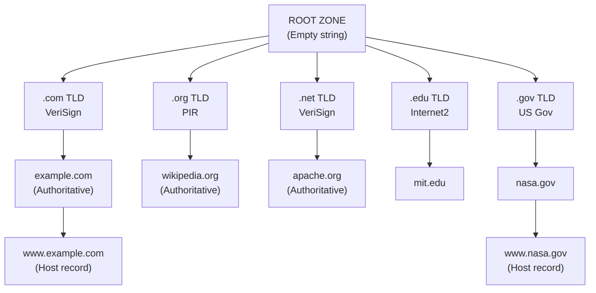
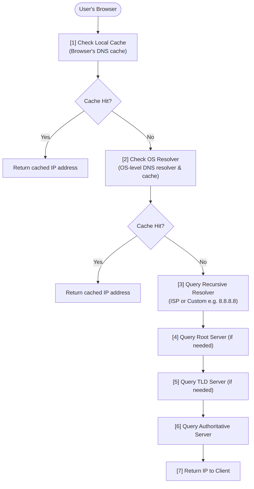
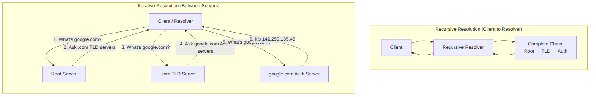
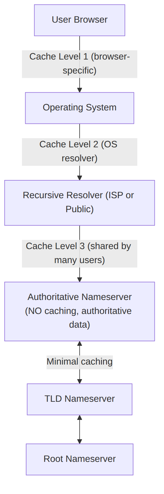
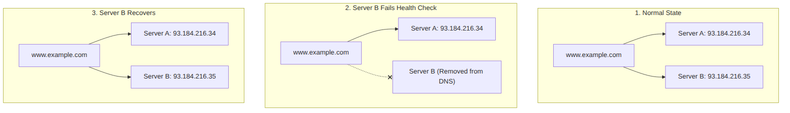
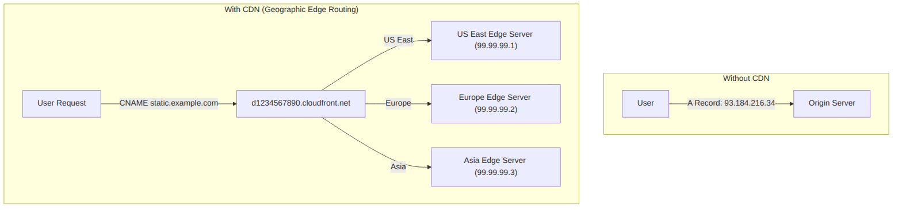
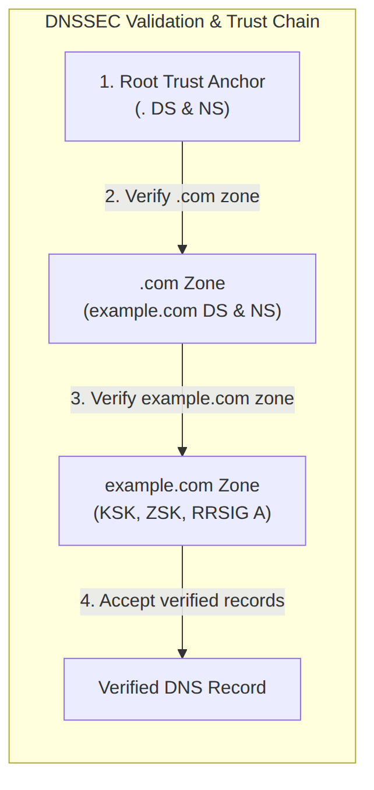

# Domain Name System (DNS) in Distributed Systems

## Overview

The **Domain Name System (DNS)** serves as the internet's address book and phone book combined. It translates human-readable domain names such as `www.example.com` into machine-readable IP addresses such as `192.0.2.1` or `2001:db8::1`, allowing browsers, applications, and services to locate and connect to hosting servers without users needing to memorize numerical IP addresses. DNS forms one of the most critical infrastructure components of the modern internet, handling billions of lookups daily with typically sub-second response times.

DNS operates as a distributed hierarchical database that spans the entire internet. Unlike a centralized phone book that exists in one location, DNS distributes its database across thousands of servers worldwide, creating a resilient system that can survive partial failures while still providing global coverage. This distributed architecture ensures that DNS queries can be resolved quickly regardless of where users are located geographically.

The fundamental problem DNS solves is **name resolution**—converting meaningful names into actionable network addresses. When you type "google.com" into your browser, DNS is responsible for determining the IP address of Google's servers so your browser can establish a connection. This translation happens invisibly, typically completing in milliseconds, making the process seem effortless while enabling the user-friendly experience we expect from the internet.

Applying the **80/20 Rule** to DNS means recognizing that most organizations do not need to manage their own DNS infrastructure from scratch. Modern managed DNS providers offer sophisticated features including global anycast networks, built-in load balancing, automatic failover, and security features that would cost millions to implement independently. Understanding DNS deeply enables you to leverage these managed services effectively while recognizing when custom solutions might be necessary.

DNS interacts fundamentally with other system design concepts. It works with **load balancing** by distributing traffic across multiple servers based on geographic proximity, health status, or configured weights. It enables **high availability** through failover mechanisms that redirect traffic away from failed infrastructure. It supports **microservices architectures** by providing stable names for dynamic service endpoints. And it affects **performance** through caching strategies, TTL configuration, and geographic routing decisions.

## The DNS Hierarchy

The DNS system is organized as a strict **hierarchical tree structure** that descends from the root of the internet namespace down to individual domain records. This hierarchy ensures that every domain can be uniquely identified and resolved through a predictable chain of authority, even though no single entity controls the entire system.

### The Root Level

At the apex of the DNS hierarchy sits the **root zone**, represented by an empty string ("") or a trailing dot in fully qualified domain names (FQDNs) such as `www.example.com.` The root zone contains the authoritative information for the top-level domains and is managed by the Internet Assigned Numbers Authority (IANA), a function now performed by Public Technical Identifiers (PTI), an affiliate of the Internet Corporation for Assigned Names and Numbers (ICANN).

The root zone is served by **root servers**, of which there are 13 logical root server identities (labeled A through M) operated by different organizations worldwide. These root servers form the foundation of the entire DNS system—if they were to fail entirely, no new domain resolutions could occur beyond cached responses. However, the distributed anycast deployment of these root servers means there are actually hundreds of physical servers distributed globally, providing resilience against individual failures.



### Top-Level Domains (TLDs)

Directly beneath the root zone are the **Top-Level Domains (TLDs)**, which represent the highest level of domain name classification. TLDs are broadly categorized into several types based on their purpose and administration.

**Generic Top-Level Domains (gTLDs)** are the most common TLDs and include familiar extensions such as `.com`, `.org`, `.net`, `.info`, and `.biz`. These were originally intended to represent specific categories (`.com` for commercial, `.org` for organizations, `.net` for network providers), but in practice, usage has become much more diverse and less constrained.

**Sponsored Top-Level Domains (sTLDs)** are specialized domains operated by specific organizations or communities under policies set by ICANN. Examples include `.edu` for accredited educational institutions, `.gov` for United States government agencies, `.mil` for United States military, and `.aero` for the air transport industry. Each sTLD has eligibility requirements enforced by its sponsoring organization.

**Country Code Top-Level Domains (ccTLDs)** represent specific countries, sovereign states, or dependent territories and use two-letter codes defined by ISO 3166-1. Examples include `.us` for United States, `.uk` for United Kingdom, `.cn` for China, `.de` for Germany, and `.jp` for Japan. Many ccTLDs have their own registration rules and are often managed by national organizations.

**Infrastructure Top-Level Domain** consists solely of `.arpa`, a special domain reserved for reverse DNS lookups and infrastructure purposes. The `.arpa` domain is critical for the operation of DNS itself and for network troubleshooting.

### Authoritative Name Servers

At the lower levels of the hierarchy are the **authoritative name servers** that actually store and serve the DNS records for specific domains. These servers have complete authority over their delegated zones and provide definitive answers to queries for names within their scope.

**Primary (Master) Name Servers** are the authoritative servers that store the original zone data for a domain. All changes to DNS records are made on the primary server, which is configured as the authoritative source of truth. Organizations typically designate one primary server, often located within their main data center or with their DNS provider.

**Secondary (Slave) Name Servers** receive zone data through automatic transfers from the primary server. They provide redundancy and load distribution for DNS queries, improving both availability and response times. Secondary servers are authoritative—they can answer queries just like primary servers—but they do not accept direct administrative changes.

**Authoritative-only servers** respond to queries for domains where they are configured as authoritative but do not perform recursive resolution on behalf of clients. This configuration improves security by limiting the server's exposure to cache poisoning attacks and reduces operational overhead by eliminating the need to maintain a cache.

## DNS Resolution Process

Understanding the DNS resolution process is essential for troubleshooting, performance optimization, and system design. The resolution path involves multiple components working together, each playing a specific role in translating domain names into IP addresses.

### Full Resolution Walkthrough

When a user types a URL into their browser, the DNS resolution process unfolds through several stages, each potentially involving cached data:



**Step 1: Local Browser Cache** represents the first checkpoint. Modern browsers maintain their own DNS caches to avoid repeated lookups for the same domains. If the requested domain exists in this cache and hasn't expired, the resolution completes immediately without any network queries.

**Step 2: Operating System Cache and Resolver** checks the system's DNS cache next. The operating system maintains a DNS cache that persists across browser sessions and provides a centralized resolution point for all applications. If the lookup fails here, the request proceeds to the configured recursive resolver.

**Step 3: Recursive Resolver** is typically provided by the user's Internet Service Provider (ISP) or can be manually configured. Common public recursive resolvers include Google Public DNS (8.8.8.8, 8.8.4.4), Cloudflare (1.1.1.1, 1.0.0.1), and Quad9 (9.9.9.9). The recursive resolver is responsible for completing the full resolution chain on behalf of the client.

**Step 4: Root Server Query** occurs when the recursive resolver doesn't have the answer cached. The resolver starts by querying a root server to find the authoritative name servers for the appropriate TLD. Root servers are hard-coded into DNS software—they never change and are distributed globally through anycast routing.

**Step 5: TLD Server Query** follows the root server response. The resolver queries the TLD server (such as a .com server operated by VeriSign) to find the authoritative name servers for the specific second-level domain (such as example.com).

**Step 6: Authoritative Server Query** retrieves the final answer. The resolver queries the authoritative name server for the target domain to obtain the specific DNS record being requested, whether an A record, AAAA record, or another type.

**Step 7: Response Caching and Delivery** completes the process. The recursive resolver caches the response according to the TTL value specified in the DNS records and returns the IP address to the client. All intermediate caches along the path also cache the response.

### Recursive vs. Iterative Resolution

DNS supports two fundamentally different resolution approaches that serve different purposes in the overall system.

**Recursive resolution** is the mode typically used by end-user clients and their configured resolvers. In recursive mode, the resolver performs all the necessary queries to completion and returns either the final answer or an error to the client. The client sends a single query and receives a complete response, delegating all intermediate lookups to the resolver. This approach simplifies client implementation but places computational burden on resolvers.

**Iterative resolution** is the mode used when servers communicate with each other. In iterative mode, each DNS server responds with the best information it has—either the final answer if it has authority, or a referral to the next server down the hierarchy if it knows more specific servers. The client (or initiating resolver) must then follow referrals by making additional queries. This approach distributes the resolution workload across the hierarchy.



### DNS Message Format

DNS queries and responses use a standardized binary message format defined in RFC 1035 and extended by subsequent RFCs. Understanding this format helps troubleshoot DNS issues and appreciate the efficiency of the protocol.

A DNS message consists of five sections: Header, Question, Answer, Authority, and Additional. The **Header section** is always present and contains flags, response codes, and counts of records in other sections. The **Question section** contains the query name, type, and class. The **Answer section** contains resource records (RRs) that answer the question. The **Authority section** contains authoritative name servers with information about the domain. The **Additional section** contains other related records that might be helpful.

DNS messages are typically transmitted over **UDP port 53**, which offers low latency and overhead. However, for responses exceeding 512 bytes (the traditional limit for UDP DNS responses) or for operations requiring reliability, **TCP port 53** is used. DNS-over-HTTPS (DoH) and DNS-over-TLS (DoT) wrap DNS messages in encrypted protocols for privacy, increasingly important as DNS queries can reveal browsing patterns.

## DNS Record Types

DNS records, known as **Resource Records (RRs)**, are the fundamental data units of the DNS system. Each record has a specific type that defines its purpose and format. Understanding the various record types enables proper domain configuration for different use cases.

### A and AAAA Records

The **A (Address) record** is the most fundamental DNS record type, mapping a domain name to a 32-bit IPv4 address. A records are essential for directing traffic to web servers, mail servers, and other network services that use IPv4 addressing. A single domain name can have multiple A records, which DNS clients will typically use in a round-robin fashion.

The **AAAA record** performs the same function as the A record but for 128-bit IPv6 addresses. As the internet transitions from IPv4 to IPv6, AAAA records have become increasingly important. The name "AAAA" comes from the record's function being "address record (128-bit)," eventually formalized as four A's to distinguish it from the single A of the original address record.

### CNAME Records

The **Canonical Name (CNAME) record** creates an alias from one domain name to another. When a DNS client resolves a name with a CNAME record, it must then resolve the canonical name the CNAME points to, potentially triggering additional DNS lookups. CNAMEs are commonly used to map www subdomain to the apex domain, point domains to CDN or load balancer endpoints, and create memorable aliases for longer domain names.

CNAME records have important restrictions. A CNAME cannot coexist with other record types at the same name (you cannot have both an A record and a CNAME for www.example.com). CNAMEs at the apex (root) level are not technically allowed by DNS standards, though some DNS providers offer workarounds. CNAME records introduce additional latency because they require chain resolution.

```
CNAME RECORD EXAMPLES

www.example.com.  300  IN  CNAME  example.com.
blog.example.com. 300  IN  CNAME  ghost.example.com.
assets.example.com. 300 IN  CNAME  d1234567890.cloudfront.net.

Resolution chain for www.example.com:
1. Query www.example.com -> CNAME to example.com
2. Query example.com -> A record 93.184.216.34
3. Final result: 93.184.216.34
```

### NS Records

The **Name Server (NS) record** delegates a DNS zone to use the specified authoritative name servers. NS records appear at the parent zone and indicate where child zones should be looked up. For example, NS records at the .com registry point to the authoritative servers for example.com, which then serve the actual DNS records for that domain.

Every domain must have at least two NS records to ensure availability through redundancy. DNS registrars typically assign default name servers when domains are registered, but organizations often migrate to custom name servers (such as ns1.example.com and ns2.example.com) for branding or control purposes. The NS records themselves must point to A or AAAA records that resolve to actual server IP addresses.

```
NS RECORD EXAMPLES

At parent zone (.com registry) for example.com:
  example.com.  172800  IN  NS  ns1.registrar.com.
  example.com.  172800  IN  NS  ns2.registrar.com.

At domain zone (example.com) for custom name servers:
  ns1.example.com.  3600  IN  A   203.0.113.10
  ns2.example.com.  3600  IN  A   203.0.113.11
```

### MX Records

The **Mail Exchange (MX) record** specifies the mail servers responsible for accepting email messages on behalf of a domain. Email delivery is a specialized use case that requires specific routing behavior, which MX records support through priority values and mail server hostnames.

MX records contain a priority value and a hostname. When delivering mail, sending mail servers attempt delivery to the MX with the lowest priority number first, falling back to higher priorities if the primary server is unavailable. Multiple MX records at the same priority enable load balancing and failover for mail delivery. The hostname specified in an MX record must resolve to an A or AAAA record—CNAMEs are not allowed for mail servers.

```
MX RECORD EXAMPLES

example.com.  3600  IN  MX   10 mail1.example.com.
example.com.  3600  IN  MX   20 mail2.example.com.
example.com.  3600  IN  MX   30 backup-mail.example.net.

mail1.example.com.  3600  IN  A   93.184.216.50
mail2.example.com.  3600  IN  A   93.184.216.51

Mail delivery attempt:
1. Try mail1.example.com (priority 10)
2. If unavailable, try mail2.example.com (priority 20)
3. If unavailable, try backup-mail.example.net (priority 30)
```

### TXT Records

**TXT records** were originally designed for human-readable text notes in DNS, but have evolved to serve critical machine-readable purposes. TXT records are essential for email security (SPF, DKIM), domain ownership verification, and various infrastructure purposes.

**Sender Policy Framework (SPF)** records in TXT format specify which mail servers are authorized to send email on behalf of a domain. Receiving mail servers check SPF records to verify that incoming mail originates from authorized servers, helping reduce spam and email spoofing.

**DomainKeys Identified Mail (DKIM)** records publish cryptographic public keys that receiving mail servers use to verify email message signatures, proving the message wasn't altered in transit and was legitimately sent from the domain.

```
TXT RECORD EXAMPLES

example.com.  3600  IN  TXT  "v=spf1 include:_spf.example.com ~all"
  (Authorizes specific servers to send mail)

_dmarc.example.com.  3600  IN  TXT  "v=DMARC1; p=quarantine; rua=mailto:reports@example.com"
  (DMARC policy for email authentication)

selector._domainkey.example.com.  3600  IN  TXT  "k=rsa; p=MIGfMA0GCSqGSIb3DQ..."
  (DKIM public key for email signing)
```

### Other Important Record Types

Several additional record types serve specialized purposes in DNS configuration.

**PTR (Pointer) records** perform reverse DNS lookups, mapping IP addresses back to domain names. PTR records are stored in the `.arpa` domain hierarchy (in-addr.arpa for IPv4, ip6.arpa for IPv6). Reverse DNS is important for email server reputation, network logging, and troubleshooting. Many email servers reject connections from IPs without valid reverse DNS.

**SRV (Service) records** specify the location (hostname and port) of servers providing specific services. SRV records enable service discovery within organizations, allowing applications to locate services by name and protocol rather than using hardcoded addresses. Common uses include SIP VoIP services, LDAP directories, and instant messaging servers.

**CAA (Certification Authority Authorization) records** restrict which Certificate Authorities (CAs) can issue SSL/TLS certificates for a domain. CAA records are a security measure that helps prevent unauthorized certificate issuance, potentially reducing the risk of man-in-the-middle attacks. RFC 6844 defines the CAA record format.

**SOA (Start of Authority) records** appear at the beginning of every DNS zone and contain administrative information including the primary name server, email of the domain administrator, zone serial number, refresh and retry intervals, and expiration time. SOA records are essential for zone transfers between primary and secondary servers.

```
ADDITIONAL RECORD TYPE EXAMPLES

PTR Record:
  34.216.184.93.in-addr.arpa.  3600  IN  PTR  www.example.com.

SRV Record:
  _sip._tcp.example.com.  3600  IN  SRV  10 5 5060 sip.example.com.

CAA Record:
  example.com.  3600  IN  CAA  0 issue "letsencrypt.org"

SOA Record:
  example.com.  3600  IN  SOA  ns1.example.com. admin.example.com. (
                            2024011501  ; Serial
                            7200        ; Refresh (2 hours)
                            3600        ; Retry (1 hour)
                            1209600     ; Expire (14 days)
                            3600 )      ; Minimum TTL (1 hour)
```

## DNS Caching and TTL

DNS caching is a critical optimization that dramatically reduces query latency and load on authoritative servers. By storing DNS responses temporarily, caches enable faster subsequent lookups and reduce the volume of queries reaching the global DNS infrastructure. However, caching introduces complexities that must be understood and managed.

### Caching Hierarchy

DNS caching occurs at multiple levels throughout the resolution chain, each with different characteristics and management considerations.

**Browser caches** are the closest to the user and offer the fastest responses for repeat visits. Browsers maintain their own DNS caches with varying implementations—Chrome caches DNS results until the OS cache expires, while other browsers maintain independent caches. Browser caches are largely outside administrative control but should be considered when troubleshooting.

**Operating system caches** represent the next level, maintained by the system's DNS resolver. The OS cache typically stores records for their TTL duration minus some margin. On Windows, theDnsCache service manages this cache; on Linux and macOS, the libc resolver or systemd-resolved handles caching. OS caches are configurable but vary by operating system.

**Recursive resolver caches** are maintained by the ISP or third-party DNS services. These large-scale caches serve numerous users and can significantly reduce global DNS traffic. Major DNS providers operate globally distributed recursive resolvers with massive cache footprints. Cloudflare's 1.1.1.1 and Google's 8.8.8.8 are prominent examples.

**Authoritative server awareness** is important because authoritative servers themselves do not cache—they always return current data from their zone files. The caching happens downstream at resolvers and clients. This distinction matters because changes at authoritative servers only propagate through caches as TTLs expire.



### Time To Live (TTL)

**TTL values** determine how long DNS records should be cached before being considered stale. TTL is specified in seconds in the DNS protocol and ranges from 0 (no caching) to indefinite (though practically limited by zone minimums). Choosing appropriate TTL values requires balancing cache effectiveness against the need for timely updates.

**Low TTL values** (60 to 300 seconds) enable rapid propagation of changes and quick failover during incidents. However, low values increase query volume on authoritative servers because caches expire more frequently. Low TTLs are appropriate for records that change frequently, during maintenance windows, and when planning to make imminent changes.

**High TTL values** (3600 to 86400 seconds or longer) maximize cache hit rates and minimize authoritative query loads. The tradeoff is slower propagation when changes are needed. High TTLs are appropriate for stable records, reducing operational overhead and infrastructure costs for popular domains.

**TTL recommendations** vary by record type and use case. A records for stable web servers might use 3600-7200 second TTLs. A records for load balancers might use 300 seconds to enable faster failover. MX records typically use longer TTLs because mail servers rarely change. NS records should use long TTLs (86400 or more) because changes to name servers are infrequent but consequential.

```
TTL VALUE RECOMMENDATIONS

Record Type          Typical TTL      Rationale
---------            -----------     ----------------------------------------
A/AAAA (stable)     3600-7200      Balance between cache effectiveness
                                     and update flexibility
A/AAAA (dynamic)     300-600        Enable rapid failover and load balancer
                                     changes
CNAME                3600-7200      Similar to A records
MX                   86400+         Mail servers are relatively stable
NS                   172800-86400   Changes are infrequent and consequential
TXT/SPF              3600-7200      Can change for security updates
CAA                  86400+         CA authorizations don't change often

TTL Strategy for Maintenance Windows:
1. Days before: Reduce TTL to 300 seconds
2. Maintenance window: Make changes at authoritative server
3. Monitor propagation: Verify changes have reached resolvers
4. After stabilization: Restore TTL to normal values
```

### DNS Propagation

The term **"DNS propagation"** refers to the time required for DNS changes to become visible globally across all caches. Because DNS is a distributed caching system, changes don't happen instantly everywhere—each cache must expire and refresh before it serves the new data.

The actual propagation time depends on the TTL values and the caching hierarchy. If all caches had 3600-second TTLs, theoretically propagation could take an hour. In practice, propagation typically completes faster because many caches refresh more frequently and UDP packet loss causes retries that refresh caches. Most changes are visible within 5-15 minutes, though edge cases can take longer.

**Forcing cache refresh** is sometimes necessary when rapid propagation is critical. Some DNS providers offer features to "flush" their own caches, though this only affects their recursive resolvers. The only guaranteed way to see fresh records is to use the authoritative server directly or wait for caches to expire according to TTL values. Some developers mistakenly believe changing TTL values retroactively helps—TTL only affects future caching, not current cached values.

### Negative Caching

**Negative caching** stores the knowledge that a domain does not exist, preventing repeated failed lookups that would waste resources and delay user experience. When a DNS query returns NXDOMAIN (non-existent domain), resolvers cache this "no such domain" result to avoid repeating the failed query.

Negative caching duration is controlled by the SOA record's minimum TTL field. RFC 2308 standardized negative caching, specifying that the minimum TTL in the SOA record determines how long NXDOMAIN responses should be cached. Values typically range from 300 seconds to 3600 seconds, balancing the desire to minimize failed queries against the need to quickly serve newly created domains.

**Negative caching caveats** exist because incorrect NXDOMAIN caching can block access to newly registered domains for the caching duration. This occurred more frequently in the past but can still happen when resolvers cache NXDOMAIN responses for longer than intended. Modern resolvers often cap negative TTLs at reasonable maximums to prevent extended outages from negative caching errors.

## DNS for System Design

DNS serves as a foundational component for many system design patterns, enabling features that would be difficult or impossible to implement otherwise. Understanding how to leverage DNS intelligently is essential for building scalable, available systems.

### Load Balancing with DNS

DNS-based load balancing distributes traffic across multiple servers using standard DNS mechanisms. While not as sophisticated as dedicated load balancers, DNS load balancing is simple, requires no additional infrastructure, and can be highly effective for many use cases.

**Round-robin DNS** is the simplest form of DNS load balancing, achieved by returning multiple A or AAAA records in rotating order. Each DNS response includes all records, but clients typically use the first working address or the first address they try. Round-robin provides basic distribution but has no awareness of server health or geographic proximity.

```
ROUND-ROBIN DNS

DNS Zone:
  www.example.com.  300  IN  A  93.184.216.34
  www.example.com.  300  IN  A  93.184.216.35
  www.example.com.  300  IN  A  93.184.216.36

Query 1 Response: [34, 35, 36] (client typically tries 34 first)
Query 2 Response: [35, 36, 34] (rotation)
Query 3 Response: [36, 34, 35] (rotation)

Limitations:
- No health checking
- No geographic routing
- No server load awareness
- All IPs always returned (even if some down)
```

**Weighted DNS records** are supported by many DNS providers, enabling more sophisticated distribution. Weights can be assigned to records to direct more traffic to certain servers—for example, directing 90% of traffic to a proven server and 10% to a new deployment for canary testing. Weights can also reflect server capacity, directing proportionally more traffic to more powerful instances.

**Geographic DNS routing** uses the client's IP address (revealed in DNS queries) to return IP addresses for nearby servers. This optimization reduces latency by directing users to geographically proximate servers. Major DNS providers implement this through extensive geographic mapping databases and globally distributed anycast networks. Geographic routing is essential for CDNs and globally distributed applications.

### High Availability and Failover

DNS provides critical high availability capabilities through its ability to dynamically change which IP addresses are returned. These capabilities enable failover scenarios that redirect traffic away from failed infrastructure.

**Health check integration** is provided by advanced DNS services such as AWS Route 53, Cloudflare, and others. These services monitor server health through HTTP/HTTPS/TCP probes and automatically remove unhealthy servers from DNS responses. When a server fails a health check, its DNS records are excluded from responses until health is restored. This automatic failover can complete in seconds to minutes depending on health check configuration.



**Multi-region failover** uses DNS to route traffic between geographically separated data centers. When an entire region fails, DNS records are updated to point to the surviving region. This pattern provides disaster recovery capability but typically involves longer failover times (minutes) and some traffic loss during the transition. Multi-region failover requires careful consideration of data replication, session state, and user experience during the failover window.

**TTL considerations for failover** are critical because cached DNS records determine how quickly traffic can be redirected. For rapid failover, TTLs must be set low enough that caches will respect new DNS records quickly. However, low TTLs increase query loads on authoritative servers. A common practice is to use higher TTLs during normal operations and temporarily lower TTLs before planned maintenance or expected failover events.

### Service Discovery

DNS supports **service discovery** patterns that enable dynamic location of services within distributed systems. Rather than configuring static IP addresses, applications can discover services through DNS queries.

**SRV records** provide structured service location information including priority, weight, port, and target hostname. Applications query for _service._protocol.domain to discover available instances of a service. The priority and weight fields enable basic load balancing similar to MX records for email.

```
SRV RECORD FOR SERVICE DISCOVERY

Service: _http._tcp.myapp.example.com.
Target:  web-1.example.com., Port: 80, Priority: 10, Weight: 50
Target:  web-2.example.com., Port: 80, Priority: 10, Weight: 50
Target:  web-backup.example.com., Port: 80, Priority: 20, Weight: 100

Client resolution:
1. Query _http._tcp.myapp.example.com
2. Receive SRV records showing available instances
3. Query web-1.example.com for its A record
4. Connect to resolved IP on specified port
```

**Dynamic DNS updates** enable services to register themselves as they start and deregister as they stop. This pattern supports auto-scaling, container orchestration, and microservices architectures where service instances are ephemeral. RFC 2136 specifies the dynamic update protocol, allowing authorized clients to add, modify, or delete DNS records programmatically.

**Consul and etcd** provide DNS interfaces for service discovery with additional features such as health checking, distributed consistency, and rich metadata. These systems expose DNS records for registered services, enabling applications to use familiar DNS queries while benefiting from sophisticated service registry features.

### CDN Integration

Content Delivery Networks rely heavily on DNS to direct users to nearby edge servers. CDN integration typically involves creating CNAME records that point to the CDN provider's domain, which then uses its own global DNS infrastructure for optimal routing.

**CNAME configuration** for CDNs involves delegating subdomain resolution to the CDN provider. For example, creating a CNAME from static.example.com to something.cloudfront.net or similar provider endpoint. The CDN provider's DNS system then resolves to the optimal edge server based on user location, server health, and other factors.



**Cache purging** considerations apply when using CDNs because cached content is distributed globally. When updating static content, the CDN cache must be explicitly purged to ensure users receive the new version. Many CDN providers offer API-based cache purging and support cache invalidation patterns such as versioning through URL parameters or path patterns.

## DNS Security

DNS security has become increasingly important as the system forms a critical attack surface. Numerous attack vectors target DNS, and defenders have developed corresponding countermeasures ranging from protocol extensions to operational best practices.

### DNS Vulnerabilities

Understanding common DNS attacks is essential for implementing appropriate defenses.

**DNS cache poisoning** (also called DNS spoofing) attempts to contaminate resolver caches with false DNS records. Attackers send forged responses that appear to come from authoritative servers, hoping the resolver will accept them and cache the false data. Successful cache poisoning can redirect users to malicious servers for phishing, malware distribution, or surveillance. The Birthday attack vulnerability discovered in 2008 led to significant DNS protocol improvements.

**DNSSEC** addresses cache poisoning by signing DNS records cryptographically. Each zone signs its records with private keys, and corresponding public keys are published in DNS. Resolvers verify signatures before accepting records, rejecting any forged responses that lack valid signatures. DNSSEC deployment has grown significantly but remains incomplete across the global DNS infrastructure.



**DDoS amplification** exploits DNS to amplify attack traffic. Open recursive resolvers that accept queries from anywhere can be used to amplify traffic—small queries generate larger responses, and spoofed source IPs direct the flood at victims. The 2016 Dyn attack demonstrated how compromised IoT devices could generate DNS queries that overwhelmed targets through this amplification effect. Mitigation involves securing recursive resolvers, rate limiting, and filtering at network boundaries.

**DNS tunneling** encodes data within DNS queries and responses, potentially bypassing network security controls. Because DNS is essential for network operation, it's often permitted through firewalls, creating an exfiltration channel. DNS tunneling tools can encode arbitrary data in subdomain labels, with responses carrying encoded payloads. Detection involves monitoring for unusual query patterns, large response sizes, and statistical anomalies in DNS traffic.

### DNSSEC Implementation

**DNSSEC (DNS Security Extensions)** adds cryptographic authentication to DNS data, providing protection against cache poisoning and man-in-the-middle attacks. Understanding DNSSEC components and deployment steps enables proper implementation.

**Key signing** involves generating two types of keys: Key Signing Keys (KSKs) that sign other keys, and Zone Signing Keys (ZSKs) that sign actual DNS records. Separating these keys enables ZSK rotation without changing DS records at the parent zone, reducing operational complexity. Keys are generated cryptographically and must be stored securely.

**Zone signing** produces RRSIG (Resource Record Signature) records that accompany each RRset (set of records of the same type). The RRSIG contains the signature, algorithm identifier, key tag, original TTL, signature expiration, and other metadata. Resolvers verify signatures using the corresponding DNSKEY records, establishing chain of trust back to the root.

**Chain of trust** connects zones through DS records in parent zones. When a zone signs its data and publishes its KSK fingerprint in a DS record at the parent, any resolver that trusts the parent automatically trusts the child zone. The root zone's trust is established through trust anchors—hard-coded or securely distributed copies of the root KSK.

**Deployment steps** typically include generating cryptographic keys, signing the zone, publishing DNSKEY records, adding DS records at the registrar, and validating deployment with DNSSEC analysis tools. Many DNS providers handle the operational complexity of DNSSEC, making deployment significantly simpler for managed DNS users.

### Operational Security Best Practices

Beyond DNSSEC, operational security measures protect DNS infrastructure from compromise and misuse.

**Access control** restricts who can modify DNS records. Use multi-factor authentication, role-based access controls, and audit logging for DNS management interfaces. Separate credentials for production DNS changes from development environments. Consider out-of-band authentication for critical changes.

**Rate limiting** protects authoritative servers from query floods. Most authoritative DNS software supports query rate limiting per source IP. Configure limits high enough to not interfere with legitimate traffic but low enough to mitigate amplification attacks. Monitor query rates and alert on anomalies.

**Resolver security** prevents resolvers from being exploited as amplification sources. Configure resolvers to only serve authorized clients (split-horizon DNS), implement query rate limiting, and keep resolver software updated. Consider using validating resolvers that perform DNSSEC verification even if zones aren't signed.

**Monitoring and alerting** provides visibility into DNS anomalies. Monitor query volumes, NXDOMAIN rates, resolution latency, and unusual query patterns. Alert on sudden changes that might indicate attacks or misconfigurations. Establish baselines to distinguish anomalies from normal traffic variations.

## Common DNS Issues and Troubleshooting

DNS problems can cause mysterious application failures that are difficult to diagnose because DNS operates invisibly and failures can manifest as timeouts, connection refused errors, or routing to wrong servers.

### Diagnostic Tools

Understanding and using DNS diagnostic tools is essential for troubleshooting.

**dig (Domain Information Groper)** is the standard DNS lookup utility on Unix-like systems. It provides detailed output showing query details, timing, and full response data. Key dig options include specifying record type (@server), enabling DNSSEC validation (+dnssec), tracing resolution path (+trace), and controlling recursion (+recurse/+norecurse).

```
DIG USAGE EXAMPLES

Basic A record lookup:
  dig www.example.com

  ;; ANSWER SECTION:
  www.example.com.    86400  IN  A  93.184.216.34

Query specific DNS server:
  dig @8.8.8.8 www.example.com

Query specific record type:
  dig www.example.com AAAA

Trace resolution path:
  dig +trace www.example.com

DNSSEC validation:
  dig +dnssec www.example.com
```

**nslookup** provides a simpler interface for DNS queries, available on all major operating systems. While less powerful than dig, nslookup is often immediately available and sufficient for basic troubleshooting.

**host** combines DNS lookup with reverse lookup capabilities in a concise format. It's particularly useful for quick checks of multiple record types.

**drill** (from the ldns tool suite) provides functionality similar to dig with DNSSEC validation support. It's a common alternative on systems without dig installed.

**Online DNS tools** such as digwebinterface.com, dnschecker.org, and whatsmydns.net enable DNS lookups from multiple global vantage points, useful for verifying propagation and identifying geographic inconsistencies.

### Common Issues

**Stale cached records** cause problems when caches hold old DNS data after changes. Symptoms include connections going to wrong servers, inability to reach newly configured services, or reaching decommissioned servers. Diagnosis involves checking TTL values, querying authoritative servers directly, and using tools that show DNS from multiple resolvers. Resolution may require waiting for TTL expiration or using DNS provider flush features if available.

**Incorrect CNAME chains** cause resolution failures or excessive latency. CNAME records must resolve to actual A or AAAA records, and chain length affects resolution time and failure probability. Each CNAME hop adds a DNS query. Debug by tracing the full CNAME chain with dig or drill.

**Propagation delays** after DNS changes manifest as inconsistent behavior across users in different locations or using different resolvers. This is normal behavior but can be minimized by setting low TTLs before planned changes, making changes during low-traffic periods, and using DNS providers with globally distributed infrastructure.

**Split-horizon DNS misconfiguration** causes internal vs. external DNS to return different results. Organizations often run separate DNS infrastructure for internal networks, and misconfigured clients or resolvers can receive unexpected results. Troubleshooting requires understanding which DNS server is being queried and whether split-horizon is intended.

**TTL misconfiguration** causes either excessive load (TTL too low) or slow updates (TTL too high). Finding the right balance requires understanding how frequently records change, acceptable propagation times for changes, and infrastructure query capacity.

### DNS Debugging Workflow

Systematic DNS debugging follows a logical path from local to remote.

**Step 1: Local cache verification** checks if the local system has cached incorrect data. Flush the local DNS cache (ipconfig /flushdns on Windows, sudo dscacheutil -flushcache; sudo killall -HUP mDNSResponder on macOS, sudo systemd-resolve --flush-caches on Linux) and retry the query.

**Step 2: Authoritative query** bypasses caches by querying authoritative name servers directly. Find authoritative servers using `dig NS example.com` and query them with `dig @ns1.example.com www.example.com`. If authoritative servers return correct data, the problem is in caching somewhere downstream.

**Step 3: Full trace** shows the complete resolution path and timing at each step. Use `dig +trace www.example.com` to see root servers, TLD servers, and authoritative servers queried in sequence. This reveals where resolution succeeds or fails.

**Step 4: DNSSEC validation** checks whether security extensions are causing validation failures. Use `dig +dnssec www.example.com` and check for AD (authentic data) flag in response. If validation fails, check DS records at parent zones and DNSKEY presence.

**Step 5: Multiple vantage points** reveal geographic or resolver-specific issues. Use online DNS checkers or script queries to multiple public DNS servers (Google, Cloudflare, Quad9, ISP resolvers) to identify whether issues are global or specific to certain resolvers.

## Interview Questions

**Q: How does DNS work, from typing a URL into a browser to receiving an IP address?**

A: When a browser needs to resolve a domain, it first checks its local DNS cache. If not cached, the query goes to the operating system's DNS resolver, which checks its cache. If still not found, the resolver performs a recursive lookup, querying from the root servers downward through TLD servers to authoritative name servers for the specific domain. The authoritative server returns the A record containing the IP address. All intermediate caches store the response according to TTL values, and the IP address is returned to the browser. This entire process typically completes in milliseconds.

**Q: What are the differences between authoritative and recursive DNS servers?**

A: Authoritative DNS servers have actual zone data and are authoritative for specific domains—they can definitively answer queries for names within their zones. There are primary (master) servers that hold the original zone data and secondary (slave) servers that receive zone transfers. Recursive DNS servers (also called resolvers) don't hold zone data themselves but perform the complete resolution process on behalf of clients, querying authoritative servers through the DNS hierarchy. They maintain caches to improve performance for repeat queries. Most end-user devices and ISPs use recursive resolvers.

**Q: How would you design DNS for a globally distributed application requiring high availability?**

A: I'd use multiple geographically distributed authoritative name servers across regions, implemented either through a managed DNS provider (Cloudflare, Route 53, Azure DNS) or custom anycast deployment. For the application itself, I'd use DNS-based health checks to remove unhealthy servers from DNS responses, enabling automatic failover. Geographic routing through DNS directs users to nearby regions for low latency. Low TTLs (300 seconds) allow rapid failover while higher TTLs (3600+) reduce query load during normal operations. I might also use weighted routing for canary deployments and traffic shifting. For critical applications, I'd implement DNSSEC to protect against cache poisoning attacks.

**Q: What is the difference between CNAME and A records, and when would you use each?**

A: An A record directly maps a domain name to an IPv4 address, while a CNAME creates an alias pointing to another domain name. CNAMEs introduce an additional DNS lookup (chain resolution), adding latency and creating a dependency on the target domain being resolvable. Use A records for stable server IPs that don't change frequently, for the apex domain where CNAMEs aren't allowed, and when minimizing lookup latency is critical. Use CNAMEs when pointing to CDN endpoints, load balancers, or other services where the target address may change, for www subdomain aliases to the apex domain, and when you want the flexibility to change targets without updating your DNS records.

**Q: What happens if DNS fails for a popular website?**

A: If DNS resolution fails, users cannot access the website regardless of whether the web servers themselves are operational. The browser will display DNS resolution errors (NET::ERR_NAME_NOT_RESOLVED or similar). Traffic to the website drops to zero because users can't determine the server IP addresses. This makes DNS a critical single point of failure if not properly redundant. The outage affects all users simultaneously, unlike server failures that might only affect some users. DDoS attacks against DNS providers (like the 2016 Dyn attack) demonstrate how DNS failures can knock major websites offline even when the actual web servers are functional. Mitigation involves using multiple DNS providers, deploying redundant nameservers, implementing DNSSEC, and using anycast routing for global DNS infrastructure.

## Summary and Key Takeaways

DNS forms the foundational naming layer that makes the internet usable, translating human-readable names into network addresses through a distributed, hierarchical system. Understanding DNS deeply enables architects to design more resilient, performant, and secure systems.

**DNS architecture** follows a strict hierarchy from root servers through TLD servers to authoritative name servers, with recursive resolvers handling client queries. This distributed design provides resilience but introduces caching complexities that must be understood and managed. The system handles billions of queries daily through aggressive caching at multiple levels.

**DNS record types** serve different purposes in domain configuration. A and AAAA records map names to IPv4 and IPv6 addresses respectively. CNAMEs create aliases but add resolution latency and restrictions. NS records delegate authority, and MX records route email. TXT records enable email security through SPF, DKIM, and DMARC. Understanding when to use each record type enables proper domain configuration.

**DNS for system design** provides load balancing, high availability, and service discovery capabilities. DNS-based load balancing distributes traffic across servers through round-robin or weighted records. Health-checked failover automatically removes unhealthy servers from DNS responses. Geographic routing directs users to nearby infrastructure. These capabilities leverage DNS as a programmable control plane for infrastructure management.

**DNS security** has grown increasingly important as attacks against DNS infrastructure have become more sophisticated. DNSSEC adds cryptographic authentication to protect against cache poisoning. Operational security practices including access control, rate limiting, and monitoring protect DNS infrastructure. Understanding DNS vulnerabilities enables appropriate defensive measures.

**DNS troubleshooting** requires systematic approaches and proper tools. Understanding the resolution path, using dig and other diagnostic tools, checking TTL values, and verifying propagation across multiple resolvers enables effective diagnosis. Many application failures that seem mysterious often trace to DNS configuration or propagation issues.

```
DNS QUICK REFERENCE

HIERARCHY:
  Root (.) --> TLD (.com, .org, .net) --> Domain (example.com) --> Subdomain (www.example.com)

KEY RECORD TYPES:
  A      - IPv4 address mapping
  AAAA   - IPv6 address mapping
  CNAME  - Domain alias
  MX     - Mail server routing
  NS     - Name server delegation
  TXT    - Text notes, SPF, DKIM
  PTR    - Reverse DNS lookup
  SRV    - Service location
  CAA    - Certificate authority authorization
  SOA    - Zone administrative info

TTL RECOMMENDATIONS:
  Stable records:    3600-7200 seconds
  Dynamic/failover: 300-600 seconds
  Before maintenance: 300 seconds (temporary)

DNS RESOLUTION TIMING:
  Local cache:      microseconds
  Recursive resolver: 5-50ms typically
  Full hierarchical: 50-200ms typically

SECURITY CONSIDERATIONS:
  DNSSEC   - Cryptographic authentication
  Rate limiting - DDoS protection
  Split-horizon - Internal vs external
  Access control - Management security

COMMON TOOLS:
  dig      - Full-featured DNS lookup
  nslookup - Basic DNS queries
  host     - Combined forward/reverse
  drill    - DNSSEC-aware lookup
```

---