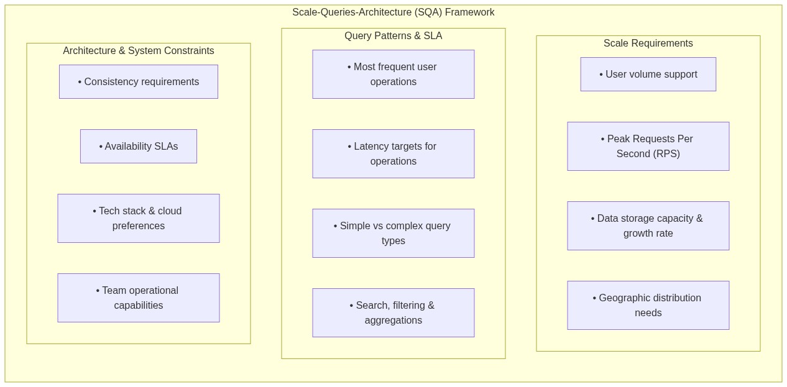
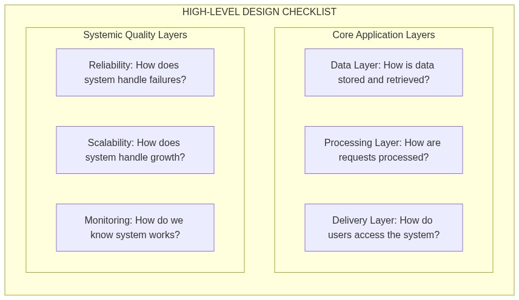

# System Design

## What is System Design?

**System Design** is the process of defining the architecture, components, modules, interfaces, and data flow of a system to satisfy specified requirements. It is the high-level blueprint that guides the construction of complex software systems, ensuring they are scalable, reliable, maintainable, and performant.

System design bridges the gap between abstract problem statements and concrete implementation. It requires understanding not just how to build something, but why particular architectural choices matter, what trade-offs they entail, and how they impact the system's ability to handle real-world demands.

The discipline of system design emerges from a fundamental truth: building software that works for a single user or a handful of users is relatively straightforward, but building software that serves millions of users simultaneously, handles petabytes of data, and remains available 99.99% of the time requires careful planning and architectural foresight. System design provides the conceptual framework and vocabulary for making these decisions deliberately rather than accidentally.

System design decisions are inherently consequential and often difficult to reverse. Choosing a monolithic architecture versus microservices, a SQL database versus NoSQL, synchronous versus asynchronous communication—these decisions shape the development trajectory for years. A system designed well from the beginning can evolve gracefully under increasing load and changing requirements, while a poorly designed system becomes a source of endless technical debt, requiring heroic efforts just to maintain the status quo.

### The 80/20 Context: Why System Design Matters

Applying the **80/20 Rule**, understanding system design fundamentals will cover approximately 80% of what you need to know to succeed in technical interviews and real-world engineering discussions. The remaining 20% involves deep specialization in particular technologies or domains. However, that 80% foundation is non-negotiable—it forms the mental model that allows you to reason about any system, regardless of the specific technologies involved.

In the context of software engineering, system design occupies a unique position. It is the phase where abstract business requirements transform into concrete architectural decisions. A well-designed system reduces development friction, enables teams to move quickly, and gracefully handles growth. A poorly designed system creates bottlenecks, introduces fragility, and accumulates technical debt that slows every future enhancement.

In the interview process, system design has become a critical differentiator. Companies use system design interviews to evaluate how candidates think about complex problems, navigate trade-offs, and communicate technical decisions. Unlike coding interviews that test algorithmic thinking, system design interviews test architectural judgment—the ability to balance competing concerns, prioritize appropriately, and design solutions that work in the real world rather than in theoretical ideal conditions.

### System Design vs. Software Architecture

While the terms are often used interchangeably, system design and software architecture represent different levels of abstraction and concern. Understanding the distinction helps clarify what system design encompasses and where it fits in the broader software engineering discipline.

Software architecture focuses on the high-level structure of a software system, the selection of architectural styles and patterns, and the definition of components and their responsibilities. It addresses questions like: Should we use a layered architecture or hexagonal architecture? How do we structure our microservices? What are the major subsystems and how do they interact? Architecture decisions are typically made early and are difficult and expensive to change.

System design, in contrast, addresses the operational qualities of a system—how it will scale, how it will handle failures, how it will maintain performance under load, and how it will evolve over time. System design takes the architectural choices as given and focuses on the implementation details that determine whether the system meets its non-functional requirements. Where architecture asks "what is the structure?", system design asks "how do we make it work at scale?"

Consider the difference through an example: choosing a microservices architecture is an architectural decision, but deciding how those microservices will discover each other, how they will handle partial failures, how they will be monitored, and how data will be consistent across service boundaries—that is system design. Both matter, but system design is where rubber meets the road for operational concerns.

### The Four Pillars of System Design

Every system design decision ultimately serves one or more of four fundamental qualities. Understanding these pillars helps you evaluate trade-offs and prioritize appropriately when designing systems.

**Scalability** refers to a system's ability to handle increased load—whether that load manifests as more users, more data, more requests per second, or more complex computations. A scalable system can grow to meet demand without requiring fundamental redesign. Scalability is not a binary property but rather a spectrum, and the specific scalability requirements depend entirely on the system's context. A system that needs to handle ten thousand concurrent users has different scalability requirements than one that needs to handle ten million.

**Reliability** is the probability that a system will function correctly under normal operating conditions. A reliable system continues to operate correctly even when things go wrong—whether those failures are hardware malfunctions, network partitions, software bugs, or human error. Reliability is not about eliminating all failures, which is often impossible or prohibitively expensive, but about designing systems that fail gracefully, recover quickly, and minimize the impact of failures on users.

**Maintainability** determines how easily the system can be modified to add new features, fix bugs, improve performance, or adapt to changing requirements. Highly maintainable systems are modular, well-documented, and designed with change in mind. Maintainability is often undervalued until a system becomes difficult to change, at which point the cost of low maintainability becomes painfully apparent through slow development velocity and high bug rates.

**Availability** is the proportion of time a system is operational and accessible when needed. While closely related to reliability, availability has a more specific meaning: a system with 99.9% availability is operational 99.9% of the time, which translates to roughly 8.7 hours of downtime per year. Availability is often expressed in "nines"—three nines (99.9%), four nines (99.99%), five nines (99.999%)—with each additional nine representing an order of magnitude improvement in downtime tolerance.

These four pillars often conflict with each other and with other desirable properties like simplicity and development speed. A highly available system typically requires redundancy and failover mechanisms that add complexity. A highly scalable system may need to sacrifice strong consistency for eventual consistency. Understanding these trade-offs and making deliberate choices is at the heart of system design.

### The Cost of Getting It Wrong

System design failures have real consequences that extend beyond technical frustration. Understanding these consequences motivates why system design deserves serious attention.

Amazon estimates that a single minute of website downtime costs approximately $1.3 million in lost revenue. While not every system has stakes this high, the economic impact of system failures scales with the system's importance to the business. A social media platform that goes offline loses user engagement and advertising revenue. An e-commerce site that cannot process orders loses sales and damages reputation. A financial system that produces incorrect results can lead to regulatory penalties and loss of customer trust.

Beyond immediate financial costs, system design failures create organizational drag. Engineers spend time working around architectural limitations rather than building new features. Incidents consume attention that could be devoted to improvement. The cumulative effect is slower development velocity and higher operational costs that persist until the architectural problems are addressed.

Perhaps most insidiously, poor system design creates technical debt that compounds over time. Each workaround, each hack to make something work despite the architecture, each manual process to compensate for lack of automation—all of these add to the debt. Just as financial debt accrues interest, technical debt accrues complexity, making future changes harder and more error-prone.

### Real-World System Design: Case Studies

Understanding system design principles becomes clearer through examination of real-world systems and how they evolved. These case studies illustrate how design decisions shape outcomes and how systems adapt to changing requirements.

**Netflix** began as a DVD-by-mail service and evolved into the world's largest streaming platform serving over 200 million subscribers. This evolution required multiple fundamental architectural transformations. The transition from monolithic architecture to microservices was not a single event but a gradual process that took years. Netflix's journey illustrates several important principles: the value of building for scale even when not immediately needed, the importance of graceful degradation when components fail, and the challenges of maintaining consistency across distributed services.

**Amazon** famously started with a monolithic e-commerce application that became a maintenance nightmare as the company grew. The transformation to a service-oriented architecture, which became the foundation for Amazon Web Services, required years of effort and was not accomplished through a big rewrite but through incremental decomposition. Amazon's experience demonstrates that architectural improvements often must proceed gradually while maintaining business operations, that breaking apart monolithic systems is harder than building distributed systems from scratch, and that the benefits of good architecture compound over time.

**Twitter** evolved from a simple microblogging platform to a complex social media system that must handle millions of tweets per day while providing real-time delivery to users. Twitter's architectural evolution illustrates the challenges of building systems where data freshness matters, where the relationships between entities (followers, following) create complex data access patterns, and where the definition of "performance" varies depending on whether you're a casual browser or an active tweeter.

These case studies share common themes: architectural transformation is expensive and time-consuming, but failing to transform is more expensive in the long run; systems evolve, and good design accommodates evolution; and operational excellence matters as much as architectural elegance.

---

## How to Approach System Design?

Approaching system design effectively requires a structured methodology that balances thoroughness with practicality. System design problems in interviews and real-world planning sessions have common patterns, and developing a repeatable approach helps you navigate them consistently.

The key insight is that system design is not about finding a single correct answer but about exploring a solution space, evaluating trade-offs, and arriving at a solution that fits the problem context. Two experienced engineers can design different systems that both work well, and understanding why each made their choices matters as much as knowing the technical details.

### The Seven-Step Framework

This structured approach provides a reliable methodology for tackling any system design problem, whether in an interview or in professional practice. Each step builds on the previous, creating a natural flow from understanding to solution.

#### Step 1: Understand the Problem and Requirements

Never start designing immediately. The most common mistake in system design is jumping to solutions before understanding the problem. Spending time on problem clarification prevents wasted effort on irrelevant concerns and ensures your design actually addresses the user's needs.

Begin by identifying who the target users are and what specific needs they have. Are you designing for millions of concurrent users or thousands? Are users primarily accessing the system from mobile devices or desktop browsers? Do they need real-time responsiveness or is eventual consistency acceptable? These questions fundamentally shape your design choices.

Surface any hidden constraints or limitations of the system. Technology constraints might include requirements to use specific programming languages, databases, or cloud providers. Time constraints might limit how elaborate your solution can be. Business constraints might include requirements for data retention, compliance with regulations, or integration with existing systems. Every constraint you uncover early is a constraint you can design around rather than discover mid-implementation.

Distinguish between functional requirements—what the system must do—and non-functional requirements—how well the system must do it. Functional requirements are typically easier to enumerate and agree upon. Non-functional requirements including scalability targets, availability SLAs, latency constraints, and consistency guarantees are harder to define precisely but often have greater impact on system design.

A useful framework for eliciting requirements is the **Scale-Queries-Architecture (SQA) method**:

#### Step 2: Identify the Scope of the System

Define the exact boundaries of your design. Clarity about what is in scope and what is out of scope prevents scope creep and ensures you invest effort appropriately. In interview settings, explicitly stating the scope demonstrates that you understand the problem is too large to address comprehensively and shows ability to prioritize.

Clearly articulate what the system will do. List the core functional features that must be present for the system to be considered successful. These are the must-haves, the features without which the system fails its fundamental purpose.

Explicitly state what the system will not do. These out-of-scope items are equally important to document. For a Twitter clone, for example, you might explicitly exclude direct messaging, multimedia hosting, or advertising systems. For a video streaming service, you might exclude content creation tools or payment processing. Stating these exclusions prevents discussion of irrelevant details and keeps focus on core functionality.

Scope definition also includes identifying which components or subsystems are within your design focus. A system design for a large-scale web application might focus on the backend architecture while treating the mobile app as given. Or it might focus on the data pipeline while treating the user interface as given. Knowing what to design and what to assume is a crucial skill.

#### Step 3: Research and Analyze Existing Systems

Do not reinvent the wheel. Look at similar architectures or systems that have been successfully built in the past. Understanding how others have solved similar problems provides a starting point, reference points for trade-offs, and awareness of pitfalls to avoid.

Identify what worked well in those designs. Why did Twitter's approach to timelines succeed? Why did Instagram's approach to photo storage scale? What made Netflix's transition to microservices smoother than others? These positive lessons provide patterns you can apply in your own design.

Learn from deficiencies and failures as well. The post-mortems and case studies of systems that failed to scale, that experienced catastrophic outages, or that were eventually rewritten provide invaluable lessons. Understanding what went wrong helps you avoid repeating those mistakes and often illuminates the underlying principles more clearly than studying successes alone.

The famous "Lessons from the Google Cloud Outage" or "How the Chaos Monkey Changed Netflix's Reliability" are not just war stories—they encode principles about the importance of redundancy, the value of testing for failures, and the need for graceful degradation that you can apply to your own designs.

#### Step 4: Create a High-Level Design

Outline the main structural pieces of the system and chart how they will interact with one another. The high-level design provides a map of the system that guides detailed design and implementation.

Sketch a rough diagram of the system's architecture. This diagram does not need to be technically precise—it needs to show the major components and their relationships. The act of drawing forces you to make decisions about boundaries and interfaces that remain abstract otherwise.

Create a flowchart outlining the data path or process the system will follow. How does a user's request travel through the system? Where does data originate, how is it transformed, and where does it end up? Tracing data flows reveals potential bottlenecks, consistency challenges, and complexity that might not be apparent from component diagrams alone.

At this stage, resist the temptation to specify technology choices. Focus on concepts and relationships first. A "database" is a useful abstraction whether it ultimately becomes PostgreSQL, MySQL, or MongoDB. An "authentication service" is a useful concept whether it uses OAuth, SAML, or custom tokens. Defer technology choices until the high-level design is sound.

The high-level design should address the core concerns identified in scope definition:

#### Step 5: Refine and Iterate the Design

System design is not linear; it is iterative. As you dive deeper into the technical details of individual components, you will inevitably discover issues with earlier decisions that require revisiting and revising those decisions.

Re-evaluate your choices and refine the design. The first design is rarely the best design. Iteration allows you to incorporate new information—about requirements, constraints, or technical feasibility—that was not available initially. Be willing to throw away or significantly revise parts of your design that prove unsound.

Run internal tests or mental walkthroughs to ensure the architecture still meets all core requirements. The "thought experiment test" is valuable: walk through what happens when the system receives ten times the expected load, when a major component fails, when a particular query pattern dominates, or when the system needs to support a new use case that was not anticipated.

Identify trade-offs explicitly. Every design choice involves trade-offs, and acknowledging them demonstrates nuanced thinking. If your design prioritizes write performance over read performance, say so. If it requires strong consistency at the cost of availability during network partitions, make that explicit. Trade-offs are not flaws—they are inevitable consequences of optimization.

Consider the second-order effects of your design. A design that optimizes for single-server performance might complicate horizontal scaling later. A design that uses eventual consistency might create user-facing anomalies that need explanation. A design that separates read and write paths might introduce replication lag that affects user experience. Thinking through these effects helps you design proactively rather than reactively.

#### Step 6: Document the Design

Create comprehensive, clear documentation of your final design. This documentation serves multiple audiences and multiple purposes over time.

As a single source of truth, design documentation ensures that all stakeholders—developers, operations teams, product managers, and future maintainers—share a common understanding of how the system works. Without documentation, this shared understanding must be reconstructed through conversation, leading to inconsistency and gaps.

As a reference for future maintenance, documentation explains why design decisions were made. Six months after a system is built, the details of implementation are often forgotten. Good documentation explains not just what the system does but why it was designed that way, providing crucial context for future modifications.

As a tool for knowledge transfer, documentation enables new team members to understand the system without lengthy investigation. It allows teams to scale by making knowledge explicit rather than residing only in the heads of original designers.

Effective system design documentation typically includes an architectural overview, data models, API specifications, component descriptions, operational procedures, and decision rationale. The level of detail should match the complexity of the system and the needs of the audience.

#### Step 7: Continuously Monitor and Improve

A system design is never truly finished. Once deployed, the system must be continuously monitored, audited, and optimized to evolve alongside changing requirements and user growth.

Monitor the system against its design assumptions. You designed the system to handle a certain load, a certain failure rate, a certain latency profile. Monitoring reveals whether those assumptions were correct and where reality diverges from expectations. This information is invaluable for future design work.

Identify and address bottlenecks. Even well-designed systems encounter bottlenecks as load patterns change or scale increases. Continuous monitoring helps identify these bottlenecks before they become critical problems.

Plan for evolution. System design is not a one-time activity but a continuous process of refinement. As the system grows, some design decisions that worked well at small scale will need to be revisited. Planning for this evolution—building modularity, maintaining flexibility, documenting decisions—makes future changes easier.

---

## Key System Design Terminology

Familiarity with key terminology enables precise communication about system design concepts. These terms appear frequently in system design discussions and interviews.

### Scale and Performance

**Horizontal Scaling** (Scale Out) refers to increasing system capacity by adding more machines to a pool. This contrasts with vertical scaling (scale up), which increases capacity by adding more resources to a single machine. Horizontal scaling is generally preferred for systems requiring high availability and elastic capacity because it offers near-linear scalability and no single point of failure, though it introduces complexity in data distribution and coordination.

**Vertical Scaling** (Scale Up) means adding more CPU, memory, or storage to an existing machine. It is simpler than horizontal scaling because all components continue to operate on a single machine, but it has natural limits and creates a single point of failure.

**Load Balancing** distributes incoming traffic across multiple servers to ensure no single server becomes overwhelmed. Load balancers can operate at different layers of the network stack and use various algorithms including round-robin, least connections, and IP hash.

**Caching** stores frequently accessed data in memory to reduce latency and load on backend systems. Effective caching can improve performance by orders of magnitude for read-heavy workloads. Common caching patterns include cache-aside, write-through, and write-behind.

**Sharding** (horizontal partitioning) divides data across multiple databases or tables, with each shard containing a subset of the total data. Sharding enables horizontal scaling of data storage but introduces complexity in query routing and cross-shard operations.

**Replication** maintains multiple copies of data across different nodes. Replication can be synchronous, where writes are complete only when confirmed by all replicas, or asynchronous, where writes are confirmed immediately and propagated later. Replication provides both redundancy for reliability and additional read capacity.

### Reliability and Availability

**Redundancy** involves having multiple copies of critical components so that failure of any single component does not cause system failure. Redundancy can be implemented at the hardware level (multiple power supplies, multiple network paths), the application level (multiple application instances), or the data level (multiple data copies).

**Failover** is the automatic or manual transfer of operations from a failed component to a standby component. Active-passive failover keeps a standby ready to take over, while active-active failover runs multiple components simultaneously and distributes load across them.

**Circuit Breaker** prevents cascading failures by stopping requests to a failing service. When a circuit breaker detects that a downstream service is failing, it "opens" and immediately returns an error rather than waiting for timeouts, preventing resource exhaustion and allowing the failing service time to recover.

**Bulkhead** isolates different parts of a system so that failure in one part does not affect others. The term comes from ship design, where bulkheads prevent flooding in one section from sinking the entire ship.

**Graceful Degradation** ensures that a system can continue operating with reduced functionality when some components fail. Rather than complete system failure, graceful degradation allows users to continue accessing core features while non-essential features are unavailable.

### Data Management

**ACID** is an acronym for the four properties guaranteed by traditional database transactions: Atomicity (all-or-nothing execution), Consistency (maintaining valid state), Isolation (concurrent execution appears sequential), and Durability (once committed, data survives failures).

**BASE** describes the properties of many distributed, eventually consistent systems: Basically Available (the system guarantees availability), Soft state (state may change over time), Eventually consistent (system will become consistent given time without updates).

**CAP Theorem** states that a distributed system can provide only two of three guarantees: Consistency, Availability, and Partition Tolerance. Since network partitions are unavoidable in distributed systems, the real choice is typically between consistency and availability.

**CQRS** (Command Query Responsibility Segregation) separates read and write operations into different models, allowing each to be optimized independently. Writes update a command model; reads query a separate query model that may be updated asynchronously.

**Event Sourcing** stores system state as a sequence of events rather than current state. This provides a complete audit trail and enables powerful analytics but requires different implementation approaches.

### Communication Patterns

**Synchronous Communication** involves the caller waiting for a response before continuing. This pattern is simple but can create tight coupling and cascade failures when services depend on each other.

**Asynchronous Communication** decouples producers from consumers using message queues or event systems. This pattern improves resilience and scalability but complicates debugging and requires handling of out-of-order or duplicate messages.

**REST** (Representational State Transfer) is an architectural style for web services that uses standard HTTP methods and resource-based URLs. REST is widely adopted and well-understood but may not be optimal for all use cases.

**gRPC** is a high-performance RPC framework that uses Protocol Buffers for serialization and HTTP/2 for transport. gRPC offers significant performance advantages over REST for internal service communication but has less tooling support and browser compatibility.

---

## Interview Preparation: Key Questions

System design interviews typically follow a predictable pattern and cover common themes. Understanding these patterns helps you prepare effectively.

### Common Interview Formats

**Open-Ended Design**: The interviewer presents a system (e.g., "Design Twitter") and you work through the design collaboratively. This format tests your methodology as much as your knowledge. The interviewer wants to see how you think, how you handle ambiguity, and how you make trade-offs.

**Component Deep-Dive**: The interviewer focuses on a specific component (e.g., "How would you design the caching layer for a news feed?"). This format tests detailed knowledge of particular technologies and patterns.

**Trade-Off Discussion**: The interviewer asks about trade-offs between approaches (e.g., "When would you choose Cassandra over PostgreSQL?"). This format tests judgment and understanding of real-world constraints.

**Scale-Up Challenge**: The interviewer asks how you would modify an existing design to handle significantly more load (e.g., "How would you scale this from 10,000 to 10 million users?"). This format tests your understanding of scalability patterns.

### What Interviewers Look For

Beyond correct answers, interviewers evaluate several factors that often matter more than technical correctness.

**Methodology**: Can you approach the problem systematically? Do you gather requirements before proposing solutions? Do you consider trade-offs? Do you iterate and refine?

**Communication**: Can you explain complex concepts clearly? Do you ask clarifying questions? Do you keep the interviewer engaged and informed about your thinking?

**Collaboration**: Are you open to feedback? Do you incorporate interviewer hints? Do you treat the interview as a collaborative problem-solving session rather than a test?

**Judgment**: Do you make reasonable assumptions? Can you justify your decisions? Do you recognize when a simple solution is appropriate versus when complexity is necessary?

**Breadth and Depth**: Do you know about a wide range of patterns and technologies? Can you explain them in depth when relevant?

### Common Pitfalls to Avoid

**Analysis Paralysis**: Spending too much time on early steps and rushing later steps. Interviewers notice when you run out of time for important topics.

**Ignoring Constraints**: Jumping to complex solutions when simple ones would work. Not every system needs microservices, sharding, and real-time processing.

**Technology-Driven Thinking**: Starting with technology choices (e.g., "I'll use Kafka") before understanding requirements. Technology should serve requirements, not the reverse.

**Missing the Big Picture**: Getting lost in details of one component while losing sight of overall system design. Interviewers want to see the forest, not just trees.

**Ignoring Trade-Offs**: Presenting solutions as if they have no downsides. Every design choice involves trade-offs, and acknowledging them shows mature thinking.

---

## Essential Study Roadmap

System design is a broad topic, and knowing where to focus your study time yields better results than trying to learn everything equally.

### Tier 1: Must-Know Fundamentals

These topics form the foundation of system design and appear in virtually every system design discussion.

**Performance vs. Scalability**: Understanding the difference between making a system faster and making a system handle more load is fundamental. Many engineers confuse these concepts, leading to solutions that address the wrong problem.

**Latency vs. Throughput**: Latency measures how long it takes to perform an operation; throughput measures how many operations can be performed per unit time. Optimizing for one can harm the other.

**Availability vs. Consistency**: The CAP theorem and its implications. Understanding that distributed systems must trade off consistency for availability during network partitions.

**Load Balancing**: How to distribute load across multiple servers, including algorithms, layers (L4 vs L7), and health checking.

**Caching**: How caching improves performance, where to cache, and how to maintain consistency between cache and source of truth.

### Tier 2: Core Technologies

These are the building blocks of most distributed systems. Understanding when and how to use each is essential.

**Databases**: SQL vs. NoSQL trade-offs, replication, sharding, indexing, and query optimization.

**Message Queues**: How asynchronous communication enables loose coupling, fault tolerance, and scalability.

**CDNs**: How content delivery networks reduce latency and offload traffic from origin servers.

**DNS**: How domain name resolution works and how to use DNS for load balancing and failover.

### Tier 3: Advanced Patterns

These topics build on the fundamentals and enable sophisticated system designs.

**Microservices**: Service decomposition, inter-service communication, and distributed systems challenges.

**CAP Theorem Variants**: PACELC, eventual consistency, and consistency models.

**Advanced Caching**: Cache invalidation strategies, distributed caching, and consistency trade-offs.

### Tier 4: Deep Dives

These topics are important for specific use cases or for demonstrating advanced knowledge.

**Distributed Transactions**: Sagas, two-phase commit, and consistency trade-offs.

**Consensus Algorithms**: Raft, Paxos, and how distributed systems achieve agreement.

**Advanced Messaging Patterns**: Event sourcing, CQRS, and event-driven architecture.

---

## Common Mistakes and How to Avoid Them

Learning from others' mistakes accelerates your progress in system design. These common errors appear frequently in both interviews and real-world projects.

**Designing for the Wrong Scale**: Building elaborate distributed systems for problems that do not require them. Complexity has costs, and simple solutions should be preferred when they suffice. The best architecture is the simplest one that meets requirements.

**Ignoring Operational Complexity**: Designing systems that are theoretically elegant but operationally burdensome. A system that requires constant attention, complex deployment procedures, or specialized expertise may not be sustainable.

**Underestimating Importance of Data**: Failing to think carefully about data modeling, access patterns, and growth. Data is often the most valuable asset and the most difficult aspect of a system to change.

**Treating Design as Permanent**: Failing to design for change. Requirements change, scale changes, and the best-designed systems accommodate evolution without requiring complete redesign.

**Neglecting Failure Modes**: Designing as if nothing will ever fail. Every component fails eventually, and the question is only how gracefully the system degrades.

---

## Key Takeaways

System design is not about memorizing solutions to specific problems but about developing a framework for thinking about complex systems. The patterns and principles you learn in system design apply across technologies and domains, making them valuable investments that pay dividends throughout your career.

The four pillars—scalability, reliability, maintainability, and availability—provide a framework for evaluating design decisions. When you propose or evaluate a design, ask how it affects each of these properties. Trade-offs are inevitable, and being explicit about them demonstrates mature engineering judgment.

Approaching system design systematically—understanding requirements, defining scope, researching existing solutions, creating high-level designs, iterating, documenting, and planning for evolution—leads to better outcomes than ad-hoc decision-making.

Real-world systems provide invaluable lessons. Studying how companies like Amazon, Google, Netflix, and Twitter solved their scaling challenges reveals patterns and principles that transfer across contexts.

System design skills develop through practice. Working through design problems, discussing solutions with others, and studying real-world systems all contribute to building expertise. There is no shortcut, but focused practice yields faster progress than unfocused exposure.

Finally, remember that the goal of system design is not architectural perfection but good enough design for the context. The best architecture is the one that meets current requirements, accommodates reasonable future changes, and can be implemented and operated by available resources. Perfection is the enemy of progress, and system design is fundamentally about making pragmatic decisions under uncertainty.

---

## Actionable Next Steps

### Immediate Actions (Next 24 Hours)

1. **[30 minutes]** Review the roadmap of topics covered in these notes. Identify which topics you already understand well and which need more study.

2. **[45 minutes]** Pick one real-world system you use regularly (Twitter, Netflix, Amazon, etc.) and analyze it using the seven-step framework. Write down the major components, how they communicate, and what trade-offs you observe.

3. **[20 minutes]** Review your notes on performance vs. scalability. Be prepared to explain the difference clearly in under two minutes.

4. **[15 minutes]** Identify one topic from the roadmap that you find confusing or intimidating. Research it enough to explain it simply to someone else.

### Deep-Dive Topics (If Time Permits)

- **Case Study: How Netflix Scales**: Read about Netflix's journey from monolithic architecture to microservices.

- **Case Study: How Amazon Built AWS**: Understand the architectural evolution that led to cloud computing services.

- **System Design for Beginners**: Work through simpler system design problems to build confidence before tackling complex scenarios.

- **Real-World Post-Mortems**: Study incident post-mortems from companies like Google, Amazon, and Cloudflare to understand real failure modes.

---

> **Final Thought**: System design is both an art and a science. The science involves understanding patterns, trade-offs, and technologies. The art involves judgment about which combination fits a particular context. Both develop through study and practice. Your notes represent the science; applying them will develop the art.
