# Latency vs Throughput

## Understanding the Fundamental Distinction

Latency and throughput are the two primary measures of system performance, yet they capture fundamentally different aspects of how a system behaves. Latency measures the time required to complete a single operation, while throughput measures how many operations can be completed within a given time period. Many engineers conflate these concepts, leading to misdiagnosis of performance problems and inappropriate optimization strategies. Mastering the distinction between latency and throughput is essential for designing systems that meet real-world performance requirements.

The relationship between latency and throughput can be understood through a simple analogy. Consider a highway toll booth: latency is the time it takes for a single car to pass through the booth, while throughput is the number of cars that can pass through per minute. A system might have low latency (each car passes quickly) but low throughput (only one car at a time can pass). Alternatively, a system might have high latency (each car takes longer) but high throughput (multiple lanes allow many cars simultaneously). The optimal design depends on the specific requirements of the system.

Understanding this distinction matters because optimizing for one metric can adversely affect the other. Adding more parallel processing can improve throughput but may increase latency for individual requests. Optimizing for faster individual responses might reduce throughput if resources become fragmented. Successful system design requires understanding which metric matters more for a given use case and making appropriate trade-offs.

---

## Latency: The Time for a Single Operation

Latency represents the time elapsed between initiating a request and receiving its complete response. It is a measure of delay—a single operation's journey through the system. Latency is typically measured in milliseconds (ms), microseconds (μs), or nanoseconds (ns), depending on the operation's speed. Low latency means fast individual operations; high latency means slow individual operations.

### Types of Latency

Latency manifests in multiple forms throughout a system, and understanding these variants is crucial for effective optimization.

**Network Latency** is the time required for data to travel across a network connection. It varies dramatically based on the distance between communicating endpoints and the physical medium of transmission. Light travels approximately 200,000 kilometers per second through fiber optic cables, meaning that a round-trip between New York and San Francisco (approximately 8,000 kilometers) has a minimum latency of about 40 milliseconds purely from the speed of light. In practice, network latency is higher due to routing, switching, and processing at intermediate nodes.

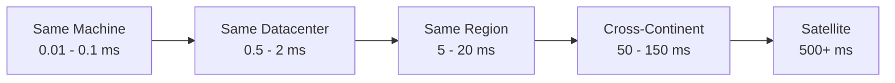

**Disk Latency** is the time required to read data from or write data to storage. Solid-state drives (SSDs) typically have latencies of 0.1 to 1 milliseconds for random access, while hard disk drives (HDDs) have latencies of 5 to 15 milliseconds due to mechanical seek times and rotational delays. The difference becomes significant in systems that perform many random I/O operations.

**Memory Latency** is the time required to access data in RAM. Modern computers typically have memory latencies of 50 to 100 nanoseconds. Cache hierarchies significantly affect effective memory latency: L1 cache access takes approximately 1 nanosecond, L2 cache takes 3 to 10 nanoseconds, and main memory access takes 50 to 100 nanoseconds.

**Application Latency** encompasses the processing time within application code, including computation, algorithm execution, and internal operations. This latency is highly variable and depends on code efficiency, algorithmic complexity, and the nature of the processing being performed.

### Why Latency Matters

Latency directly impacts user experience in interactive applications. Users perceive delays in real-time—research shows that response times exceeding 100 milliseconds are noticeable to users, and times exceeding one second interrupt the flow of thought. For certain applications, latency is even more critical: high-frequency trading systems require latencies measured in microseconds, and online gaming demands latencies under 50 milliseconds to feel responsive.

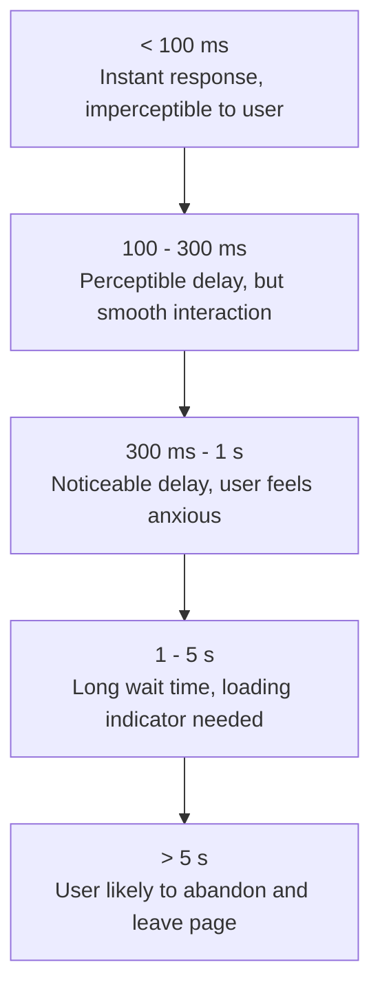

Beyond user experience, latency affects system efficiency in indirect ways. High latency in service-to-service communication increases the time resources are held, potentially causing thread exhaustion and reducing overall system throughput. This relationship between latency and throughput is a key insight that informs architectural decisions.

---

## Throughput: Operations Per Unit Time

Throughput measures the rate at which a system can process work, typically expressed as operations per second (ops), requests per second (RPS), transactions per second (TPS), or similar units. Throughput represents capacity—the system's ability to handle concurrent load. High throughput means the system can process many operations simultaneously; low throughput means the system is bottlenecked.

### Understanding Throughput Limits

Every system has a maximum throughput determined by its bottleneck resources. Identifying and eliminating bottlenecks is the primary means of improving throughput. Common bottlenecks include CPU capacity, memory bandwidth, disk I/O, network bandwidth, and database lock contention.

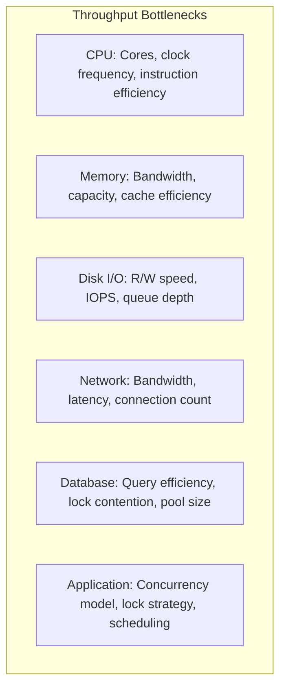

The concept of **Little's Law** provides a fundamental relationship between latency, throughput, and concurrent work. Little's Law states that the average number of concurrent requests (L) equals throughput (λ) multiplied by average latency (W): L = λ × W. This relationship reveals why high latency can limit throughput: if each request holds resources for a long time, fewer requests can be processed concurrently, reducing overall throughput.

### Throughput vs Concurrency

Throughput is closely related to concurrency but distinct from it. Concurrency refers to the number of simultaneous operations a system can support, while throughput refers to how many operations complete per unit time. A system might have high concurrency (many simultaneous connections) but low throughput (each connection processes slowly).

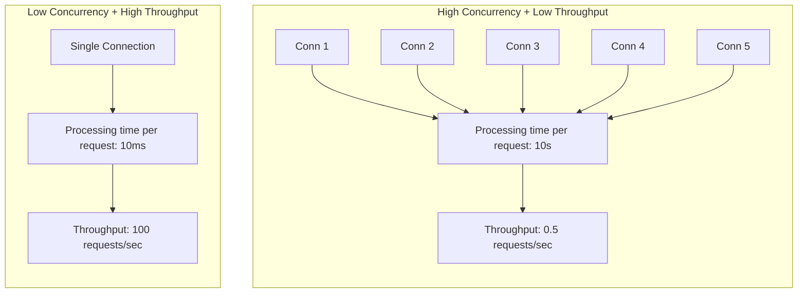

---

## The Critical Relationship: Why Trade-offs Exist

Latency and throughput are not independent; they are connected through resource utilization and system architecture. Understanding their relationship is essential for making appropriate optimization decisions.

### Little's Law in Practice

Little's Law (L = λ × W) provides the mathematical foundation for understanding the latency-throughput relationship. Here, L represents the average number of items in the system (concurrent requests), λ represents the arrival rate (throughput), and W represents the average time an item spends in the system (latency).

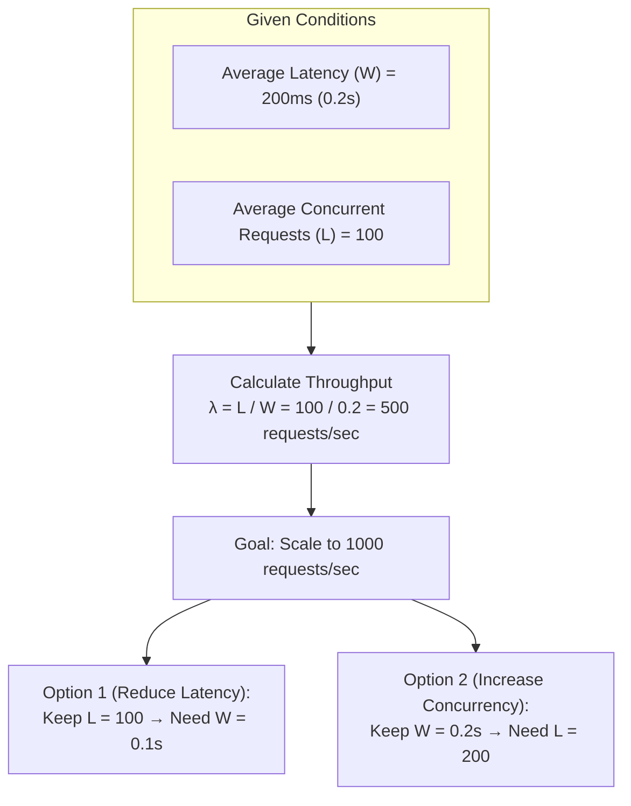

This relationship reveals the fundamental trade-off: to increase throughput without increasing concurrency, you must reduce latency. To increase throughput by increasing concurrency, you must maintain or accept slightly higher latency while scaling resources.

### How Optimizing One Affects the Other

Optimizing for latency often involves reducing the work required per operation, which can improve throughput as a side effect. For example, optimizing a database query from 100ms to 10ms reduces latency, and if concurrency remains the same, throughput increases from 10 queries per second to 100 queries per second.

Optimizing for throughput often involves increasing parallelism and concurrency, which may increase latency for individual operations due to coordination overhead. A system processing requests in parallel might have slightly higher per-request latency due to the overhead of parallel coordination, but can achieve much higher overall throughput.

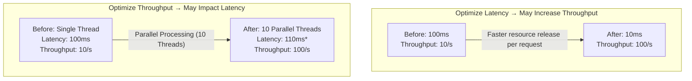

### The Perfect System: Low Latency and High Throughput

The ideal system achieves both low latency and high throughput. This requires careful optimization at multiple levels: efficient algorithms to minimize processing time, effective caching to serve repeated requests quickly, horizontal scaling to distribute load across multiple machines, and asynchronous processing to maximize resource utilization.

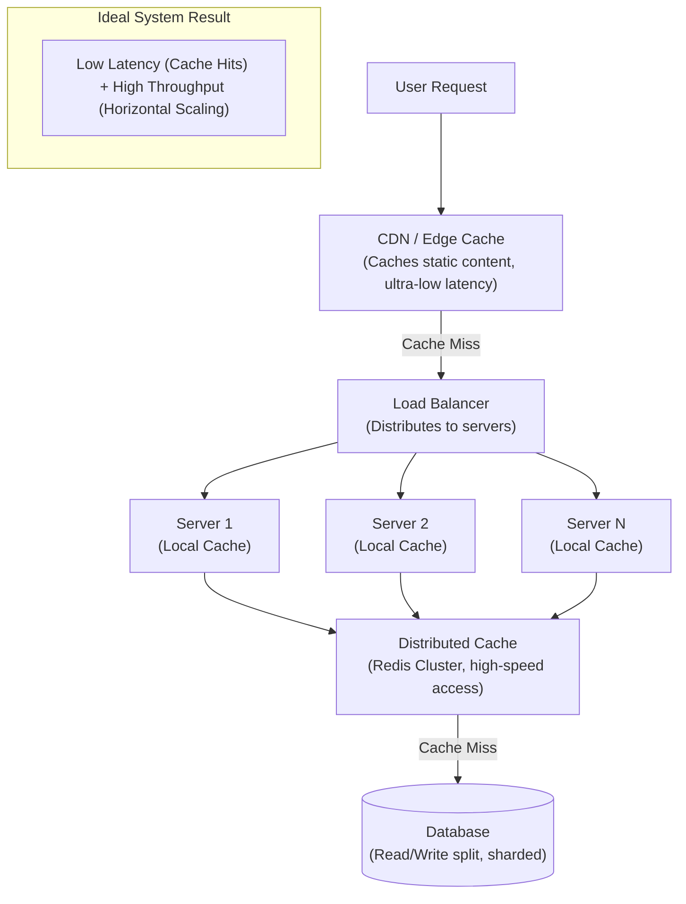

---

## The 80/20 Rule: Practicality First

Applying the **80/20 Rule** to latency and throughput optimization means understanding that 80% of performance issues stem from 20% of bottlenecks. You don't need to dive into every minute detail—focus on mastering the factors with the highest impact.

In real-world work, optimizing latency often yields immediate, visible results faster than optimizing throughput. Optimizing a query, adding a cache, or eliminating an unnecessary network round-trip can improve both latency and throughput simultaneously. In contrast, increasing throughput usually requires architectural changes, such as adding hardware, scaling horizontally, or introducing asynchronous processing.

Understanding Little's Law is key to understanding the relationship between latency and throughput. The formula $L = \lambda \times W$ is a powerful tool for diagnosing performance issues and predicting optimization outcomes.

For most web applications, latency is the critical metric—users directly perceive response speed. However, for batch processing systems or data pipelines, throughput is far more critical—completion time depends on the processing rate. Choose your optimization focus based on the specific scenario.

---

## Measuring Latency and Throughput

Effective optimization requires accurate measurement. Both latency and throughput must be measured under realistic conditions to guide optimization efforts.

### Measuring Latency

Latency measurement should capture the full distribution of response times, not just averages. Percentiles provide a complete picture of latency distribution.

**Key latency metrics:**

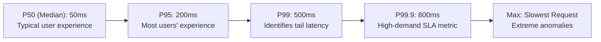

### Measuring Throughput

Throughput measurement requires load testing under realistic conditions. The key is to generate sufficient concurrent load to reveal bottlenecks.

**Key throughput metrics:**

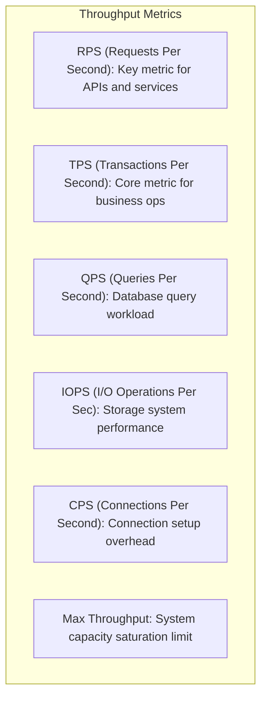

### Load Testing Methodology

Effective load testing follows a systematic methodology:

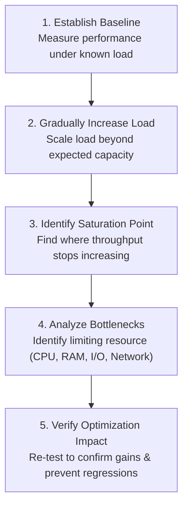

---

## Common Patterns and Anti-Patterns

Understanding common patterns helps identify opportunities for improvement. Recognizing anti-patterns prevents wasted effort on ineffective optimizations.

### Patterns for Low Latency

**Caching** is the most effective pattern for reducing latency. By storing frequently accessed data closer to the consumer, caching eliminates network round trips and expensive computations. Cache hit latency is typically measured in microseconds, compared to milliseconds for database queries or tens of milliseconds for remote service calls.

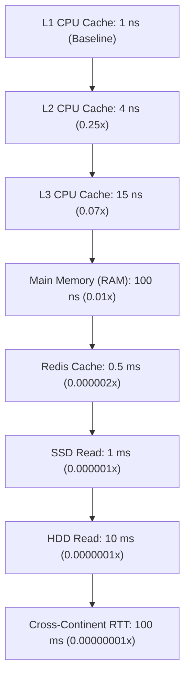

**Connection Pooling** reduces latency for repeated database or service calls by reusing established connections instead of creating new ones for each request. Connection establishment involves network round trips and handshake protocols that add significant latency; pooling eliminates this overhead for pooled connections.

**Async Processing** reduces effective latency for users by returning responses immediately while processing continues in the background. Users experience low latency (the request is acknowledged quickly), while the system achieves high throughput (processing happens asynchronously).

### Patterns for High Throughput

**Horizontal Scaling** increases throughput by adding more processing capacity. By distributing load across multiple servers, databases, or services, horizontal scaling provides near-linear throughput increases up to the point where shared resources become bottlenecks.

**Batch Processing** improves throughput for bulk operations by grouping multiple items together. Instead of processing one item at a time with per-item overhead, batch processing amortizes overhead across many items, dramatically improving throughput for appropriate workloads.

**Message Queues** decouple producers from consumers, allowing each to operate at their own pace. Producers can submit work quickly without waiting for processing; consumers process work as capacity allows. This decoupling enables high producer throughput while maintaining system stability.

### Anti-Patterns to Avoid

**Synchronous Chatty I/O** performs many small synchronous operations instead of fewer larger ones. Each operation incurs latency for connection, request, and response. The cumulative effect dramatically reduces throughput.

**Premature Optimization** addresses latency or throughput issues without measurement. Optimizing the wrong bottleneck wastes effort and may introduce complexity without benefit.

**Ignoring the Bottleneck** optimizes resources that are not limiting throughput. Throughput is only as good as the weakest bottleneck; optimizing elsewhere provides no improvement.

---

## Real-World Case Studies

### Case Study: E-Commerce Platform During Flash Sale

An e-commerce platform experiences severe performance degradation during flash sales, with page load times exceeding 10 seconds and frequent timeouts. Analysis reveals the problem involves both latency and throughput.

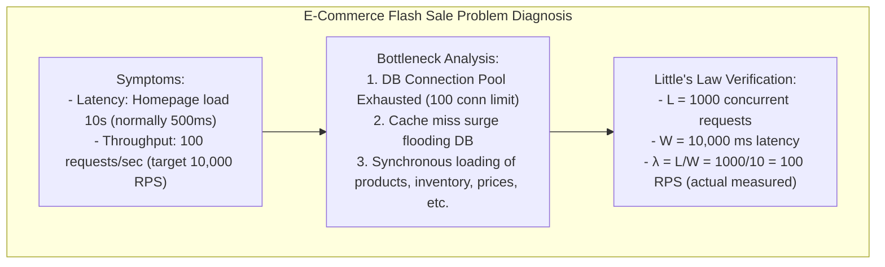

**Solution**: Implement a multi-layered optimization strategy:

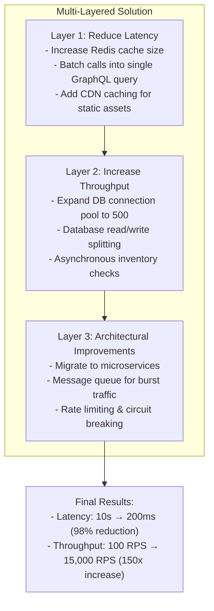

### Case Study: Video Streaming Platform

A video streaming platform struggles with buffering during peak hours. Users experience frequent pauses while videos load, indicating latency issues in video delivery.

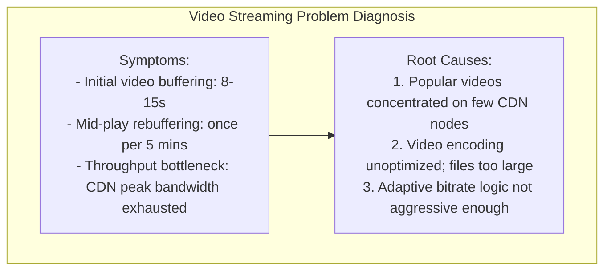

**Solution**: Address both latency and throughput:

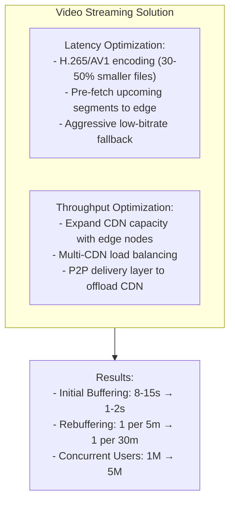

---

## Interview Questions and Answers

### Q1: Explain the difference between latency and throughput.

**Answer Framework**: Latency measures the time for a single operation (how long does one request take?), while throughput measures the rate of operations (how many requests can be processed per second?). Use the toll booth analogy: latency is the time for one car to pass; throughput is cars per minute. Emphasize that both matter but in different contexts—low latency matters for user experience in interactive applications, while high throughput matters for system capacity. Mention Little's Law (L = λ × W) to explain their mathematical relationship.

### Q2: How would you reduce latency in a web application?

**Answer Framework**: Start by measuring to identify bottlenecks. Then apply the optimization hierarchy: first, add caching at multiple levels (CDN, application cache, database cache) since caching typically provides the largest latency improvements. Second, optimize the critical path—remove unnecessary steps, reduce network round trips, use connection pooling. Third, optimize database queries and add appropriate indexes. Fourth, consider asynchronous processing for operations that don't need to complete before responding. Finally, scale horizontally with load balancers if needed.

### Q3: Your system has high latency but low utilization. What does this indicate?

**Answer Framework**: Low utilization with high latency typically indicates a performance problem rather than a capacity problem. The system isn't overloaded, but individual operations are slow. This suggests opportunities for optimization: inefficient code, unnecessary work, blocking operations, or external dependencies that are slow. Little's Law shows this clearly: if L (concurrent work) is low but W (latency) is high, throughput λ is limited. The solution is optimization, not scaling.

### Q4: How would you design a system that needs both low latency and high throughput?

**Answer Framework**: Achieve low latency through caching, efficient algorithms, and minimizing network round trips. Achieve high throughput through horizontal scaling, parallel processing, and asynchronous architecture. The key insight is that these goals reinforce each other: reducing latency typically reduces resource holding time, which enables higher concurrency and thus higher throughput. Use a layered approach: CDN for static content, distributed caches for frequently accessed data, efficient application code, and horizontally scaled application and database tiers.

---

## Key Takeaways

**Latency and throughput are different metrics** that measure different aspects of performance. Latency is the time for a single operation; throughput is operations per unit time. Both matter, but which matters more depends on the use case.

**Little's Law (L = λ × W) reveals their relationship**. Concurrent work equals throughput multiplied by latency. This equation explains why high latency limits throughput and vice versa, and guides capacity planning.

**Caching is the most effective latency optimization**. Caching reduces latency by orders of magnitude and simultaneously improves throughput by reducing load on backend systems.

**Horizontal scaling primarily improves throughput**. Adding more machines increases capacity but may slightly increase per-request latency due to coordination overhead.

**Measure before optimizing**. Use percentiles (P50, P95, P99) for latency to understand the full distribution. Use load testing to find actual throughput limits.

**User experience depends on latency percentiles**. Average latency can be misleading. P99 latency is often more important for user experience because outliers represent frustrated users.

**Little's Law is a diagnostic tool**. If you know two variables, you can calculate the third. This helps diagnose whether problems are latency-related or throughput-related.

**Both metrics matter for different reasons**. Low latency improves user experience; high throughput enables capacity. The best systems optimize both.

---

## Actionable Next Steps

### Immediate Actions (Next 24 Hours)

1. **[30 minutes]** Measure your current system's latency distribution. Calculate P50, P95, and P99. Identify where outliers are coming from.

2. **[20 minutes]** Identify your system's maximum throughput under load. Use load testing or examine historical peak data. Compare to expected capacity.

3. **[25 minutes]** Audit your caching strategy. What is cached? What could be cached? Where are the biggest latency savings available?

4. **[15 minutes]** Calculate Little's Law for your system. If you know latency and concurrency, what's your throughput? If you know throughput target and latency, how much concurrency do you need?

### Understanding Exercises

1. **[45 minutes]** Profile an application's request handling. Where does time go in a typical request? Can you identify the top three latency sources?

2. **[30 minutes]** Design a load test that systematically increases concurrency and measures latency and throughput. Plot the results to find the saturation point.

3. **[20 minutes]** Review a recent performance incident. Was the problem latency-related or throughput-related? How would Little's Law explain the symptoms?

### Deep-Dive Topics (If Time Permits)

- **Database Query Optimization**: Understanding execution plans and index impact on latency
- **CDN Architecture**: How content delivery networks achieve low latency globally
- **Connection Pooling**: Implementation strategies and trade-offs
- **Async I/O Patterns**: Achieving high throughput without thread-per-request models
- **Performance Monitoring**: Tools and techniques for production latency and throughput tracking

---

> **Final Thought**: Latency and throughput are two perspectives on the same system—they describe how fast individual operations are and how many operations can happen simultaneously. Understanding their relationship through Little's Law provides a powerful framework for diagnosing performance problems and designing efficient systems. Neither metric should be optimized in isolation; the best systems achieve both low latency and high throughput through careful design at every layer.
