# Performance vs. Scalability

## Understanding the Core Difference

While closely related, performance and scalability address entirely different dimensions of system behavior. The easiest way to distinguish between them is to look at how the system behaves under load: a performance problem causes the system to be slow for all users, while a scalability problem causes the system to become slow as the number of users increases. Understanding this distinction is fundamental because optimizing for one does not necessarily improve the other, and failing to address both can doom a system to failure regardless of how well other aspects are designed.

The confusion between performance and scalability is one of the most common mistakes in system design. Engineers often optimize for performance when they should be optimizing for scalability, or vice versa. This leads to systems that work well in testing or with small user bases but fail catastrophically under real-world conditions. By understanding the fundamental difference between these two properties, you can make better design decisions that lead to systems that remain fast and reliable as they grow.

Consider a highway as an analogy. A performance problem is like a road where the speed limit is too low or the surface is poorly maintained—every car is slow regardless of traffic volume. A scalability problem is like a highway that works fine at rush hour but becomes a parking lot when traffic doubles for a holiday weekend. The first problem requires improving the road itself; the second requires adding more lanes. Both make driving better, but they are fundamentally different interventions.

### Performance Problem

A **performance problem** manifests as slow response times regardless of load. Your system is inefficient even when handling minimal traffic. This is analogous to an engine that gets poor gas mileage regardless of how much cargo it carries—the fundamental efficiency is low.

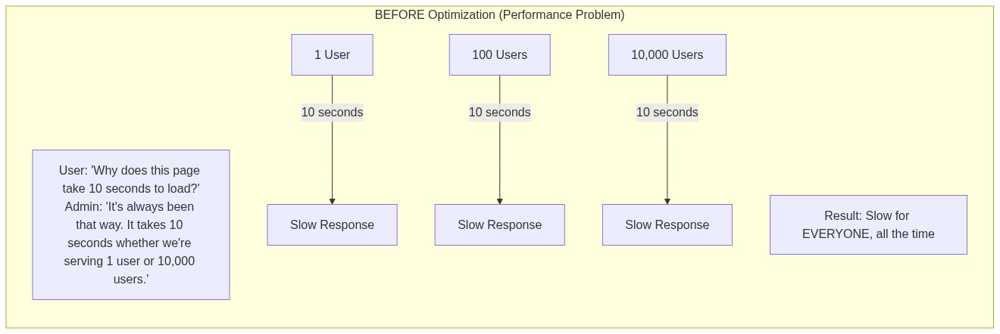

Real-world examples of performance problems include inefficient database queries that full-scan tables, code that performs unnecessary computations, serialization bottlenecks that waste CPU cycles, and synchronous operations that block resources unnecessarily. A database query that takes 10 seconds to execute is a performance problem—it takes 10 seconds whether it runs once per day or a thousand times per second.

### Scalability Problem

A **scalability problem** manifests as degradation under load. Your system works fine at small scale but fails or becomes unresponsive as traffic increases. This is analogous to a bridge that can handle normal traffic but collapses under the weight of rush hour congestion—it is not inherently weak, but it cannot handle the increased demand.

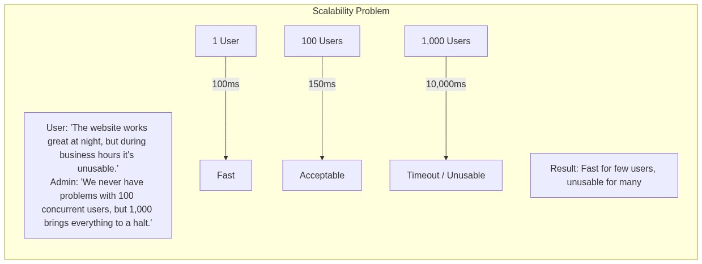

Real-world examples of scalability problems include single-threaded servers that cannot use multiple CPU cores, databases that cannot distribute load across multiple machines, and session storage that relies on single-server memory. A system that handles 100 concurrent users perfectly but falls over at 1,000 has a scalability problem, not necessarily a performance problem.

---

## The 80/20 Context: Why This Distinction Matters

Applying the **80/20 Rule**, understanding the difference between performance and scalability will help you avoid approximately 80% of common system design mistakes. Most engineers understand both concepts in the abstract, but failing to internalize their fundamental differences leads to misallocated engineering effort, inappropriate optimizations, and ultimately systems that cannot meet real-world demands.

The consequences of this confusion are severe. Optimizing for performance without considering scalability leads to systems that work beautifully in testing but crumble under production load. Optimizing for scalability without considering performance leads to systems that technically handle large user bases but provide such poor user experience that users abandon them. The best systems address both concerns, which requires understanding each in depth.

In practice, most large-scale systems require both performance optimization and scalability architecture. You need performance optimization to ensure that individual operations are as fast as possible, reducing resource consumption and improving user experience. You need scalability architecture to ensure that the system can grow to meet demand. Neither alone is sufficient.

---

## Performance: Making the System Fast

**Performance** refers to how efficiently a system processes a single unit of work. When we optimize for performance, we are trying to reduce latency, increase throughput, or decrease resource consumption for individual operations. Performance optimization assumes a fixed workload and asks: how can we process this workload faster or more efficiently?

Performance improvements typically involve making the existing infrastructure work harder or more efficiently. This might mean optimizing algorithms to use fewer CPU cycles, reducing database query times through better indexing, eliminating unnecessary network round trips, or caching frequently accessed data to avoid redundant computation.

### Measuring Performance

Performance is measured through several key metrics that capture different aspects of system behavior.

**Latency** is the time it takes to complete a single operation. It is typically measured in milliseconds or microseconds and represents the delay between initiating a request and receiving a response. Low latency means fast individual operations; high latency means slow individual operations.

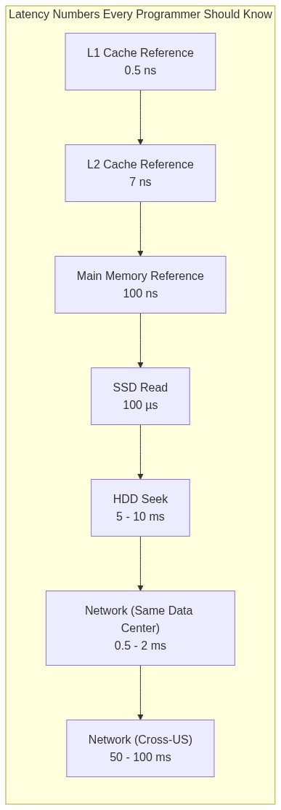

**Throughput** is the number of operations a system can complete per unit of time. It is typically measured in requests per second (RPS), transactions per second (TPS), or operations per second (OPS). High throughput means the system can handle many operations simultaneously; low throughput means the system is bottlenecked.

**Resource Utilization** measures how efficiently a system uses available resources. CPU utilization, memory utilization, disk I/O, and network bandwidth all represent potential bottlenecks. High utilization of any resource indicates a potential performance constraint.

### Performance Optimization Strategies

Performance optimization follows a systematic approach that prioritizes interventions based on their impact.

**Profile before optimizing**: Never guess where performance problems lie. Use profiling tools to identify actual bottlenecks. The majority of performance problems come from a small fraction of the code, and optimizing the wrong part wastes effort.

**Optimize the hot path**: Focus optimization efforts on the code paths that execute most frequently. A 10% improvement in code that runs 50% of the time provides more overall benefit than a 50% improvement in code that runs 1% of the time.

**Consider the full stack**: Performance problems can occur at any layer—application code, database queries, network communication, or operating system configuration. Comprehensive optimization requires understanding the entire system.

---

## Scalability: Making the System Handle Growth

**Scalability** refers to a system's ability to handle increased load without degradation. When we optimize for scalability, we are trying to ensure that adding more resources allows the system to handle proportionally more work. Scalability assumes that workload will grow and asks: how can we handle more work as demand increases?

Scalability improvements typically involve changing the system's architecture to support distribution across multiple machines, processes, or data centers. This might mean adding load balancers to distribute traffic, sharding data across multiple databases, or redesigning state management to avoid single-server bottlenecks.

### Dimensions of Scalability

Scalability manifests in several different dimensions, and a system that scales well in one dimension may scale poorly in another.

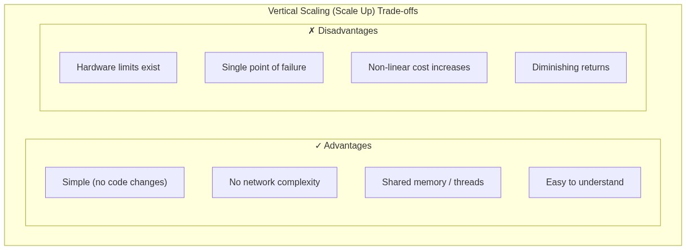

Example: Upgrading from 4-core to 32-core server
- Not 8x faster (Amdahl's Law limits)
- Still vulnerable to that server failing

**Horizontal Scalability (Scale Out)** involves adding more machines to the system. This is the preferred approach for large-scale systems because it offers theoretically unlimited capacity and eliminates single points of failure. However, horizontal scalability introduces complexity in data distribution, consistency, and coordination.

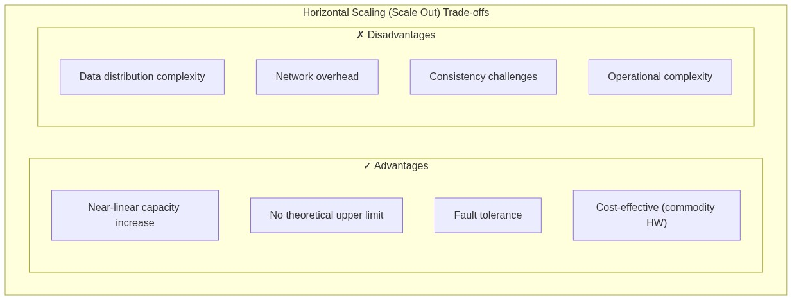

Example: Adding 10 application servers instead of 1 big server
- Can handle ~10x traffic
- If one fails, others continue
- Need load balancer and session management

### Scalability Patterns

Several architectural patterns enable horizontal scalability by removing bottlenecks and distributing work effectively.

**Stateless Design** removes server-side state so that any request can be handled by any server. When servers do not maintain client state, load balancers can distribute traffic freely and servers can be added or removed without impact.

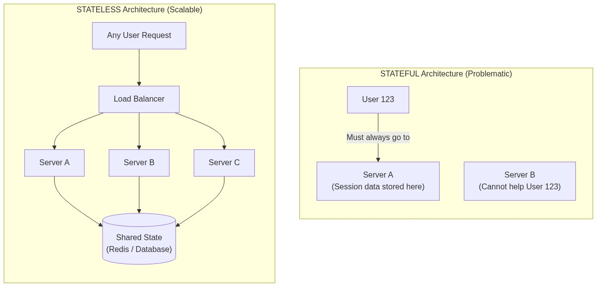

**Data Partitioning** divides data across multiple databases or tables so that each partition handles only a fraction of the total load. This enables write scalability for systems where a single database cannot handle all writes.

**Caching** reduces load on backend systems by storing frequently accessed data in memory. Effective caching can dramatically improve both performance and scalability by serving requests from cache rather than hitting databases.

**Asynchronous Processing** moves expensive operations out of the critical path, allowing the system to accept requests faster. Background job processing, message queues, and event-driven architectures all contribute to scalability by decoupling request handling from request processing.

---

## Latency vs. Throughput: Two Sides of Performance

Closely related to the performance versus scalability distinction is the difference between latency and throughput. While often discussed together, they measure different aspects of system behavior and can even conflict with each other.

**Latency** measures the time for a single operation: how long does it take to complete one request? Low latency means fast individual responses. Latency is critical for interactive applications where users notice delays.

**Throughput** measures the rate of operations: how many operations can complete per second? High throughput means the system can handle many concurrent requests. Throughput is critical for batch processing and high-traffic applications.

### The Trade-off

Optimizing for one often comes at the expense of the other, and the right balance depends on your use case.

```
High Latency + High Throughput:
A system that processes each request slowly but can handle many
simultaneously. Example: Large batch processing jobs that take
minutes each but run continuously.

Low Latency + Low Throughput:
A system that responds quickly to each request but cannot handle
many concurrent requests. Example: A simple calculator service
that is fast but single-threaded.

High Latency + Low Throughput:
The worst combination—slow and limited. Example: A poorly
optimized system with unnecessary serialization.

Low Latency + High Throughput:
The ideal combination—fast and scalable. Example: A well-
optimized system with effective caching and horizontal scaling.
```

### Practical Implications

In practice, achieving both low latency and high throughput requires careful system design. Techniques include:

**Parallelization**: Process multiple requests concurrently to improve throughput without increasing latency for individual requests.

**Pipelining**: Overlap the stages of processing multiple requests so that while one request is in stage two, another can be in stage one.

**Batching**: Group multiple small operations into fewer large operations, reducing per-operation overhead and improving throughput.

**Caching**: Serve repeated requests from cache at extremely low latency, freeing resources to handle other requests at higher throughput.

---

## Quantifying System Performance: Key Metrics

Understanding performance requires familiarity with the metrics used to measure and describe system behavior. These metrics provide a common vocabulary for discussing performance and enable quantitative comparison between systems.

### Response Time Percentiles

Raw response time averages can be misleading because they obscure the distribution of response times. A system with an average response time of 100ms might have most requests completing in 10ms while a small fraction takes 10 seconds. Percentiles provide a more accurate picture of actual user experience.

**Percentiles** divide response times into groups. The 50th percentile (P50) is the median—half of requests complete faster, half slower. The 95th percentile (P95) means 95% of requests complete faster; 5% are slower. The 99th percentile (P99) means 99% of requests complete faster.

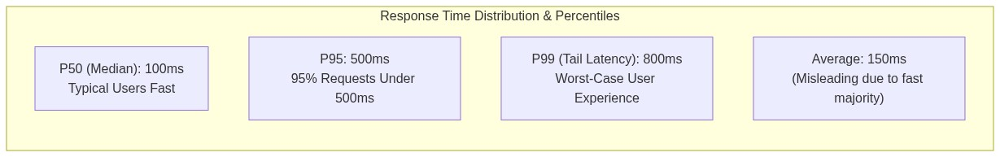

**Why percentiles matter**: Users who experience slow requests are often the ones who abandon your service. A system that is fast for 99% of requests but takes 10 seconds for 1% will have frustrated users, even though the average looks good.

**P99 vs P50**: P50 tells you about typical users; P99 tells you about worst-case users. For user experience, P99 is often more important because those slow requests represent users who might give up and leave.

### Service Level Objectives (SLOs)

SLOs define the performance targets that a system must meet. They provide concrete goals for optimization efforts and criteria for determining when a system is operating acceptably.

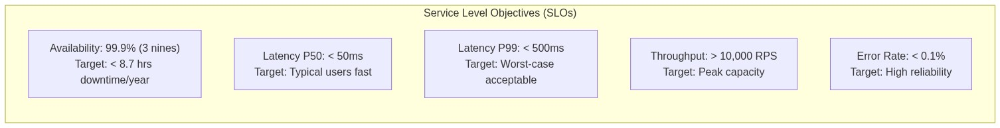

**SLO vs SLA**: SLOs are internal targets you set for your system. SLAs (Service Level Agreements) are contractual commitments to customers. SLAs are typically slightly more lenient than SLOs to provide a buffer.

### The RED Method

For services, the RED method provides a simple framework for key metrics:

- **Rate**: Requests per second
- **Errors**: Error rate (percentage of requests that fail)
- **Duration**: Latency (typically P99)

These three metrics capture the essential performance characteristics of most services.

---

## Capacity Planning: Predicting Scalability Needs

Capacity planning involves predicting future resource needs based on current usage and growth projections. Effective capacity planning ensures that you add resources before they become insufficient, rather than scrambling to react to crises.

### Key Metrics for Capacity Planning

**Current Utilization** measures how much of available capacity you are currently using. High utilization (above 70-80%) on any resource—CPU, memory, disk, network—indicates that you are approaching limits.

**Growth Rate** projects how quickly demand is increasing. Linear growth is easier to plan for than exponential growth. Understanding whether your user base is growing 10% per month or 100% per month dramatically changes capacity planning.

**Headroom** is the buffer between current utilization and maximum capacity. Maintaining headroom ensures you can handle traffic spikes without degradation.

### The Scalability Equation

A service is truly **scalable** if adding resources results in a proportional increase in capacity. The ideal scalability equation is:

```
Capacity ∝ Resources

If you double your servers, you should double your throughput.
If you double your database size, you should handle twice the data.
```

In practice, perfect linearity is rarely achieved. **Amdahl's Law** describes why: the speedup of a parallel system is limited by the portion that cannot be parallelized.

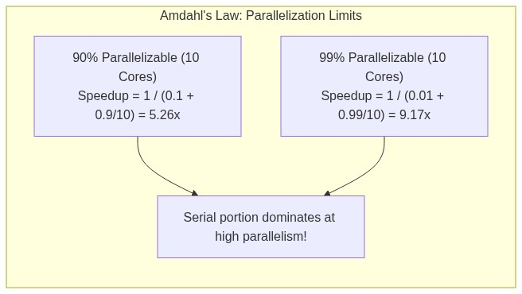

### Planning for Growth

Capacity planning should answer several key questions:

**When will we need to add capacity?** Project growth rates against current capacity to determine when you will hit limits.

**How much capacity should we add?** Add enough to handle not just immediate growth but the expected growth over the capacity addition's lifetime.

**What is the lead time?** Some resources take weeks to provision. Plan accordingly.

**What is the cost?** Capacity has a cost, and infinite scalability requires infinite budget. Balance capacity needs against business economics.

---

## Real-World Examples: Performance vs. Scalability in Action

### Case Study: The Database Bottleneck

Consider an e-commerce platform experiencing slow checkout times. Analysis reveals the database can process 1,000 queries per second but the application is generating 2,000 queries per second.

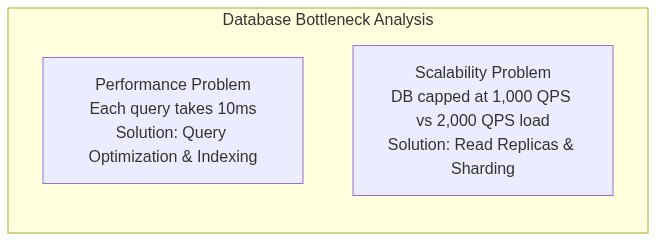

This example illustrates that real systems often have both performance and scalability problems simultaneously. The query optimization improves performance for individual operations; the database scaling improves overall capacity.

### Case Study: The Caching Win

A news website experiencing slow page load times during breaking news events. Analysis shows that the database is handling 10,000 queries per minute during peak, but most queries are for the same top stories.

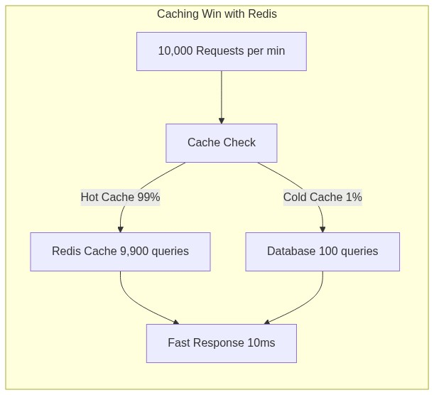

Caching improves both performance (faster response) and scalability (reduced database load). This is often the highest-impact optimization available.

### Case Study: The Horizontal Scaling Transformation

A startup's monolithic application running on a single large server is experiencing growing pains. Response times are degrading as the user base grows, and the single server is approaching capacity limits.

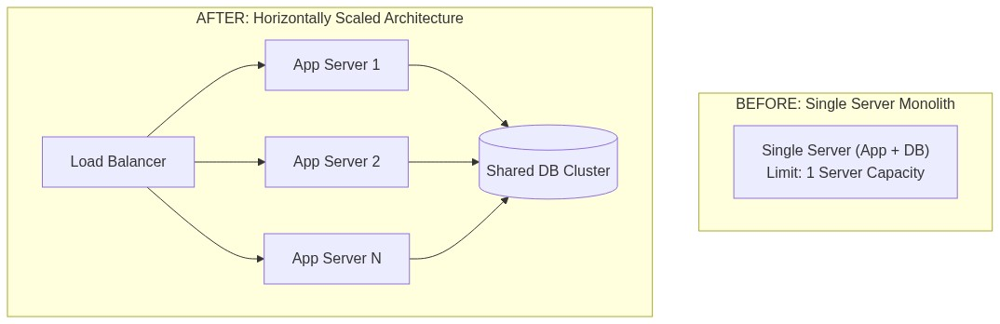

This transformation improves scalability dramatically but requires significant architectural changes: stateless application design, external session storage, database scaling, and load balancing infrastructure.

---

## Interview Preparation: Key Questions

System design interviews frequently test understanding of performance versus scalability. Being able to explain these concepts clearly—and apply them to real scenarios—is essential.

### Q1: What's the difference between performance and scalability?

**Expected Answer Framework**:

Performance and scalability are related but distinct properties. Performance measures how fast a system processes a single request; scalability measures how well a system handles increased load. A system can have good performance but poor scalability—it might handle each request quickly but become overwhelmed as request volume increases. Conversely, a system can have good scalability but poor performance—it might handle many concurrent requests but process each one slowly.

A useful analogy is transportation: performance is like the speed of individual vehicles; scalability is like the capacity of the road system. A Formula 1 car has excellent performance but cannot transport many people. A city bus is slower but can carry many passengers. A well-designed transportation system needs both.

In practical terms, performance problems are solved through optimization—better algorithms, better indexing, lower-latency storage. Scalability problems are solved through distribution—adding capacity, partitioning data, distributing load across machines.

### Q2: How would you scale a system from 1,000 to 1,000,000 users?

**Expected Answer Framework**:

Begin by identifying current bottlenecks through measurement. The answer depends on where those bottlenecks lie:

If the bottleneck is **database capacity**, options include adding read replicas to distribute read load, implementing caching to reduce database queries, sharding data across multiple databases, or upgrading to more capable database hardware.

If the bottleneck is **application server capacity**, options include adding more application servers behind a load balancer, implementing stateless design to allow horizontal scaling, or optimizing application code to reduce resource consumption per request.

If the bottleneck is **network bandwidth**, options include adding CDN for static content, implementing caching at multiple layers, or optimizing payload sizes.

If the bottleneck is **external dependencies**, options include adding caching to reduce external calls, implementing circuit breakers to prevent cascade failures, or replacing synchronous calls with asynchronous processing.

The key insight is that different bottlenecks require different solutions. Premature optimization of the wrong bottleneck wastes effort.

### Q3: Your system has high average response time. How would you diagnose it?

**Expected Answer Framework**:

First, clarify what "high" means relative to SLOs and user expectations. Then systematically isolate the cause:

**Check resource utilization**: Is CPU, memory, disk, or network saturated? If CPU is high, the problem is likely in application code or computation. If memory is high, there may be memory leaks or insufficient caching.

**Check latency distribution**: Is the average dominated by slow outliers, or are all requests slow? If P50 is acceptable but average is high, the problem is with tail latency. If P50 is high, the problem is systemic.

**Profile the application**: Where does time go? Database queries? Network calls? Computation? Serialization? The bottleneck is usually in a small fraction of the code.

**Check for queueing**: If requests are waiting for resources, latency compounds. Monitor queue lengths and wait times.

**Check external dependencies**: Slow downstream services can cascade upward. Monitor all external calls.

---

## Common Pitfalls and Anti-Patterns

Understanding common mistakes helps you avoid them in your own system design.

### Treating Performance as an Afterthought

Optimizing for performance after the system is built is much harder and more expensive than designing for performance initially. Performance should be a first-class consideration throughout the design process, not an afterthought.

### Over-Engineering for Scale

Not every system needs to scale to millions of users. Building elaborate distributed systems for modest workloads adds unnecessary complexity and operational burden. Design for the scale you expect, with clear thresholds for when to evolve the architecture.

### Ignoring the Bottleneck

Performance improvements are limited by the current bottleneck. Optimizing a non-bottleneck resource provides no benefit. Always identify the true bottleneck before investing in optimization.

### Neglecting Caching

Caching is often the highest-impact performance optimization available, yet it is frequently underutilized. Before adding hardware, see if effective caching can reduce load on existing infrastructure.

### Confusing Latency and Throughput

A system with low latency might still have poor throughput if it cannot handle concurrent requests. Conversely, a system with high throughput might still have unacceptable latency for individual requests. Both metrics matter.

---

## Key Takeaways

**Performance and scalability are different properties**: Performance measures how fast the system processes individual operations; scalability measures how well the system handles increased load. Both matter, and both need to be designed into the system.

**Latency and throughput are different metrics**: Latency measures response time for individual operations; throughput measures the rate of operations. Optimizing for one can harm the other, and the right balance depends on your use case.

**Measure before optimizing**: Premature optimization is wasteful. Use profiling and monitoring to identify actual bottlenecks before investing in solutions.

**Caching is often the highest-impact optimization**: Before adding hardware, see if effective caching can reduce load and improve performance dramatically.

**Design for the scale you expect**: Over-engineering for scale adds complexity; under-engineering leads to crisis. Design for realistic growth with clear thresholds for architectural evolution.

**Percentiles reveal user experience**: Averages hide distribution. P95 and P99 latencies often matter more for user experience than average latency.

**Scalability requires architectural change**: Horizontal scalability requires stateless design, data partitioning, or other architectural patterns. Simply adding more hardware to a monolithic system has limits.

**Capacity planning prevents crises**: Understanding growth rates and planning capacity additions before they are needed prevents emergency scrambles and ensures consistent service quality.

---

## Actionable Next Steps

### Immediate Actions (Next 24 Hours)

1. **[30 minutes]** Profile your current application or a sample application. Identify where time is spent in a typical request. Is it in computation? Database queries? Network calls? Serialization?

2. **[20 minutes]** Review your system's latency distribution. Calculate or estimate P50, P95, and P99. Are these within your SLOs? Which percentile is most concerning?

3. **[25 minutes]** Identify your system's bottlenecks. If you added 10x more traffic tomorrow, what would break first? Database? CPU? Memory? Network? External services?

4. **[15 minutes]** Review your caching strategy. What is currently cached? What could be cached? How stale can cached data be before it causes problems?

### Understanding Exercises

1. **[45 minutes]** Design a system that maintains low latency (P99 < 100ms) while handling 1 million requests per second. What architectural patterns would you use?

2. **[30 minutes]** Explain to a non-technical stakeholder why a system might have excellent average performance but poor P99 performance. Why does this matter for user experience?

3. **[20 minutes]** Research a recent well-documented outage. What was the scalability or performance problem? How could it have been prevented?

### Deep-Dive Topics (If Time Permits)

- **Database Query Optimization**: Understanding query execution plans and index optimization
- **Caching Strategies**: Cache-aside, write-through, write-behind, and when to use each
- **Load Balancing Algorithms**: Round-robin, least connections, IP hash, and their trade-offs
- **Capacity Planning Methods**: Horizontal and vertical scaling considerations
- **Performance Monitoring**: Tools and techniques for identifying bottlenecks

---

> **Final Thought**: Performance and scalability are not either-or choices but two dimensions of system quality that must both be addressed. A system that is fast but cannot grow is as limited as a system that scales but responds slowly. The best engineers understand both properties deeply and design systems that excel at both. Your study of this topic is not about memorizing definitions but about developing intuition for when to optimize for performance, when to optimize for scalability, and when both are needed simultaneously.
